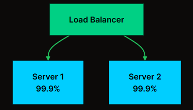
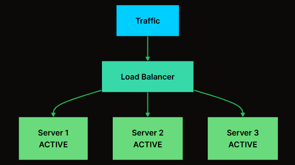
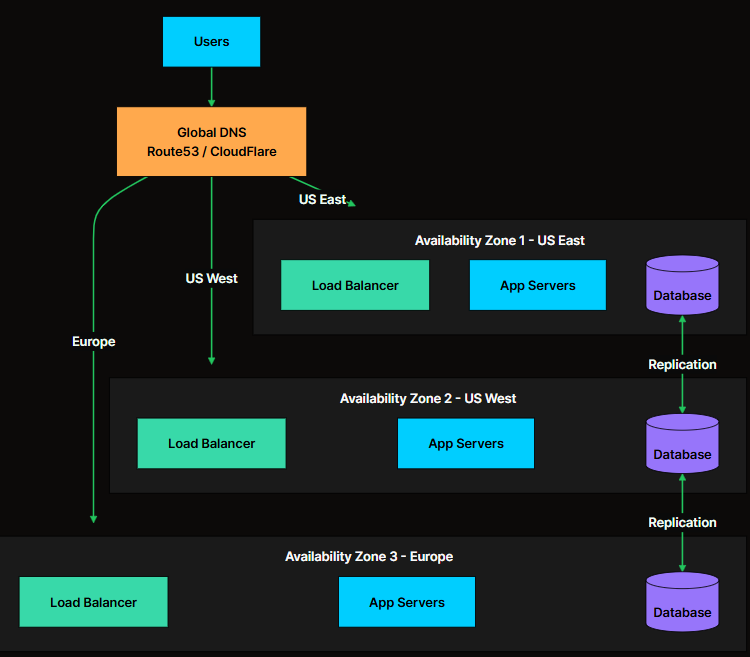
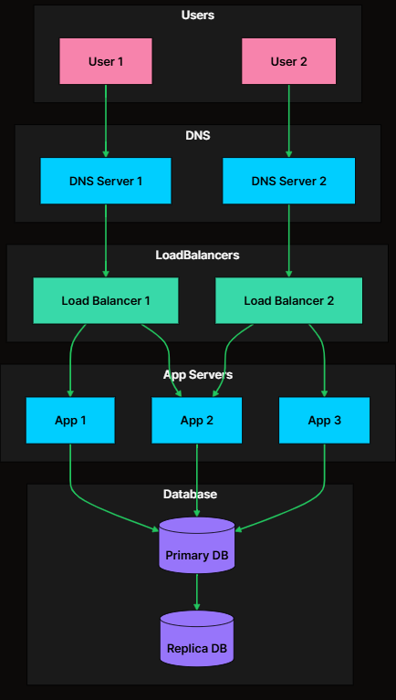
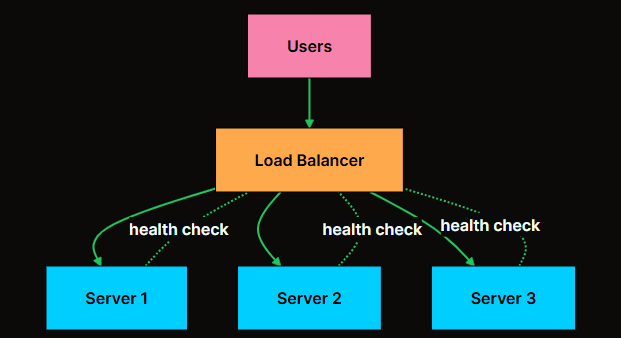
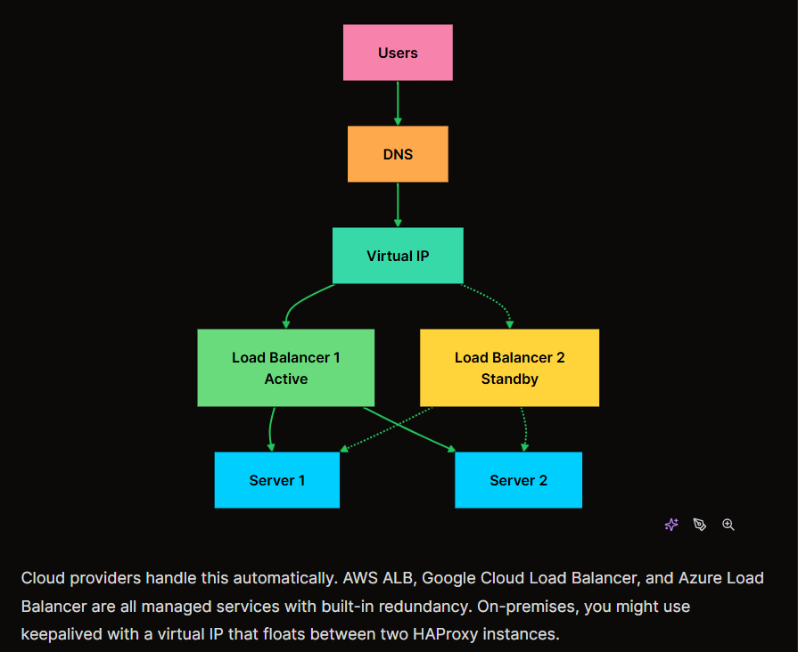
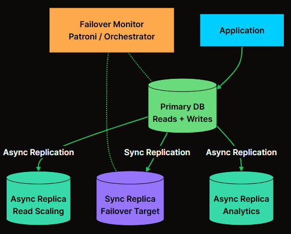
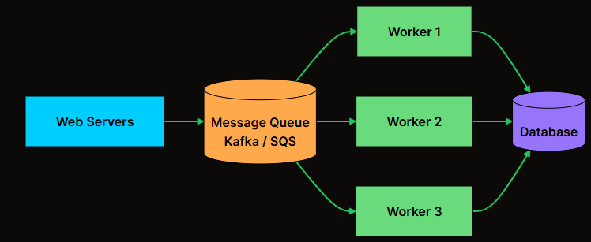
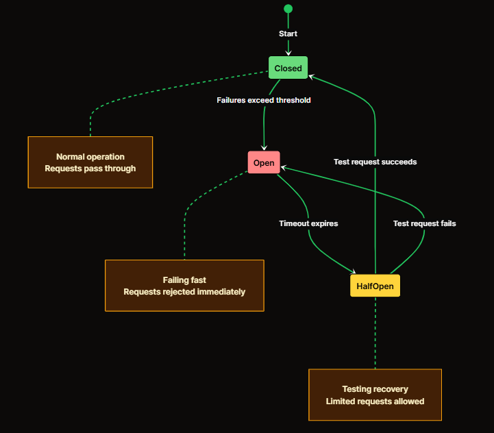

# <center>Availability</center>

Availability measures how often your system is operational and accessible to users. A highly available system continues functioning even when individual components fail. Availability means that the system always responds to a request even when there is a failure. **The response might be outdated, but the key here is to keep you moving.**
* **`Availability` is not the same as `Reliability`. A system can be highly available but unreliable.**
* **Availability** in a system. It may not return the exact data you expected, but it **always responds.**. The priority is **to stay online/responsive**, even if that means serving slighltly outdated or fallback data. 

### Measuring Availability
Availability is typically expressed as a percentage of `uptime` over a given period. 

<code class="px-0.5 py-0.5 rounded-md font-mono text-[1em] text-primary border border-border/50 shadow-sm"><strong class="font-bold">Availability = Uptime / (Uptime + Downtime)</strong></code>

```ini
Uptime: The total time a system is operational and functioning as expected.
Downtime: The total time the system is unavailable due to failures, maintenance, or other issues.
Higher Percentage = Better Availability: Systems aim for high availability such as 99%, 99.9%, or 99.99% uptime.

If a system was up for 364 days and down 1 day in a year:
Availability = 364 / 365 = 99.73 %
```

Availability is often described in terms of `nines`. **Each additional nine dramatically reduces allowed downtime:**

<table class="w-full border-collapse rounded-lg overflow-hidden shadow-sm border border-gray-200 dark:border-gray-700"><thead><tr class="bg-primary text-black"><th class="px-2 py-2 sm:px-3 sm:py-3 md:px-4 md:py-3 font-semibold text-xs sm:text-sm min-w-[80px] sm:min-w-[100px] border-b border-r border-gray-200/30 dark:border-gray-600/30 text-left"><span>Availability</span></th><th class="px-2 py-2 sm:px-3 sm:py-3 md:px-4 md:py-3 font-semibold text-xs sm:text-sm min-w-[80px] sm:min-w-[100px] border-b border-r border-gray-200/30 dark:border-gray-600/30 text-left"><span>Downtime per Year</span></th><th class="px-2 py-2 sm:px-3 sm:py-3 md:px-4 md:py-3 font-semibold text-xs sm:text-sm min-w-[80px] sm:min-w-[100px] border-b border-r border-gray-200/30 dark:border-gray-600/30 text-left"><span>Downtime per Month</span></th><th class="px-2 py-2 sm:px-3 sm:py-3 md:px-4 md:py-3 font-semibold text-xs sm:text-sm min-w-[80px] sm:min-w-[100px] border-b border-gray-200 dark:border-gray-700 text-left"><span>Downtime per Week</span></th></tr></thead><tbody><tr class="hover:bg-primary/10 dark:hover:bg-primary/20 transition-colors bg-white dark:bg-black"><td class="px-2 py-1.5 sm:px-3 sm:py-2 md:px-4 md:py-2 text-xs sm:text-sm font-medium text-gray-800 dark:text-gray-200 min-w-[80px] sm:min-w-[100px] border-b border-r border-gray-100 dark:border-gray-700/50 text-left"><span>99% (two nines)</span></td><td class="px-2 py-1.5 sm:px-3 sm:py-2 md:px-4 md:py-2 text-xs sm:text-sm font-medium text-gray-800 dark:text-gray-200 min-w-[80px] sm:min-w-[100px] border-b border-r border-gray-100 dark:border-gray-700/50 text-left"><span>3.65 days</span></td><td class="px-2 py-1.5 sm:px-3 sm:py-2 md:px-4 md:py-2 text-xs sm:text-sm font-medium text-gray-800 dark:text-gray-200 min-w-[80px] sm:min-w-[100px] border-b border-r border-gray-100 dark:border-gray-700/50 text-left"><span>7.3 hours</span></td><td class="px-2 py-1.5 sm:px-3 sm:py-2 md:px-4 md:py-2 text-xs sm:text-sm font-medium text-gray-800 dark:text-gray-200 min-w-[80px] sm:min-w-[100px] border-b border-gray-100 dark:border-gray-700/50 text-left"><span>1.68 hours</span></td></tr><tr class="hover:bg-primary/10 dark:hover:bg-primary/20 transition-colors bg-white dark:bg-black"><td class="px-2 py-1.5 sm:px-3 sm:py-2 md:px-4 md:py-2 text-xs sm:text-sm font-medium text-gray-800 dark:text-gray-200 min-w-[80px] sm:min-w-[100px] border-b border-r border-gray-100 dark:border-gray-700/50 text-left"><span>99.9% (three nines)</span></td><td class="px-2 py-1.5 sm:px-3 sm:py-2 md:px-4 md:py-2 text-xs sm:text-sm font-medium text-gray-800 dark:text-gray-200 min-w-[80px] sm:min-w-[100px] border-b border-r border-gray-100 dark:border-gray-700/50 text-left"><span>8.76 hours</span></td><td class="px-2 py-1.5 sm:px-3 sm:py-2 md:px-4 md:py-2 text-xs sm:text-sm font-medium text-gray-800 dark:text-gray-200 min-w-[80px] sm:min-w-[100px] border-b border-r border-gray-100 dark:border-gray-700/50 text-left"><span>43.8 minutes</span></td><td class="px-2 py-1.5 sm:px-3 sm:py-2 md:px-4 md:py-2 text-xs sm:text-sm font-medium text-gray-800 dark:text-gray-200 min-w-[80px] sm:min-w-[100px] border-b border-gray-100 dark:border-gray-700/50 text-left"><span>10.1 minutes</span></td></tr><tr class="hover:bg-primary/10 dark:hover:bg-primary/20 transition-colors bg-white dark:bg-black"><td class="px-2 py-1.5 sm:px-3 sm:py-2 md:px-4 md:py-2 text-xs sm:text-sm font-medium text-gray-800 dark:text-gray-200 min-w-[80px] sm:min-w-[100px] border-b border-r border-gray-100 dark:border-gray-700/50 text-left"><span>99.99% (four nines)</span></td><td class="px-2 py-1.5 sm:px-3 sm:py-2 md:px-4 md:py-2 text-xs sm:text-sm font-medium text-gray-800 dark:text-gray-200 min-w-[80px] sm:min-w-[100px] border-b border-r border-gray-100 dark:border-gray-700/50 text-left"><span>52.6 minutes</span></td><td class="px-2 py-1.5 sm:px-3 sm:py-2 md:px-4 md:py-2 text-xs sm:text-sm font-medium text-gray-800 dark:text-gray-200 min-w-[80px] sm:min-w-[100px] border-b border-r border-gray-100 dark:border-gray-700/50 text-left"><span>4.38 minutes</span></td><td class="px-2 py-1.5 sm:px-3 sm:py-2 md:px-4 md:py-2 text-xs sm:text-sm font-medium text-gray-800 dark:text-gray-200 min-w-[80px] sm:min-w-[100px] border-b border-gray-100 dark:border-gray-700/50 text-left"><span>1.01 minutes</span></td></tr><tr class="hover:bg-primary/10 dark:hover:bg-primary/20 transition-colors bg-white dark:bg-black"><td class="px-2 py-1.5 sm:px-3 sm:py-2 md:px-4 md:py-2 text-xs sm:text-sm font-medium text-gray-800 dark:text-gray-200 min-w-[80px] sm:min-w-[100px] border-b border-r border-gray-100 dark:border-gray-700/50 text-left"><span>99.999% (five nines)</span></td><td class="px-2 py-1.5 sm:px-3 sm:py-2 md:px-4 md:py-2 text-xs sm:text-sm font-medium text-gray-800 dark:text-gray-200 min-w-[80px] sm:min-w-[100px] border-b border-r border-gray-100 dark:border-gray-700/50 text-left"><span>5.26 minutes</span></td><td class="px-2 py-1.5 sm:px-3 sm:py-2 md:px-4 md:py-2 text-xs sm:text-sm font-medium text-gray-800 dark:text-gray-200 min-w-[80px] sm:min-w-[100px] border-b border-r border-gray-100 dark:border-gray-700/50 text-left"><span>26.3 seconds</span></td><td class="px-2 py-1.5 sm:px-3 sm:py-2 md:px-4 md:py-2 text-xs sm:text-sm font-medium text-gray-800 dark:text-gray-200 min-w-[80px] sm:min-w-[100px] border-b border-gray-100 dark:border-gray-700/50 text-left"><span>6.05 seconds</span></td></tr><tr class="hover:bg-primary/10 dark:hover:bg-primary/20 transition-colors bg-white dark:bg-black"><td class="px-2 py-1.5 sm:px-3 sm:py-2 md:px-4 md:py-2 text-xs sm:text-sm font-medium text-gray-800 dark:text-gray-200 min-w-[80px] sm:min-w-[100px] border-r border-gray-100 dark:border-gray-700/50 text-left"><span>99.9999% (six nines)</span></td><td class="px-2 py-1.5 sm:px-3 sm:py-2 md:px-4 md:py-2 text-xs sm:text-sm font-medium text-gray-800 dark:text-gray-200 min-w-[80px] sm:min-w-[100px] border-r border-gray-100 dark:border-gray-700/50 text-left"><span>31.5 seconds</span></td><td class="px-2 py-1.5 sm:px-3 sm:py-2 md:px-4 md:py-2 text-xs sm:text-sm font-medium text-gray-800 dark:text-gray-200 min-w-[80px] sm:min-w-[100px] border-r border-gray-100 dark:border-gray-700/50 text-left"><span>2.63 seconds</span></td><td class="px-2 py-1.5 sm:px-3 sm:py-2 md:px-4 md:py-2 text-xs sm:text-sm font-medium text-gray-800 dark:text-gray-200 min-w-[80px] sm:min-w-[100px] text-left"><span>0.6 seconds</span></td></tr></tbody></table>

---

### Availability in Series vs Parallel

#### 1. Components in Series
When components are in series, meaning all must work for the system to function, availability multiplies. 


<code>Overall = 99.9% × 99.9% × 99.9% = 99.7%</code>

Each component in the chain reduces overall availability. You started with three components, each at "three nines," but the combined system is below three nines. Add more components in series, and availability keeps dropping. 

#### 2. Components in Parallel
When componnents are in parallel, meaning any can handle the request, availability improvesdramatically:


<code>
For both servers to be down simultaneously, both must fail at the same time:

Failure probability = 0.1% × 0.1% = 0.0001%

Availability = 100% - 0.0001% = 99.9999%
Two servers with 99.9% availability each give you nearly six nines when running in parallel. This is the power of `redundancy`.
</code>

---

### Common Failure Modes
Knowing the common failure modes helps you design the high availability system. 

#### 1. Hardware Failures
* Everything physical eventually breaks. The question is when, `MTBF = Mean Time Between Failures`
* At scale, hardware failures are not exceptional events. They are routine. A data center with 10,000 servers will see hundreds of hardware failures per year. If your architecture cannot handle as server dying at any moment, you do not have a highly available system.

<table class="w-full border-collapse rounded-lg overflow-hidden shadow-sm border border-gray-200 dark:border-gray-700"><thead><tr class="bg-primary text-black"><th class="px-2 py-2 sm:px-3 sm:py-3 md:px-4 md:py-3 font-semibold text-xs sm:text-sm min-w-[80px] sm:min-w-[100px] border-b border-r border-gray-200/30 dark:border-gray-600/30 text-left"><span>Component</span></th><th class="px-2 py-2 sm:px-3 sm:py-3 md:px-4 md:py-3 font-semibold text-xs sm:text-sm min-w-[80px] sm:min-w-[100px] border-b border-r border-gray-200/30 dark:border-gray-600/30 text-left"><span>Typical Failure Rate</span></th><th class="px-2 py-2 sm:px-3 sm:py-3 md:px-4 md:py-3 font-semibold text-xs sm:text-sm min-w-[80px] sm:min-w-[100px] border-b border-gray-200 dark:border-gray-700 text-left"><span>MTBF</span></th></tr></thead><tbody><tr class="hover:bg-primary/10 dark:hover:bg-primary/20 transition-colors bg-white dark:bg-black"><td class="px-2 py-1.5 sm:px-3 sm:py-2 md:px-4 md:py-2 text-xs sm:text-sm font-medium text-gray-800 dark:text-gray-200 min-w-[80px] sm:min-w-[100px] border-b border-r border-gray-100 dark:border-gray-700/50 text-left"><span>Hard Drive (HDD)</span></td><td class="px-2 py-1.5 sm:px-3 sm:py-2 md:px-4 md:py-2 text-xs sm:text-sm font-medium text-gray-800 dark:text-gray-200 min-w-[80px] sm:min-w-[100px] border-b border-r border-gray-100 dark:border-gray-700/50 text-left"><span>2-4% per year</span></td><td class="px-2 py-1.5 sm:px-3 sm:py-2 md:px-4 md:py-2 text-xs sm:text-sm font-medium text-gray-800 dark:text-gray-200 min-w-[80px] sm:min-w-[100px] border-b border-gray-100 dark:border-gray-700/50 text-left"><span>300,000 hours</span></td></tr><tr class="hover:bg-primary/10 dark:hover:bg-primary/20 transition-colors bg-white dark:bg-black"><td class="px-2 py-1.5 sm:px-3 sm:py-2 md:px-4 md:py-2 text-xs sm:text-sm font-medium text-gray-800 dark:text-gray-200 min-w-[80px] sm:min-w-[100px] border-b border-r border-gray-100 dark:border-gray-700/50 text-left"><span>SSD</span></td><td class="px-2 py-1.5 sm:px-3 sm:py-2 md:px-4 md:py-2 text-xs sm:text-sm font-medium text-gray-800 dark:text-gray-200 min-w-[80px] sm:min-w-[100px] border-b border-r border-gray-100 dark:border-gray-700/50 text-left"><span>0.5-1% per year</span></td><td class="px-2 py-1.5 sm:px-3 sm:py-2 md:px-4 md:py-2 text-xs sm:text-sm font-medium text-gray-800 dark:text-gray-200 min-w-[80px] sm:min-w-[100px] border-b border-gray-100 dark:border-gray-700/50 text-left"><span>1-2 million hours</span></td></tr><tr class="hover:bg-primary/10 dark:hover:bg-primary/20 transition-colors bg-white dark:bg-black"><td class="px-2 py-1.5 sm:px-3 sm:py-2 md:px-4 md:py-2 text-xs sm:text-sm font-medium text-gray-800 dark:text-gray-200 min-w-[80px] sm:min-w-[100px] border-b border-r border-gray-100 dark:border-gray-700/50 text-left"><span>Server</span></td><td class="px-2 py-1.5 sm:px-3 sm:py-2 md:px-4 md:py-2 text-xs sm:text-sm font-medium text-gray-800 dark:text-gray-200 min-w-[80px] sm:min-w-[100px] border-b border-r border-gray-100 dark:border-gray-700/50 text-left"><span>2-4% per year</span></td><td class="px-2 py-1.5 sm:px-3 sm:py-2 md:px-4 md:py-2 text-xs sm:text-sm font-medium text-gray-800 dark:text-gray-200 min-w-[80px] sm:min-w-[100px] border-b border-gray-100 dark:border-gray-700/50 text-left"><span>300,000 hours</span></td></tr><tr class="hover:bg-primary/10 dark:hover:bg-primary/20 transition-colors bg-white dark:bg-black"><td class="px-2 py-1.5 sm:px-3 sm:py-2 md:px-4 md:py-2 text-xs sm:text-sm font-medium text-gray-800 dark:text-gray-200 min-w-[80px] sm:min-w-[100px] border-b border-r border-gray-100 dark:border-gray-700/50 text-left"><span>Network Switch</span></td><td class="px-2 py-1.5 sm:px-3 sm:py-2 md:px-4 md:py-2 text-xs sm:text-sm font-medium text-gray-800 dark:text-gray-200 min-w-[80px] sm:min-w-[100px] border-b border-r border-gray-100 dark:border-gray-700/50 text-left"><span>1-2% per year</span></td><td class="px-2 py-1.5 sm:px-3 sm:py-2 md:px-4 md:py-2 text-xs sm:text-sm font-medium text-gray-800 dark:text-gray-200 min-w-[80px] sm:min-w-[100px] border-b border-gray-100 dark:border-gray-700/50 text-left"><span>500,000 hours</span></td></tr><tr class="hover:bg-primary/10 dark:hover:bg-primary/20 transition-colors bg-white dark:bg-black"><td class="px-2 py-1.5 sm:px-3 sm:py-2 md:px-4 md:py-2 text-xs sm:text-sm font-medium text-gray-800 dark:text-gray-200 min-w-[80px] sm:min-w-[100px] border-r border-gray-100 dark:border-gray-700/50 text-left"><span>Power Supply</span></td><td class="px-2 py-1.5 sm:px-3 sm:py-2 md:px-4 md:py-2 text-xs sm:text-sm font-medium text-gray-800 dark:text-gray-200 min-w-[80px] sm:min-w-[100px] border-r border-gray-100 dark:border-gray-700/50 text-left"><span>1-3% per year</span></td><td class="px-2 py-1.5 sm:px-3 sm:py-2 md:px-4 md:py-2 text-xs sm:text-sm font-medium text-gray-800 dark:text-gray-200 min-w-[80px] sm:min-w-[100px] text-left"><span>400,000 hours</span></td></tr></tbody></table>

#### 2. Software Failures
Software breaks creatively.
* `Bugs`: Code defects that cause crashes or incorrect behavior
* `Memory Leaks`: Gradual resource Exhaustion
* `Deadlocks`: Processes waiting on each other indefinitely. 
* `Cascading Failures`: One failure triggering failures in dependent systems. 

#### 3. Network Failures
Networks fail in ways that are subtle, intermittent, and painful to debug.

* `Packet Loss`: Data does not reach its destination
* `Latency Spikes`: Delays in communication
* `Partition`: Network split isolates groups of servers.
* `DNS Failures`: Name resolution stops working. 

#### 4. Human Errors
* `Configuration Mistakes`: Wrong environment variable, typo in a config file
* `Failed Deployments`: Bad code or broken migrations pushed to production
* `Accidental Deletions`: Running the wrong command in the wrong place
* `Capacity Planning Errors`: Underestimating traffic

---
### Importance
Availability is important because it ensures that systems and services remain accessible and reliable for users and businesses.

1. `User Experience:` A positive user experience results from availability, which guarantees that users can access the system and its services when needed. Users become frustrated and may become dissatisfied with systems that are regularly unavailable or encounter downtime.
2. `Service Level Agreements (SLAs):` Many businesses use `SLAs` to bind themselves to certain availability goals with their stakeholders or consumers. Financial fines or contractual obligations may follow noncompliance with these SLAs.
3. `Disaster Recovery:` Resilience and disaster recovery are directly linked to availability. Systems can survive and recover from unforeseen occurrences like hardware failures, network outages, natural disasters, or cyberattacks if they are designed with `redundancy`, `failover mechanisms`, and `disaster recovery` strategies.
4. `Regulatory Compliance:` In many industries, there are regulatory requirements or standards that mandate a `minimum level of system availability`. Failure to comply with these regulations can result in legal consequences, fines, or sanctions.

---

### Ways to Achieve High Availability

High availability is necessary for systems that need to run continuously since any disruption could lead to losses in money, reputational damage, or even safety hazards. **Systems that usually demand high availability include cloud infrastructure, emergency response services, healthcare systems, e-commerce platforms, and banking apps.**

1. **REDUNDANCY**: Use redundant servers or components so that, in the event of a failure, another can take over without any problems. Data centers, networking, and hardware redundancy are a few examples of this. 
2. **LOAD BALANCING**: Incoming requests are divided among several servers or resources to enhance system performance and fault tolerance while avoiding overload on any one part.
3. **FAILOVER MECHANISMS**: Implementing automated processes to detect failures and switch to redundant systems without manual intevention.
4. **DISASTER RECOVERY**: Having a comprehensive plan in place to recover the system in case of a catastrophic event that affects the primary infrastructure.
5. **MONITORING & ALERTING**: Putting in place reliable monitoring systems that can identify problems instantly and alert administrators so they can act quickly.
6. **PERFORMANCE OPTIMIZATION**: Lowering the possibility of bottlenecks and breakdowns by making sure the system is built and adjusted to efficiently manage the expected load.
7. **SCALABILITY**: Desiging the system to scale easily by adding more resources when needed to accommodate increased demand.

---
## <center>Redundancy</center>

If there is one concept that underpins all of availability, it is redundancy. The logic is simple: If you have only one of something, when it fails, you have zero. If you have two, when one fails, you still have one.

* **Redundancy means having backup components that can take over when primary components fail.**

### Redundancy Architectures for High Availability

Redundancy is a common strategy used to achieve high availability by running multiple instances of a system. If one instance fails, another instance can take over and continue serving users. For systems that store data, redundancy is usually combined with data replication to keep copies of data across multiple servers.

#### 1. Active-Passive (Standby)
one component handles all the work while another waits idle as a backup. When the active component fails, the passive one takes over.


The passive can be configured in different states of readiness:
<table class="w-full border-collapse rounded-lg overflow-hidden shadow-sm border border-gray-200 dark:border-gray-700"><thead><tr class="bg-primary text-black"><th class="px-2 py-2 sm:px-3 sm:py-3 md:px-4 md:py-3 font-semibold text-xs sm:text-sm min-w-[80px] sm:min-w-[100px] border-b border-r border-gray-200/30 dark:border-gray-600/30 text-left"><span>Standby Type</span></th><th class="px-2 py-2 sm:px-3 sm:py-3 md:px-4 md:py-3 font-semibold text-xs sm:text-sm min-w-[80px] sm:min-w-[100px] border-b border-r border-gray-200/30 dark:border-gray-600/30 text-left"><span>State</span></th><th class="px-2 py-2 sm:px-3 sm:py-3 md:px-4 md:py-3 font-semibold text-xs sm:text-sm min-w-[80px] sm:min-w-[100px] border-b border-r border-gray-200/30 dark:border-gray-600/30 text-left"><span>Failover Time</span></th><th class="px-2 py-2 sm:px-3 sm:py-3 md:px-4 md:py-3 font-semibold text-xs sm:text-sm min-w-[80px] sm:min-w-[100px] border-b border-gray-200 dark:border-gray-700 text-left"><span>Cost</span></th></tr></thead><tbody><tr class="hover:bg-primary/10 dark:hover:bg-primary/20 transition-colors bg-white dark:bg-black"><td class="px-2 py-1.5 sm:px-3 sm:py-2 md:px-4 md:py-2 text-xs sm:text-sm font-medium text-gray-800 dark:text-gray-200 min-w-[80px] sm:min-w-[100px] border-b border-r border-gray-100 dark:border-gray-700/50 text-left"><span><strong>Cold Standby</strong></span></td><td class="px-2 py-1.5 sm:px-3 sm:py-2 md:px-4 md:py-2 text-xs sm:text-sm font-medium text-gray-800 dark:text-gray-200 min-w-[80px] sm:min-w-[100px] border-b border-r border-gray-100 dark:border-gray-700/50 text-left"><span>Powered off, needs to boot</span></td><td class="px-2 py-1.5 sm:px-3 sm:py-2 md:px-4 md:py-2 text-xs sm:text-sm font-medium text-gray-800 dark:text-gray-200 min-w-[80px] sm:min-w-[100px] border-b border-r border-gray-100 dark:border-gray-700/50 text-left"><span>Minutes</span></td><td class="px-2 py-1.5 sm:px-3 sm:py-2 md:px-4 md:py-2 text-xs sm:text-sm font-medium text-gray-800 dark:text-gray-200 min-w-[80px] sm:min-w-[100px] border-b border-gray-100 dark:border-gray-700/50 text-left"><span>Lowest</span></td></tr><tr class="hover:bg-primary/10 dark:hover:bg-primary/20 transition-colors bg-white dark:bg-black"><td class="px-2 py-1.5 sm:px-3 sm:py-2 md:px-4 md:py-2 text-xs sm:text-sm font-medium text-gray-800 dark:text-gray-200 min-w-[80px] sm:min-w-[100px] border-b border-r border-gray-100 dark:border-gray-700/50 text-left"><span><strong>Warm Standby</strong></span></td><td class="px-2 py-1.5 sm:px-3 sm:py-2 md:px-4 md:py-2 text-xs sm:text-sm font-medium text-gray-800 dark:text-gray-200 min-w-[80px] sm:min-w-[100px] border-b border-r border-gray-100 dark:border-gray-700/50 text-left"><span>Running but not receiving traffic</span></td><td class="px-2 py-1.5 sm:px-3 sm:py-2 md:px-4 md:py-2 text-xs sm:text-sm font-medium text-gray-800 dark:text-gray-200 min-w-[80px] sm:min-w-[100px] border-b border-r border-gray-100 dark:border-gray-700/50 text-left"><span>Seconds to minutes</span></td><td class="px-2 py-1.5 sm:px-3 sm:py-2 md:px-4 md:py-2 text-xs sm:text-sm font-medium text-gray-800 dark:text-gray-200 min-w-[80px] sm:min-w-[100px] border-b border-gray-100 dark:border-gray-700/50 text-left"><span>Medium</span></td></tr><tr class="hover:bg-primary/10 dark:hover:bg-primary/20 transition-colors bg-white dark:bg-black"><td class="px-2 py-1.5 sm:px-3 sm:py-2 md:px-4 md:py-2 text-xs sm:text-sm font-medium text-gray-800 dark:text-gray-200 min-w-[80px] sm:min-w-[100px] border-r border-gray-100 dark:border-gray-700/50 text-left"><span><strong>Hot Standby</strong></span></td><td class="px-2 py-1.5 sm:px-3 sm:py-2 md:px-4 md:py-2 text-xs sm:text-sm font-medium text-gray-800 dark:text-gray-200 min-w-[80px] sm:min-w-[100px] border-r border-gray-100 dark:border-gray-700/50 text-left"><span>Running, data synchronized, ready to serve</span></td><td class="px-2 py-1.5 sm:px-3 sm:py-2 md:px-4 md:py-2 text-xs sm:text-sm font-medium text-gray-800 dark:text-gray-200 min-w-[80px] sm:min-w-[100px] border-r border-gray-100 dark:border-gray-700/50 text-left"><span>Seconds</span></td><td class="px-2 py-1.5 sm:px-3 sm:py-2 md:px-4 md:py-2 text-xs sm:text-sm font-medium text-gray-800 dark:text-gray-200 min-w-[80px] sm:min-w-[100px] text-left"><span>Highest</span></td></tr></tbody></table>

* Standby uses fewer resources 
* Failover takes time (detection + promotion + routing changes)
* Standby may not be truly "production ready" because it isn't tested under real load.

#### 2. Active-Active
In this configureation, all components handle traffic simultaneously. There is no distinction between primary and backup because every node is doing real work. 


When one node fails, the load balancer simply stops sending traffic to it. There is no failover process because the other nodes were already handling traffic. The remaining nodes absore the additional load. 

* No failover delay and nodes tested under real load, Better resource utilization
* More complex and must handle data consistency across nodes, needs stateless design or shared state. 

#### 3. Geographic Redundancy
Redundancy within a single data center protects against hardware failures, but **what if the entire data center goes offline ?** `Power outages, Network cuts, Natural Disasters, backhoe`
* Geographic redundancy distributes your system across multiple physical locations. 


Cloud providers offer different levels of geographic redundancy:

<table class="w-full border-collapse rounded-lg overflow-hidden shadow-sm border border-gray-200 dark:border-gray-700"><thead><tr class="bg-primary text-black"><th class="px-2 py-2 sm:px-3 sm:py-3 md:px-4 md:py-3 font-semibold text-xs sm:text-sm min-w-[80px] sm:min-w-[100px] border-b border-r border-gray-200/30 dark:border-gray-600/30 text-left"><span>Level</span></th><th class="px-2 py-2 sm:px-3 sm:py-3 md:px-4 md:py-3 font-semibold text-xs sm:text-sm min-w-[80px] sm:min-w-[100px] border-b border-r border-gray-200/30 dark:border-gray-600/30 text-left"><span>What It Is</span></th><th class="px-2 py-2 sm:px-3 sm:py-3 md:px-4 md:py-3 font-semibold text-xs sm:text-sm min-w-[80px] sm:min-w-[100px] border-b border-r border-gray-200/30 dark:border-gray-600/30 text-left"><span>Protects Against</span></th><th class="px-2 py-2 sm:px-3 sm:py-3 md:px-4 md:py-3 font-semibold text-xs sm:text-sm min-w-[80px] sm:min-w-[100px] border-b border-gray-200 dark:border-gray-700 text-left"><span>Latency Impact</span></th></tr></thead><tbody><tr class="hover:bg-primary/10 dark:hover:bg-primary/20 transition-colors bg-white dark:bg-black"><td class="px-2 py-1.5 sm:px-3 sm:py-2 md:px-4 md:py-2 text-xs sm:text-sm font-medium text-gray-800 dark:text-gray-200 min-w-[80px] sm:min-w-[100px] border-b border-r border-gray-100 dark:border-gray-700/50 text-left"><span><strong>Availability Zones (AZs)</strong></span></td><td class="px-2 py-1.5 sm:px-3 sm:py-2 md:px-4 md:py-2 text-xs sm:text-sm font-medium text-gray-800 dark:text-gray-200 min-w-[80px] sm:min-w-[100px] border-b border-r border-gray-100 dark:border-gray-700/50 text-left"><span>Separate data centers in the same region, connected by low-latency links</span></td><td class="px-2 py-1.5 sm:px-3 sm:py-2 md:px-4 md:py-2 text-xs sm:text-sm font-medium text-gray-800 dark:text-gray-200 min-w-[80px] sm:min-w-[100px] border-b border-r border-gray-100 dark:border-gray-700/50 text-left"><span>Single data center failure</span></td><td class="px-2 py-1.5 sm:px-3 sm:py-2 md:px-4 md:py-2 text-xs sm:text-sm font-medium text-gray-800 dark:text-gray-200 min-w-[80px] sm:min-w-[100px] border-b border-gray-100 dark:border-gray-700/50 text-left"><span>Minimal (1-2ms)</span></td></tr><tr class="hover:bg-primary/10 dark:hover:bg-primary/20 transition-colors bg-white dark:bg-black"><td class="px-2 py-1.5 sm:px-3 sm:py-2 md:px-4 md:py-2 text-xs sm:text-sm font-medium text-gray-800 dark:text-gray-200 min-w-[80px] sm:min-w-[100px] border-b border-r border-gray-100 dark:border-gray-700/50 text-left"><span><strong>Regions</strong></span></td><td class="px-2 py-1.5 sm:px-3 sm:py-2 md:px-4 md:py-2 text-xs sm:text-sm font-medium text-gray-800 dark:text-gray-200 min-w-[80px] sm:min-w-[100px] border-b border-r border-gray-100 dark:border-gray-700/50 text-left"><span>Geographically separate areas (e.g., US-East vs US-West)</span></td><td class="px-2 py-1.5 sm:px-3 sm:py-2 md:px-4 md:py-2 text-xs sm:text-sm font-medium text-gray-800 dark:text-gray-200 min-w-[80px] sm:min-w-[100px] border-b border-r border-gray-100 dark:border-gray-700/50 text-left"><span>Regional disasters, widespread outages</span></td><td class="px-2 py-1.5 sm:px-3 sm:py-2 md:px-4 md:py-2 text-xs sm:text-sm font-medium text-gray-800 dark:text-gray-200 min-w-[80px] sm:min-w-[100px] border-b border-gray-100 dark:border-gray-700/50 text-left"><span>Significant (50-100ms+)</span></td></tr><tr class="hover:bg-primary/10 dark:hover:bg-primary/20 transition-colors bg-white dark:bg-black"><td class="px-2 py-1.5 sm:px-3 sm:py-2 md:px-4 md:py-2 text-xs sm:text-sm font-medium text-gray-800 dark:text-gray-200 min-w-[80px] sm:min-w-[100px] border-r border-gray-100 dark:border-gray-700/50 text-left"><span><strong>Multi-Cloud</strong></span></td><td class="px-2 py-1.5 sm:px-3 sm:py-2 md:px-4 md:py-2 text-xs sm:text-sm font-medium text-gray-800 dark:text-gray-200 min-w-[80px] sm:min-w-[100px] border-r border-gray-100 dark:border-gray-700/50 text-left"><span>Different cloud providers (AWS + GCP)</span></td><td class="px-2 py-1.5 sm:px-3 sm:py-2 md:px-4 md:py-2 text-xs sm:text-sm font-medium text-gray-800 dark:text-gray-200 min-w-[80px] sm:min-w-[100px] border-r border-gray-100 dark:border-gray-700/50 text-left"><span>Cloud provider outages</span></td><td class="px-2 py-1.5 sm:px-3 sm:py-2 md:px-4 md:py-2 text-xs sm:text-sm font-medium text-gray-800 dark:text-gray-200 min-w-[80px] sm:min-w-[100px] text-left"><span>Variable</span></td></tr></tbody></table>

#### 4. Redundancy Across Layers
A chain is only as strong as its weakest link. If you have redendant app servers but a single data-base, the databse is your single point of failure. True high availability requires redundancy at every layer of your stack.



Redundancy gets harder as you move down the stack. 
* Adding more web servers is trivial. 
* Adding database replicas with automatic failover requires careful engineering.

```ini
Redundancy is not FREE
Every backup server, every replica, every additional availabilty zone costs money. 
The question is whether that cost is justified by the reduction in down-time risk.
```
---
# <center> High Availability Patterns</center>

## Pattern 1: Load Balancer with Multiple Backends
The most common and fundamental pattern for stateless services. A load balancer distributes traffic across multiple servers, automatically routing around failures.


* Load balancer continuously monitors backend health
* Failed servers are automatically removed from rotation
* Traffic redistributes to healthy servers within seconds
* New servers can be added without any downtime

**Load Balancer itself is a `SINGLE POINT OF FAILURE`. Fore true high availability, you need redundant load balancers: 


## Pattern 2: Database Replication with Automatic Failover
Replication is an availability pattern that involves having multiple copies of the same data stored in different locations. In the event of a failure, the data can be retrieved from a different location.
- Databases are stateful and cannot simply be load-balanced like web servers. Database high availability requires `replication` and careful failover management. 




##### Synchronous vs Asynchronous Replication

<table class="w-full border-collapse rounded-lg overflow-hidden shadow-sm border border-gray-200 dark:border-gray-700"><thead><tr class="bg-primary text-black"><th class="px-2 py-2 sm:px-3 sm:py-3 md:px-4 md:py-3 font-semibold text-xs sm:text-sm min-w-[80px] sm:min-w-[100px] border-b border-r border-gray-200/30 dark:border-gray-600/30 text-left"><span>Type</span></th><th class="px-2 py-2 sm:px-3 sm:py-3 md:px-4 md:py-3 font-semibold text-xs sm:text-sm min-w-[80px] sm:min-w-[100px] border-b border-r border-gray-200/30 dark:border-gray-600/30 text-left"><span>How It Works</span></th><th class="px-2 py-2 sm:px-3 sm:py-3 md:px-4 md:py-3 font-semibold text-xs sm:text-sm min-w-[80px] sm:min-w-[100px] border-b border-r border-gray-200/30 dark:border-gray-600/30 text-left"><span>Data Loss</span></th><th class="px-2 py-2 sm:px-3 sm:py-3 md:px-4 md:py-3 font-semibold text-xs sm:text-sm min-w-[80px] sm:min-w-[100px] border-b border-gray-200 dark:border-gray-700 text-left"><span>Performance Impact</span></th></tr></thead><tbody><tr class="hover:bg-primary/10 dark:hover:bg-primary/20 transition-colors bg-white dark:bg-black"><td class="px-2 py-1.5 sm:px-3 sm:py-2 md:px-4 md:py-2 text-xs sm:text-sm font-medium text-gray-800 dark:text-gray-200 min-w-[80px] sm:min-w-[100px] border-b border-r border-gray-100 dark:border-gray-700/50 text-left"><span><strong>Synchronous</strong></span></td><td class="px-2 py-1.5 sm:px-3 sm:py-2 md:px-4 md:py-2 text-xs sm:text-sm font-medium text-gray-800 dark:text-gray-200 min-w-[80px] sm:min-w-[100px] border-b border-r border-gray-100 dark:border-gray-700/50 text-left"><span>Write confirmed only after replica acknowledges</span></td><td class="px-2 py-1.5 sm:px-3 sm:py-2 md:px-4 md:py-2 text-xs sm:text-sm font-medium text-gray-800 dark:text-gray-200 min-w-[80px] sm:min-w-[100px] border-b border-r border-gray-100 dark:border-gray-700/50 text-left"><span>Zero (RPO = 0)</span></td><td class="px-2 py-1.5 sm:px-3 sm:py-2 md:px-4 md:py-2 text-xs sm:text-sm font-medium text-gray-800 dark:text-gray-200 min-w-[80px] sm:min-w-[100px] border-b border-gray-100 dark:border-gray-700/50 text-left"><span>Higher latency (wait for replica)</span></td></tr><tr class="hover:bg-primary/10 dark:hover:bg-primary/20 transition-colors bg-white dark:bg-black"><td class="px-2 py-1.5 sm:px-3 sm:py-2 md:px-4 md:py-2 text-xs sm:text-sm font-medium text-gray-800 dark:text-gray-200 min-w-[80px] sm:min-w-[100px] border-b border-r border-gray-100 dark:border-gray-700/50 text-left"><span><strong>Asynchronous</strong></span></td><td class="px-2 py-1.5 sm:px-3 sm:py-2 md:px-4 md:py-2 text-xs sm:text-sm font-medium text-gray-800 dark:text-gray-200 min-w-[80px] sm:min-w-[100px] border-b border-r border-gray-100 dark:border-gray-700/50 text-left"><span>Write confirmed immediately, replica catches up later</span></td><td class="px-2 py-1.5 sm:px-3 sm:py-2 md:px-4 md:py-2 text-xs sm:text-sm font-medium text-gray-800 dark:text-gray-200 min-w-[80px] sm:min-w-[100px] border-b border-r border-gray-100 dark:border-gray-700/50 text-left"><span>Possible (seconds to minutes)</span></td><td class="px-2 py-1.5 sm:px-3 sm:py-2 md:px-4 md:py-2 text-xs sm:text-sm font-medium text-gray-800 dark:text-gray-200 min-w-[80px] sm:min-w-[100px] border-b border-gray-100 dark:border-gray-700/50 text-left"><span>No impact on write latency</span></td></tr><tr class="hover:bg-primary/10 dark:hover:bg-primary/20 transition-colors bg-white dark:bg-black"><td class="px-2 py-1.5 sm:px-3 sm:py-2 md:px-4 md:py-2 text-xs sm:text-sm font-medium text-gray-800 dark:text-gray-200 min-w-[80px] sm:min-w-[100px] border-r border-gray-100 dark:border-gray-700/50 text-left"><span><strong>Semi-synchronous</strong></span></td><td class="px-2 py-1.5 sm:px-3 sm:py-2 md:px-4 md:py-2 text-xs sm:text-sm font-medium text-gray-800 dark:text-gray-200 min-w-[80px] sm:min-w-[100px] border-r border-gray-100 dark:border-gray-700/50 text-left"><span>Wait for at least one replica, others async</span></td><td class="px-2 py-1.5 sm:px-3 sm:py-2 md:px-4 md:py-2 text-xs sm:text-sm font-medium text-gray-800 dark:text-gray-200 min-w-[80px] sm:min-w-[100px] border-r border-gray-100 dark:border-gray-700/50 text-left"><span>Minimal</span></td><td class="px-2 py-1.5 sm:px-3 sm:py-2 md:px-4 md:py-2 text-xs sm:text-sm font-medium text-gray-800 dark:text-gray-200 min-w-[80px] sm:min-w-[100px] text-left"><span>Moderate impact</span></td></tr></tbody></table>

**Most production systems use synchronous replication for the failover target and asynchronous replication for read replicas and analytics.**

#### Master-Master & Master_Slave Replication
1. **Master-Master replication**: In this type of replication, multiple servers are configured as "masters," and each one can accept read and write operations. This allows for high availability and allows any of the servers to take over if one of them fails. However, this type of replication can lead to conflicts if multiple servers update the same data at the same time, so some conflict resolution mechanism is needed to handle this.


2. **Master-Slave Replication**:  In this type of replication, one server is designated as the "master" and handles all write operations, while multiple "slave" servers handle read operations. If the master fails, one of the slaves can be promoted to take its place. This type of replication is simpler to set up and maintain compared to Master-Master replication.


## Pattern 3: Queue-Based Load Leveling
When downstream services cannot handle peak load, use a queue to buffer requests and process them at a sustainable rate. 



* Buffers traffic spikes that would/could overwhelm the database
* Workers can fail and restart without losing messages
* Can scale workers independently based on queue depth

* This pattern is essential for handling bursty traffic. A flash sale might generate 100x normal traffic for a few minutes.
* Without a queue, the database would be overwhelmed. With a queue, orders accumulate and are processed at a sustainable rate.

## Pattern 4: Circuit Breaker
When a dependency fails, continuing to call it wastes resources and can cause cascading failures. **The circuite breaker pattern prevents this by failing fast. 



<table class="w-full border-collapse rounded-lg overflow-hidden shadow-sm border border-gray-200 dark:border-gray-700"><thead><tr class="bg-primary text-black"><th class="px-2 py-2 sm:px-3 sm:py-3 md:px-4 md:py-3 font-semibold text-xs sm:text-sm min-w-[80px] sm:min-w-[100px] border-b border-r border-gray-200/30 dark:border-gray-600/30 text-left"><span>State</span></th><th class="px-2 py-2 sm:px-3 sm:py-3 md:px-4 md:py-3 font-semibold text-xs sm:text-sm min-w-[80px] sm:min-w-[100px] border-b border-r border-gray-200/30 dark:border-gray-600/30 text-left"><span>Behavior</span></th><th class="px-2 py-2 sm:px-3 sm:py-3 md:px-4 md:py-3 font-semibold text-xs sm:text-sm min-w-[80px] sm:min-w-[100px] border-b border-gray-200 dark:border-gray-700 text-left"><span>Transitions</span></th></tr></thead><tbody><tr class="hover:bg-primary/10 dark:hover:bg-primary/20 transition-colors bg-white dark:bg-black"><td class="px-2 py-1.5 sm:px-3 sm:py-2 md:px-4 md:py-2 text-xs sm:text-sm font-medium text-gray-800 dark:text-gray-200 min-w-[80px] sm:min-w-[100px] border-b border-r border-gray-100 dark:border-gray-700/50 text-left"><span><strong>Closed</strong></span></td><td class="px-2 py-1.5 sm:px-3 sm:py-2 md:px-4 md:py-2 text-xs sm:text-sm font-medium text-gray-800 dark:text-gray-200 min-w-[80px] sm:min-w-[100px] border-b border-r border-gray-100 dark:border-gray-700/50 text-left"><span>Normal operation. All requests pass through. Track failure rate.</span></td><td class="px-2 py-1.5 sm:px-3 sm:py-2 md:px-4 md:py-2 text-xs sm:text-sm font-medium text-gray-800 dark:text-gray-200 min-w-[80px] sm:min-w-[100px] border-b border-gray-100 dark:border-gray-700/50 text-left"><span>→ Open: when failure rate exceeds threshold</span></td></tr><tr class="hover:bg-primary/10 dark:hover:bg-primary/20 transition-colors bg-white dark:bg-black"><td class="px-2 py-1.5 sm:px-3 sm:py-2 md:px-4 md:py-2 text-xs sm:text-sm font-medium text-gray-800 dark:text-gray-200 min-w-[80px] sm:min-w-[100px] border-b border-r border-gray-100 dark:border-gray-700/50 text-left"><span><strong>Open</strong></span></td><td class="px-2 py-1.5 sm:px-3 sm:py-2 md:px-4 md:py-2 text-xs sm:text-sm font-medium text-gray-800 dark:text-gray-200 min-w-[80px] sm:min-w-[100px] border-b border-r border-gray-100 dark:border-gray-700/50 text-left"><span>Fail fast. All requests immediately rejected with error.</span></td><td class="px-2 py-1.5 sm:px-3 sm:py-2 md:px-4 md:py-2 text-xs sm:text-sm font-medium text-gray-800 dark:text-gray-200 min-w-[80px] sm:min-w-[100px] border-b border-gray-100 dark:border-gray-700/50 text-left"><span>→ Half-Open: after timeout period</span></td></tr><tr class="hover:bg-primary/10 dark:hover:bg-primary/20 transition-colors bg-white dark:bg-black"><td class="px-2 py-1.5 sm:px-3 sm:py-2 md:px-4 md:py-2 text-xs sm:text-sm font-medium text-gray-800 dark:text-gray-200 min-w-[80px] sm:min-w-[100px] border-r border-gray-100 dark:border-gray-700/50 text-left"><span><strong>Half-Open</strong></span></td><td class="px-2 py-1.5 sm:px-3 sm:py-2 md:px-4 md:py-2 text-xs sm:text-sm font-medium text-gray-800 dark:text-gray-200 min-w-[80px] sm:min-w-[100px] border-r border-gray-100 dark:border-gray-700/50 text-left"><span>Testing. Allow limited requests through.</span></td><td class="px-2 py-1.5 sm:px-3 sm:py-2 md:px-4 md:py-2 text-xs sm:text-sm font-medium text-gray-800 dark:text-gray-200 min-w-[80px] sm:min-w-[100px] text-left"><span>→ Closed: if test succeeds / → Open: if test fails</span></td></tr></tbody></table>

---

```
A highly available system stays up even when components fail. 
But availability alone is not enough. 
A system that is always up but sometimes gives wrong answers is not trustworthy. 
```