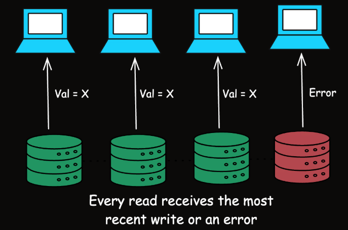
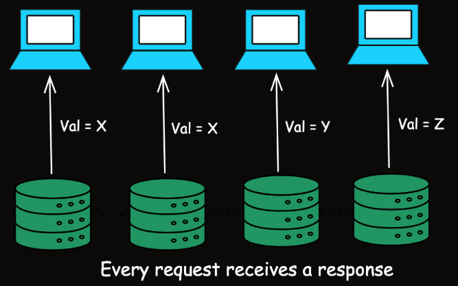
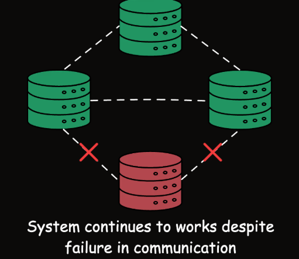

# 
 CAP Theorem

CAP stands for **Consistency**, **Availability**, and **Partition Tolerance**, and the theorem states that:
`It is impossible for a distributed data store to simultaneously provide all three guarantees.`

- **Consistency (C)**: Every read receives the most recent write or an error.
- **Availability (A)**: Every request (read or write) receives a non-error response, without guarantee that it contains the most recent write.
- **Partition Tolerance (P)**: The system continues to operate despite an arbitrary number of messages being dropped (or delayed) by the network between nodes.

---

## 1. Consistency

- Consistency ensures that every read receives the most recent write or an error. This means that all working nodes in a distributed system will return the same data at any given time.
- **In a consistent distributed system, if you write data to node A, a read operation from node B will immediately reflect the write operation on node A.**

- Consistency is crucial for applications where having the most up-to-date data is critical, such as financial systems, where a balance inquiry must reflect the most up-to-date state of an account.

## 2. Availability

- Availability guarantees that **every request. (read or write) receives a response**, without ensuring that it contains the most recent write.
- This means that the system remains operational and responsive, even if the response from some of the nodes don't reflect most up-to-date.
  
- Availability is important for applications that need to remain operational at all times, such as online retail systems.

## 3. Partition Tolerance

- **Partition Tolerance** means that the system continues to function despite network partitions where nodes cannot communicate with each other.
  
- **A `network partition` occurs when a network failure causes a distributed system to split into two or more groups of nodes that cannot communicate with each other.**
- `Partition Tolerance` is essential for distributed systems because network failures can and do happen. **A system that tolerates partitions can maintain across different network segements.**

---

## 
Trade-offs in the CAP Theorem

- The `CAP Theorem` states that a distributed system can provide only **two out of three** guarantees at the same time: `Consistency (C)`, `Availability (A)`, and `Partition Tolerance (P)`.

* `When a network partition occurs, a system must choose between maintaining consistency or availability.`
  

#### 1. **CP (Consistency and Partition Tolerance)**

- These systems prioritize consistency and can tolerate network partitions, but at the cost of availability.
- During a partition, the system may reject some requests to maintain consistency.
- When a partition occurs between nodes, the system may temporarily block requests to ensure that all nodes maintain consistent data.
- Traditional relational databases, such as MySQL and PostgreSQL, when configured for strong consistency, prioritize consistency over availability during network partitions.

**Banking systems typically prioritize consistency over availability since data accuracy is more critical than availability during network issues. Consider an ATM network for a bank. When you withdraw money, the system must ensure that your balance is updated accurately across all nodes (consistency) to prevent overdrafts or other errors.**

#### 2. **AP (Availability and Partition Tolerance)**

- These systems ensure availability and can tolerate network partitions, but at the cost of consistency.
- During a partition, different nodes may return different values for the same data.
- During a network partition, the system continues to serve requests, but some nodes may return stale or outdated data until the system eventually synchronizes.
- NoSQL databases like `Cassandra` and `DynamoDB` are designed to be `highly available & partition-tolerant`, potentially at the cost of strong consistency.

**Amazon's shopping cart system is designed to always accept items, prioritizing availability. When you add items to your Amazon cart, the action almost never fails, even during high traffic periods like Black Friday.**

#### 3. **CA (Consistency and Availability)**

- In the absence of partitions, a system can be both `consistent and available`. However, network partitions are inevitable in distributed systems,making this combination impractical.
  **Example Systems: Single-node databases can provide both consistency and availability but aren't partition-tolerant. In a distributed setting, this combination is theoretically impossible.**

#### **Example**

- We have a simple distributed system where S1 and S2 are two server. The two server can talk to each other. Here, System is partition tolerant. Here We will prove that system can be either consistent or available.
- Suppose there is a network failure and S1 and S2 cannot talk to each other. Now assume that the client makes a write to S1. The client then send a read to S2.
- Given S1 and S2 cannot talk, they have different view of the data.
- **If the system has to remain consistent, it must deny the request and thus give up on availability.**
- **If the system is available, then the system has to give up on consistency. This proves the CAP Theorem.**

[Study this Usecase](https://www.geeksforgeeks.org/system-design/cap-theorem-in-system-design/)
