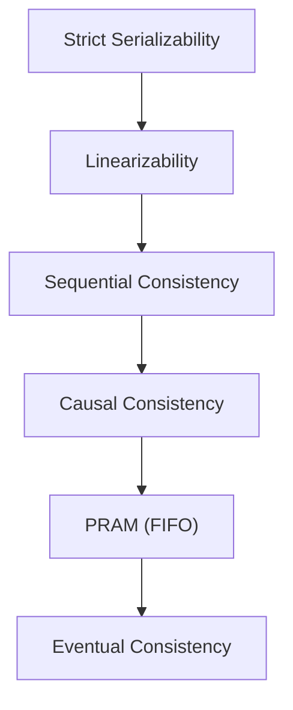

# <center> Consistency in System Design</center>

Consistency in system design refers all nodes or clients see the same state of data, even in the presence of concurrent operations, replication, and network delays.

- All users and system nodes read the same data value after an update.
- Prevents conflicts or mismatched data across different parts of the system.

<p>This distribution brings scalability and resilience, but it also introduces a fascinating challenge: how do we ensure that all users, and all parts of the system, see a coherent and correct view of the data, especially when things are changing rapidly?</p>

- On a single machine, consistency is simple. There is one copy of the data, and every read sees the most recent write. But the moment you replicate data across multiple machines, everything changes.

**In an online banking system, if money is transferred from one account to another, all servers should immediately show the updated balance so that users always see the correct information.**

## Challenges with maintaining Consistency

1. **Coordination Overhead**: Corrdination between distributed nodes is frequently necessary for consistency, which adds overhead as the system grows. System scalability may be impacted by synchronous coordination techniques that crate bottlenecks, such as distributed locking or two-phase commit protocols.
2. **Latency**: Latency may increase if strong consistency models need to await achnowledgements from several nodes before finishing a write operation. The user experience may suffer when this delay incrases as the system grows physically or in terms of the number of customers.
3. **Scalability Limitations:** Strict consistency becomes harder to scale as the number of nodes and data volume increases
3. **Operational Complexity**: Ensuring consistency often involves configuring and amanging complex distributed systems. Human error in configuring replication settings, consistency levels, or coordination mechanisms can lead to data inconsistencies or performance issues.
4. **Data Synchronization**: Strong synchronization methods are necessary to guarantee data consistency across many platforms and devices. Device-specific limitations, network latency, and asynchronous updates might make it more difficult to consistently synchronize data across platforms.
5. **Concurrency Control**: Coordinating concurrent access to shared data across different platforms while maintaining consistency requires careful design and implementation of concurrency control mechanisms.
6. **Conflict Resolution**: Weak consistency systems can face challenges handling conflicts from concurrent updates on shared data.
6. **Trade-offs with Performance and Latency**: Weak consistency improves scalability but can introduce delays due to synchronization and conflict resolution.

---

## Types of Consistency Patterns:
Consistency patterns refer to the ways in which data is stored and managed in a distributed system and how that data is made available to users and applications. There are three main types of consistency patterns:

**Each of these patterns has its own advantages and disadvantages, and the choice of which pattern to use will depend on the specific requirements of the application or system.**
#### 1. Strong Consistency
- In a strong consistency system, any updates to some data are immediately propagated to all locations. This ensures that all locations have the same version of the data, but it also means that the system is not highly available and has high latency.
- Requires synchronization across nodes to keep data aligned, which can increase latency and reduce overall system availability in distributed environments. 

**In a traditional SQL system with a single master and multiple replicas, writes go to the master and are synchronously replicated to all replicas. This ensures that reads from any replica return the latest data, maintaining a consistent view across all clients.**

- This pattern prioritizes accuracy and reliability, making sure that all users get the most up-to-date information without any differences.
- It ensures strong data integrity but can reduce performance in large distributed systems. It is best suited for critical applications like banking and healthcare where accuracy is essential.


Strong consistency patterns ensure that all replicas of data in a distributed system are updated synchronously and uniformly. Here are a few key patterns:

* **Strict Two-Phase Locking**: Uses a locking system so only one transaction accesses data at a time, ensuring serial execution and strong consistency.
* **Serializability**: Ensures transactions behave as if they were executed one after another, even when run concurrently, maintaining a consistent final state.
* **Quorum Consistency**: Requires a majority of replicas to agree on a value before committing, helping consistency but not always guaranteeing strict strong consistency.
* **Synchronous Replication**: Updates are written to all replicas at the same time before completion, ensuring all nodes stay fully consistent.

#### 2. Weak Consistency
- In a weakly consistent system, updates to the data may not be immediately propagated. This can lead to inconsistencies and conflicts between different versions of the data, but it also allows for high availability and low latency.
- Does not guarantee when or if all replicas will become consistent, allowing temporary or even prolonged inconsistencies across the system.
- Supports high availability and fast performance by permitting simultaneous updates without strict synchronization, but may lead to data discrepancies.

**In distributed caching systems like Redis or Memcached, data is stored in memory for fast access and updates are propagated asynchronously across nodes. This can cause temporary inconsistencies where clients may read outdated or different values until all nodes are synchronized.**


Weak consistency patterns prioritize availability and partition tolerance over strict data consistency in distributed systems. Here are some common weak consistency patterns:

* **Eventual Consistency**: Allows replicas of data to be inconsistent temporarily but ensures they will eventually converge to a consistent state without human intervention.
* **Read Your Writes Consistency**: Guarantees that a process will always see its own writes, even in a weakly consistent system. This ensures that users perceive consistency based on their own actions.
* **Monotonic Reads/Writes Consistency**: Monotonic Reads ensure a client never sees older values in subsequent reads, while Monotonic Writes guarantee that write operations from a client are applied in the same order.
* **Causal Consistency:** Maintains causal relationships between related operations, ensuring that causally related events are seen by all nodes in the same order.

#### 3. Eventual Consistency Patterns
Eventual consistency patterns allow temporary differences between replicas but ensure they eventually synchronize automatically without intervention. They are suitable for systems where real-time synchronization is not critical
- Data repair and periodic reconciliation help fix inconsistencies and align replicas over time.
- Causal tracking and conflict-free data types ensure updates are applied correctly without conflicts while maintaining performance balance


Eventual consistency patterns allow temporary inconsistencies in distributed systems but ensure all replicas eventually converge to a consistent state without intervention.

* **Read Repair**: Fixes stale or inconsistent data during read operations by updating it to the latest version, helping replicas converge over time.
* **Anti-Entropy Mechanisms**: Periodically compares replicas and reconciles differences to reduce inconsistencies and ensure eventual consistency.
* **Vector Clocks**: Track the order of updates across replicas to identify causality and resolve conflicts correctly.
* **Conflict-free Replicated Data Types (CRDTs)**: Enable concurrent updates without conflicts and ensure all replicas converge without coordination.

---
```ini
    [Strong Consistency Models]
    |--> [Linearizability]
    |--> [Sequential Consistency]
    |--> [Strict Serializability]

    [Weak Consistency Models]
    |--> [Eventual Consistency]
    |--> [Causal Consistency]
    |--> [PRAM Consistency<br/>(FIFO)]

    [Client-Centric Consistency Models]
    |--> [Read-Your-Writes]
    |--> [Monotonic Reads]
    |--> [Monotonic Writes]
    |--> [Writes-Follow-Reads]
```
* The relative strength from `strongest → weakest`


---
### 1.1 Linarizability 
* Every operation appears to happen instantaeously at some moment betwwen its start and end time. 
* Respects real-time ordering **If write A finishes before write B starts, everyone must see A before B**
* Expensive to implement & High Latency
Example: `Leader-based systems`, `Financial Systems`

### 1.2 Sequential Consistency
* All operations appear in some global order, but not necessarily real-time order.
```ini
Linearizability = global order + real time
Sequential consistency = global order only
```
* May vilate real-time expectations & Lower latency than linearizability.
Exmaple: `Replication Protocols`

### 1.3 Strict Serializability (Transactions)
* Transactions behave as if they were executed: `One at a time (serial)`, `In real-time order`
Example: `Distributed databases with strong ACID guarantees` [ACID](Atomicity, Consistency, Isolation, Durability)

### 2.1 Eventual Consistency
*  All replicas will eventually converge.
* Temporary inconsistency is allowed & No guarantee on read freshness
* `High Scalability`
Example: `Used in DNS`, `DynamoDB`

### 2.2 Causal Consistency
* Operations that are causally related must be seen in the same order. 
Example: `Collaborative Apps`

### 2.3 PRAM Consistency 
* Writes from a single client are seen by others in the order issued. 
* Per-client ordering only, No global ordering
```ini
Client 1: write(x=1) → write(x=2)
Others must see 1 before 2
```
### 3.1 Read-Your-Writes
* Once a client writes data, their future reads must reflect it. 

```ini
User updates profile name
Refresh page → must see new name
```

### 3.2  Monotonic Reads
Guarantee Once a client has seen a value, they will never see older data.

### 3.3 Monotonic Writes
Guarantee A client’s writes are applied in order.
```ini
Update email → update password
System must apply email change first
```
### 3.4 Writes-Follow-Reads
Guarantee A write performed after a read is guaranteed to be based on at least that read’s version.
```ini
Read balance = 100
Withdraw 20
Must apply withdrawal to ≥100
```
---
```ini
Use Case               → Consistency Priority          -> Recommended Model
--------------------------------------------------------------------------------------
Banking / Payments     → Correctness                   -> Linarizability/Strict Serializability
Distributed Locks      → Global Ordering               -> Linarizability
Social Media           → Availability & Causality      -> Eventual + Casual
Caches / CDN           → Performance                   -> Eventual Consistency
User Sessions          → User Experience               -> RYW + Monotonic Reads
Analytics              → Scalability                   -> Weak Consistency
```

**Always explain consistency choices in terms of trade-offs, not definitions.**