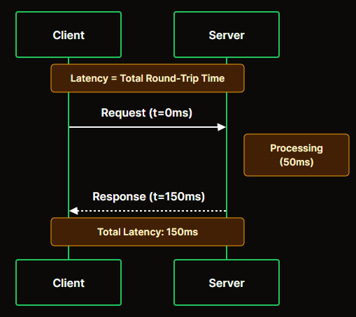
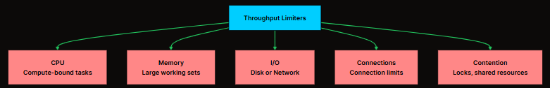

# <center>Latency vs Throughtput vs Bandwidth</center>

These concepts are often confused or used interchangeably, but they measure fundamentally different things. Understanding these metrics is crucial for:
```
Diagnosing performance bottlenecks
Making informed architectural decisions
Setting realistic expectations with stakeholders
Answering system design interview questions
```

```ini
These three terms quietly control how "fast" anything feels in computing, networking, or system design.
```
---
### The Highway Analogy
- **Bandwidth** is the number of lanes on the highway. More lanes mean more cars can travel simultaneously.
- **Throughput** is how many cars actually pass through per hour. This depends on traffic conditions, not just the number of lanes.
- **Latency** is the time it takes for a single car to travel from one city to the other.

A highway might have 4 lanes (high bandwidth), but if there is an accident, only 100 cars per hour pass through (low throughput). Meanwhile, each car might take 2 hours to complete the journey (high latency).

---
### 1. Latency
**Latency** is the time it takes for a single request to travel from source to destination and back. It measures delay.

* In networking, `latency` if often called `ROUND TRIP TIME`[RTT], the time from sending a request to receiving a response.


#### Components of Latency
Latency is not a single value. It is the sum of multiple delays. 


1. **Propagation delay:** Time for signals to travel through the medium. Light in fiber travels at ~200,000 km/s. A cross-Atlantic request (6,000 km) takes ~30ms just for propagation.
2. **Transmission delay:** Time to push bits onto the wire. Depends on packet size and link bandwidth.
3. **Processing delay:** Time for routers, load balancers, and servers to process packets.
4. **Queuing delay:** Time spent waiting in buffers when components are busy.

#### Measuring Latency
Latency is typically measured using **percentiles**

<table class="w-full border-collapse rounded-lg overflow-hidden shadow-sm border border-gray-200 dark:border-gray-700"><thead><tr class="bg-primary text-black"><th class="px-2 py-2 sm:px-3 sm:py-3 md:px-4 md:py-3 font-semibold text-xs sm:text-sm min-w-[80px] sm:min-w-[100px] border-b border-r border-gray-200/30 dark:border-gray-600/30 text-left"><span>Metric</span></th><th class="px-2 py-2 sm:px-3 sm:py-3 md:px-4 md:py-3 font-semibold text-xs sm:text-sm min-w-[80px] sm:min-w-[100px] border-b border-gray-200 dark:border-gray-700 text-left"><span>Description</span></th></tr></thead><tbody><tr class="hover:bg-primary/10 dark:hover:bg-primary/20 transition-colors bg-white dark:bg-black"><td class="px-2 py-1.5 sm:px-3 sm:py-2 md:px-4 md:py-2 text-xs sm:text-sm font-medium text-gray-800 dark:text-gray-200 min-w-[80px] sm:min-w-[100px] border-b border-r border-gray-100 dark:border-gray-700/50 text-left"><span><strong>p50 (median)</strong></span></td><td class="px-2 py-1.5 sm:px-3 sm:py-2 md:px-4 md:py-2 text-xs sm:text-sm font-medium text-gray-800 dark:text-gray-200 min-w-[80px] sm:min-w-[100px] border-b border-gray-100 dark:border-gray-700/50 text-left"><span>50% of requests are faster than this</span></td></tr><tr class="hover:bg-primary/10 dark:hover:bg-primary/20 transition-colors bg-white dark:bg-black"><td class="px-2 py-1.5 sm:px-3 sm:py-2 md:px-4 md:py-2 text-xs sm:text-sm font-medium text-gray-800 dark:text-gray-200 min-w-[80px] sm:min-w-[100px] border-b border-r border-gray-100 dark:border-gray-700/50 text-left"><span><strong>p95</strong></span></td><td class="px-2 py-1.5 sm:px-3 sm:py-2 md:px-4 md:py-2 text-xs sm:text-sm font-medium text-gray-800 dark:text-gray-200 min-w-[80px] sm:min-w-[100px] border-b border-gray-100 dark:border-gray-700/50 text-left"><span>95% of requests are faster than this</span></td></tr><tr class="hover:bg-primary/10 dark:hover:bg-primary/20 transition-colors bg-white dark:bg-black"><td class="px-2 py-1.5 sm:px-3 sm:py-2 md:px-4 md:py-2 text-xs sm:text-sm font-medium text-gray-800 dark:text-gray-200 min-w-[80px] sm:min-w-[100px] border-b border-r border-gray-100 dark:border-gray-700/50 text-left"><span><strong>p99</strong></span></td><td class="px-2 py-1.5 sm:px-3 sm:py-2 md:px-4 md:py-2 text-xs sm:text-sm font-medium text-gray-800 dark:text-gray-200 min-w-[80px] sm:min-w-[100px] border-b border-gray-100 dark:border-gray-700/50 text-left"><span>99% of requests are faster than this</span></td></tr><tr class="hover:bg-primary/10 dark:hover:bg-primary/20 transition-colors bg-white dark:bg-black"><td class="px-2 py-1.5 sm:px-3 sm:py-2 md:px-4 md:py-2 text-xs sm:text-sm font-medium text-gray-800 dark:text-gray-200 min-w-[80px] sm:min-w-[100px] border-r border-gray-100 dark:border-gray-700/50 text-left"><span><strong>p99.9</strong></span></td><td class="px-2 py-1.5 sm:px-3 sm:py-2 md:px-4 md:py-2 text-xs sm:text-sm font-medium text-gray-800 dark:text-gray-200 min-w-[80px] sm:min-w-[100px] text-left"><span>99.9% of requests are faster than this</span></td></tr></tbody></table>

Why percentiles matter: A system with 10ms average might have p99 of 500ms, meaning 1% of users experience terrible performance.

#### What Affects Latency ?

<table class="w-full border-collapse rounded-lg overflow-hidden shadow-sm border border-gray-200 dark:border-gray-700"><thead><tr class="bg-primary text-black"><th class="px-2 py-2 sm:px-3 sm:py-3 md:px-4 md:py-3 font-semibold text-xs sm:text-sm min-w-[80px] sm:min-w-[100px] border-b border-r border-gray-200/30 dark:border-gray-600/30 text-left"><span>Factor</span></th><th class="px-2 py-2 sm:px-3 sm:py-3 md:px-4 md:py-3 font-semibold text-xs sm:text-sm min-w-[80px] sm:min-w-[100px] border-b border-gray-200 dark:border-gray-700 text-left"><span>Impact</span></th></tr></thead><tbody><tr class="hover:bg-primary/10 dark:hover:bg-primary/20 transition-colors bg-white dark:bg-black"><td class="px-2 py-1.5 sm:px-3 sm:py-2 md:px-4 md:py-2 text-xs sm:text-sm font-medium text-gray-800 dark:text-gray-200 min-w-[80px] sm:min-w-[100px] border-b border-r border-gray-100 dark:border-gray-700/50 text-left"><span>Geographic distance</span></td><td class="px-2 py-1.5 sm:px-3 sm:py-2 md:px-4 md:py-2 text-xs sm:text-sm font-medium text-gray-800 dark:text-gray-200 min-w-[80px] sm:min-w-[100px] border-b border-gray-100 dark:border-gray-700/50 text-left"><span>More distance = more propagation delay</span></td></tr><tr class="hover:bg-primary/10 dark:hover:bg-primary/20 transition-colors bg-white dark:bg-black"><td class="px-2 py-1.5 sm:px-3 sm:py-2 md:px-4 md:py-2 text-xs sm:text-sm font-medium text-gray-800 dark:text-gray-200 min-w-[80px] sm:min-w-[100px] border-b border-r border-gray-100 dark:border-gray-700/50 text-left"><span>Network congestion</span></td><td class="px-2 py-1.5 sm:px-3 sm:py-2 md:px-4 md:py-2 text-xs sm:text-sm font-medium text-gray-800 dark:text-gray-200 min-w-[80px] sm:min-w-[100px] border-b border-gray-100 dark:border-gray-700/50 text-left"><span>Causes queuing delays</span></td></tr><tr class="hover:bg-primary/10 dark:hover:bg-primary/20 transition-colors bg-white dark:bg-black"><td class="px-2 py-1.5 sm:px-3 sm:py-2 md:px-4 md:py-2 text-xs sm:text-sm font-medium text-gray-800 dark:text-gray-200 min-w-[80px] sm:min-w-[100px] border-b border-r border-gray-100 dark:border-gray-700/50 text-left"><span>Server load</span></td><td class="px-2 py-1.5 sm:px-3 sm:py-2 md:px-4 md:py-2 text-xs sm:text-sm font-medium text-gray-800 dark:text-gray-200 min-w-[80px] sm:min-w-[100px] border-b border-gray-100 dark:border-gray-700/50 text-left"><span>Increases processing time</span></td></tr><tr class="hover:bg-primary/10 dark:hover:bg-primary/20 transition-colors bg-white dark:bg-black"><td class="px-2 py-1.5 sm:px-3 sm:py-2 md:px-4 md:py-2 text-xs sm:text-sm font-medium text-gray-800 dark:text-gray-200 min-w-[80px] sm:min-w-[100px] border-b border-r border-gray-100 dark:border-gray-700/50 text-left"><span>Database queries</span></td><td class="px-2 py-1.5 sm:px-3 sm:py-2 md:px-4 md:py-2 text-xs sm:text-sm font-medium text-gray-800 dark:text-gray-200 min-w-[80px] sm:min-w-[100px] border-b border-gray-100 dark:border-gray-700/50 text-left"><span>Slow queries add latency</span></td></tr><tr class="hover:bg-primary/10 dark:hover:bg-primary/20 transition-colors bg-white dark:bg-black"><td class="px-2 py-1.5 sm:px-3 sm:py-2 md:px-4 md:py-2 text-xs sm:text-sm font-medium text-gray-800 dark:text-gray-200 min-w-[80px] sm:min-w-[100px] border-b border-r border-gray-100 dark:border-gray-700/50 text-left"><span>DNS resolution</span></td><td class="px-2 py-1.5 sm:px-3 sm:py-2 md:px-4 md:py-2 text-xs sm:text-sm font-medium text-gray-800 dark:text-gray-200 min-w-[80px] sm:min-w-[100px] border-b border-gray-100 dark:border-gray-700/50 text-left"><span>Cold requests need DNS lookup</span></td></tr><tr class="hover:bg-primary/10 dark:hover:bg-primary/20 transition-colors bg-white dark:bg-black"><td class="px-2 py-1.5 sm:px-3 sm:py-2 md:px-4 md:py-2 text-xs sm:text-sm font-medium text-gray-800 dark:text-gray-200 min-w-[80px] sm:min-w-[100px] border-r border-gray-100 dark:border-gray-700/50 text-left"><span>TLS handshake</span></td><td class="px-2 py-1.5 sm:px-3 sm:py-2 md:px-4 md:py-2 text-xs sm:text-sm font-medium text-gray-800 dark:text-gray-200 min-w-[80px] sm:min-w-[100px] text-left"><span>Adds 1-2 round trips</span></td></tr></tbody></table>

#### Reducing Latency
* **Used CDNs**: Serve content from edge locations closer to users.
* **Caching**: Eliminate round trips by caching at multiple layers.
* **Connection Pooling**: Avoid repeated connection setup.
* **Database Optimization**: Add indexes, optimize queries
* **Geographic distribution**: Deploy servers closer to users
* **Protocol Optimization** use `HTTP/2`, `HTTP/3`

---
### 2. Throughput
**Throughput** is the amount of work completed per unit of time. It measures volume.
* For web systems, throughput is often expressed as `Requests per second (RPS)` or `transactions per second (TPS)`.

### Calculating Throughput
* For a single-threaded system:
```ini
Throughput = 1 / Latency

If latency = 10ms:
Throughput = 1 / 0.01s = 100 requests/second
```
* For a multi-threaded system:
```ini
Throughput = Concurrent Workers / Latency

If latency = 10ms and 50 workers:
Throughput = 50 / 0.01s = 5,000 requests/second
```

### What Limits Throughput ?
The bottleneck determines maximum throughput. **A system is only as fast as its slowest component.**


### Improving Throughput
* **Horizontal Scaling**: Add more servers
* **Vertical Scaling**: Add more CPU, memory
* **Async processing**: Do not block on slow operations
* **Batching**: Process multiple items together
* **Caching**: Reduce work by reusing results.
* **Load Balancing**: Distribute work evely.

---
### 3. Bandwidht
**Bandwidth** is the maximum rate at which data can be transferred. It means `CAPACITY`. 
* Bandwidth is typically expressed in `bits per second(bps)`: `Kbps, Mbps, Gpbs`

#### Types of Bandwidth

<table class="w-full border-collapse rounded-lg overflow-hidden shadow-sm border border-gray-200 dark:border-gray-700"><thead><tr class="bg-primary text-black"><th class="px-2 py-2 sm:px-3 sm:py-3 md:px-4 md:py-3 font-semibold text-xs sm:text-sm min-w-[80px] sm:min-w-[100px] border-b border-r border-gray-200/30 dark:border-gray-600/30 text-left"><span>Type</span></th><th class="px-2 py-2 sm:px-3 sm:py-3 md:px-4 md:py-3 font-semibold text-xs sm:text-sm min-w-[80px] sm:min-w-[100px] border-b border-gray-200 dark:border-gray-700 text-left"><span>Description</span></th></tr></thead><tbody><tr class="hover:bg-primary/10 dark:hover:bg-primary/20 transition-colors bg-white dark:bg-black"><td class="px-2 py-1.5 sm:px-3 sm:py-2 md:px-4 md:py-2 text-xs sm:text-sm font-medium text-gray-800 dark:text-gray-200 min-w-[80px] sm:min-w-[100px] border-b border-r border-gray-100 dark:border-gray-700/50 text-left"><span><strong>Network bandwidth</strong></span></td><td class="px-2 py-1.5 sm:px-3 sm:py-2 md:px-4 md:py-2 text-xs sm:text-sm font-medium text-gray-800 dark:text-gray-200 min-w-[80px] sm:min-w-[100px] border-b border-gray-100 dark:border-gray-700/50 text-left"><span>Capacity of network links (1 Gbps Ethernet)</span></td></tr><tr class="hover:bg-primary/10 dark:hover:bg-primary/20 transition-colors bg-white dark:bg-black"><td class="px-2 py-1.5 sm:px-3 sm:py-2 md:px-4 md:py-2 text-xs sm:text-sm font-medium text-gray-800 dark:text-gray-200 min-w-[80px] sm:min-w-[100px] border-b border-r border-gray-100 dark:border-gray-700/50 text-left"><span><strong>Memory bandwidth</strong></span></td><td class="px-2 py-1.5 sm:px-3 sm:py-2 md:px-4 md:py-2 text-xs sm:text-sm font-medium text-gray-800 dark:text-gray-200 min-w-[80px] sm:min-w-[100px] border-b border-gray-100 dark:border-gray-700/50 text-left"><span>Rate of data transfer to/from RAM (DDR4: ~25 GB/s)</span></td></tr><tr class="hover:bg-primary/10 dark:hover:bg-primary/20 transition-colors bg-white dark:bg-black"><td class="px-2 py-1.5 sm:px-3 sm:py-2 md:px-4 md:py-2 text-xs sm:text-sm font-medium text-gray-800 dark:text-gray-200 min-w-[80px] sm:min-w-[100px] border-b border-r border-gray-100 dark:border-gray-700/50 text-left"><span><strong>Disk bandwidth</strong></span></td><td class="px-2 py-1.5 sm:px-3 sm:py-2 md:px-4 md:py-2 text-xs sm:text-sm font-medium text-gray-800 dark:text-gray-200 min-w-[80px] sm:min-w-[100px] border-b border-gray-100 dark:border-gray-700/50 text-left"><span>Read/write speed of storage (SSD: ~500 MB/s)</span></td></tr><tr class="hover:bg-primary/10 dark:hover:bg-primary/20 transition-colors bg-white dark:bg-black"><td class="px-2 py-1.5 sm:px-3 sm:py-2 md:px-4 md:py-2 text-xs sm:text-sm font-medium text-gray-800 dark:text-gray-200 min-w-[80px] sm:min-w-[100px] border-r border-gray-100 dark:border-gray-700/50 text-left"><span><strong>Bus bandwidth</strong></span></td><td class="px-2 py-1.5 sm:px-3 sm:py-2 md:px-4 md:py-2 text-xs sm:text-sm font-medium text-gray-800 dark:text-gray-200 min-w-[80px] sm:min-w-[100px] text-left"><span>Internal data transfer rate (PCIe 4.0: ~64 GB/s)</span></td></tr></tbody></table>

#### Bandwidth-Delay Product
`BDP` represents how much data can be "In-Flight" at any moment.

`Bandwidth-Delay Product (BDP) = Bandwidth × Latency`

```ini
bps: bits per second
B/s: Bytes per second
1 byte = 8 bits

Bandwidth: 1 Gbps = 125 MB/s
Latency: 100ms (coast-to-coast US)

BDP: 125 MB/s × 0.1s = 12.5 MB

This means 12.5 MB of data can be traveling through the pipe at any instant. 
If your TCP window size is smaller than BDP, you will not fully utilize available bandwidth.
```
---

### Throughput vs Bandwidth

* `Bandwidth` is theoretical **maximum capacity**, while `throughput` is actual **achieved rate**.

<table class="w-full border-collapse rounded-lg overflow-hidden shadow-sm border border-gray-200 dark:border-gray-700"><thead><tr class="bg-primary text-black"><th class="px-2 py-2 sm:px-3 sm:py-3 md:px-4 md:py-3 font-semibold text-xs sm:text-sm min-w-[80px] sm:min-w-[100px] border-b border-r border-gray-200/30 dark:border-gray-600/30 text-left"><span>Metric</span></th><th class="px-2 py-2 sm:px-3 sm:py-3 md:px-4 md:py-3 font-semibold text-xs sm:text-sm min-w-[80px] sm:min-w-[100px] border-b border-r border-gray-200/30 dark:border-gray-600/30 text-left"><span>Definition</span></th><th class="px-2 py-2 sm:px-3 sm:py-3 md:px-4 md:py-3 font-semibold text-xs sm:text-sm min-w-[80px] sm:min-w-[100px] border-b border-gray-200 dark:border-gray-700 text-left"><span>Example</span></th></tr></thead><tbody><tr class="hover:bg-primary/10 dark:hover:bg-primary/20 transition-colors bg-white dark:bg-black"><td class="px-2 py-1.5 sm:px-3 sm:py-2 md:px-4 md:py-2 text-xs sm:text-sm font-medium text-gray-800 dark:text-gray-200 min-w-[80px] sm:min-w-[100px] border-b border-r border-gray-100 dark:border-gray-700/50 text-left"><span><strong>Bandwidth</strong></span></td><td class="px-2 py-1.5 sm:px-3 sm:py-2 md:px-4 md:py-2 text-xs sm:text-sm font-medium text-gray-800 dark:text-gray-200 min-w-[80px] sm:min-w-[100px] border-b border-r border-gray-100 dark:border-gray-700/50 text-left"><span>Maximum possible data transfer rate</span></td><td class="px-2 py-1.5 sm:px-3 sm:py-2 md:px-4 md:py-2 text-xs sm:text-sm font-medium text-gray-800 dark:text-gray-200 min-w-[80px] sm:min-w-[100px] border-b border-gray-100 dark:border-gray-700/50 text-left"><span>1 Gbps network link</span></td></tr><tr class="hover:bg-primary/10 dark:hover:bg-primary/20 transition-colors bg-white dark:bg-black"><td class="px-2 py-1.5 sm:px-3 sm:py-2 md:px-4 md:py-2 text-xs sm:text-sm font-medium text-gray-800 dark:text-gray-200 min-w-[80px] sm:min-w-[100px] border-r border-gray-100 dark:border-gray-700/50 text-left"><span><strong>Throughput</strong></span></td><td class="px-2 py-1.5 sm:px-3 sm:py-2 md:px-4 md:py-2 text-xs sm:text-sm font-medium text-gray-800 dark:text-gray-200 min-w-[80px] sm:min-w-[100px] border-r border-gray-100 dark:border-gray-700/50 text-left"><span>Actual data transfer achieved</span></td><td class="px-2 py-1.5 sm:px-3 sm:py-2 md:px-4 md:py-2 text-xs sm:text-sm font-medium text-gray-800 dark:text-gray-200 min-w-[80px] sm:min-w-[100px] text-left"><span>600 Mbps actual transfer</span></td></tr></tbody></table>

You can never have throughput higher than bandwidth, but throughput is almost always lower due to:
- Protocol overhead (header, ACK)
- Congestion and Packet Loss
- Processing limitations
- Inefficient resource utilization