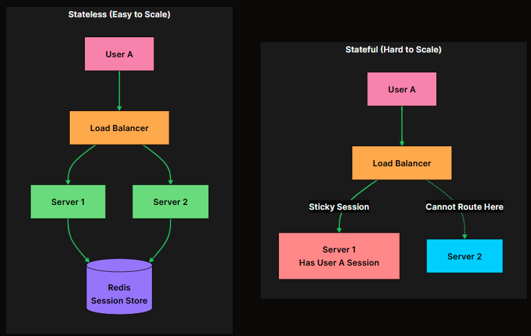
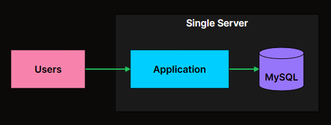
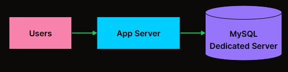
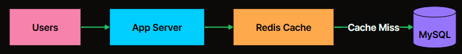
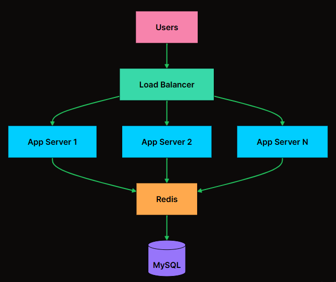
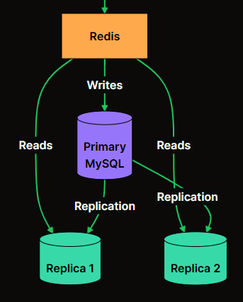
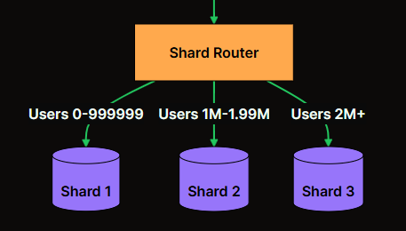

# <center> Performance vs Scalability </center>

Performance vs Scalability in System design explores how systems balance speed(`performance`) and ability to handle growth(`scalability`). 
`Imagine a race car (performance) and a bus (scalability). The car zooms quickly but can't carry many passengers, while the bus carries lots but moves slower.`

* Similarly, A system may be super fast but crash with too many users, or handle many users but slow down.
* Designing systems requires finding the right balance that is, fast enough for current needs, yet flexible to grow with demand. 

---

## 1. Performance
Performance in system design refers to how well a system executes tasks or processes within a given timeframe. It encompasses factors like `speed`, `responsiveness`, `throughput`, and `resource utilization`.  
* For instance, a high-perfromance system might process a large amount of data quickly, respond to user inputs rapidly, and efficiently utilize system resources such as `CPU, memory and network bandwidth`
* Performance optimization involves techniques such as `code optimization`, `caching`, `load balancing` and `hardware upgrades` to ensure that a system meets its performance requirements and delivers a smooth user experience.

### Performance Optimization Techniques
It involve various strategies aimed at improving the `speed`, `efficiency`, and `resource utilization` of a system.
##### <b>`Code Optimization`:</b> 
* Refining algorithms and code structures to minimize execution time and resource consumption.
* This can involve eliminating redundant operations, reducing algorithmic complexity, and optimizing loops and data structures.

##### <b>`Caching`:</b> 
* Storing frequently accessed data or computed results in fast-access memory `cache` to reduce the need for repeated computations or database queries.
* Caching can significantly improve response times for frequently requested data.

##### <b>`Load Balanacing`:</b>
* Distributing incoming requests or tasks evenly across multiple servers or resources to prevent overloading any single component.
* Load balancers can dynamically adjust resource allocation based on current demand to optimize performance.

##### <b>`Parallelism and concurrency`:</b>
* Leveraging multiple threads or processes to execute tasks simultaneously, thereby utilizing available resources more efficiently and reducing overall processing time.
* Techniques such as `parallel processing`, `asynchronous programming` and `multi-threading` can enhance system performance.

##### <b>`Database optimization`:</b>
* Optimizing database `queries`, `indexing`, and `schema` design to improve data retrieval speed and reduce latency.
* Techniques like `query optimization`, `index optimization`, and `denormalization` can enhance database performance.

##### <b>`Caching at various levels`:</b>
* Implementing caching mechanisms not only at the application level but also at the `database`, `server`, and `network levels` to reduce latency and improve responsiveness.
* This can include `browser caching`, `server-side caching`, and `content delivery network (CDN) caching`.

##### <b>`Resource pooling and reuse`:</b>
* Reusing `existing resources`, `connections`, or `objects` rather than creating new ones for each request, reducing overhead and improving efficiency.
Techniques like `connection pooling` in database connections or `object pooling` in object-oriented programming can help conserve resources.

---

## 2. Scalability
`Scalability` in system design refers to a system's ability to handle increasing amounts of work or users without compromising performance. It involves designing a system so that it can easily accommodate growth in terms of data volume, user traffic, or processing demands without significant changes to its architecture.
* `Horizontal Scaling` & `Vertical Scaling`
* Scalable systems can seamlessly expand by adding more resources or components, such as servers or databases, to distribute the workload efficiently.

### Measuring Scalability
Before scaling, you need to understand how to measure it. You cannot improve what you do not measure, and vague statements like "we need to scale" are useless without concrete numbers.

<table class="min-w-full border-collapse"><thead class="bg-primary [&amp;&gt;tr:hover]:bg-primary"><tr class="transition-colors"><th class="px-2 py-2 sm:px-3 sm:py-2 text-left text-xs sm:text-sm font-semibold text-black">Metric</th><th class="px-2 py-2 sm:px-3 sm:py-2 text-left text-xs sm:text-sm font-semibold text-black">Description</th><th class="px-2 py-2 sm:px-3 sm:py-2 text-left text-xs sm:text-sm font-semibold text-black">Example</th></tr></thead><tbody class="divide-y divide-border bg-white dark:bg-black [&amp;&gt;tr:hover]:bg-primary/10 dark:[&amp;&gt;tr:hover]:bg-primary/20"><tr class="transition-colors"><td class="px-2 py-1.5 sm:px-3 sm:py-2 text-xs sm:text-sm text-foreground"><strong class="font-semibold">Requests per second (RPS)</strong></td><td class="px-2 py-1.5 sm:px-3 sm:py-2 text-xs sm:text-sm text-foreground">Number of API calls the system handles</td><td class="px-2 py-1.5 sm:px-3 sm:py-2 text-xs sm:text-sm text-foreground">10,000 RPS</td></tr><tr class="transition-colors"><td class="px-2 py-1.5 sm:px-3 sm:py-2 text-xs sm:text-sm text-foreground"><strong class="font-semibold">Concurrent users</strong></td><td class="px-2 py-1.5 sm:px-3 sm:py-2 text-xs sm:text-sm text-foreground">Users active at the same time</td><td class="px-2 py-1.5 sm:px-3 sm:py-2 text-xs sm:text-sm text-foreground">50,000 concurrent</td></tr><tr class="transition-colors"><td class="px-2 py-1.5 sm:px-3 sm:py-2 text-xs sm:text-sm text-foreground"><strong class="font-semibold">Data volume</strong></td><td class="px-2 py-1.5 sm:px-3 sm:py-2 text-xs sm:text-sm text-foreground">Amount of data stored or processed</td><td class="px-2 py-1.5 sm:px-3 sm:py-2 text-xs sm:text-sm text-foreground">10 TB storage</td></tr><tr class="transition-colors"><td class="px-2 py-1.5 sm:px-3 sm:py-2 text-xs sm:text-sm text-foreground"><strong class="font-semibold">Throughput</strong></td><td class="px-2 py-1.5 sm:px-3 sm:py-2 text-xs sm:text-sm text-foreground">Data transferred per unit time</td><td class="px-2 py-1.5 sm:px-3 sm:py-2 text-xs sm:text-sm text-foreground">1 GB/s</td></tr><tr class="transition-colors"><td class="px-2 py-1.5 sm:px-3 sm:py-2 text-xs sm:text-sm text-foreground"><strong class="font-semibold">Query rate</strong></td><td class="px-2 py-1.5 sm:px-3 sm:py-2 text-xs sm:text-sm text-foreground">Database queries per second</td><td class="px-2 py-1.5 sm:px-3 sm:py-2 text-xs sm:text-sm text-foreground">50,000 QPS</td></tr><tr class="transition-colors"><td class="px-2 py-1.5 sm:px-3 sm:py-2 text-xs sm:text-sm text-foreground"><strong class="font-semibold">Message rate</strong></td><td class="px-2 py-1.5 sm:px-3 sm:py-2 text-xs sm:text-sm text-foreground">Messages processed through queues</td><td class="px-2 py-1.5 sm:px-3 sm:py-2 text-xs sm:text-sm text-foreground">100,000 msg/s</td></tr></tbody></table>

A system scales well if it maintains acceptable performance as load increases. 

<table class="min-w-full border-collapse"><thead class="bg-primary [&amp;&gt;tr:hover]:bg-primary"><tr class="transition-colors"><th class="px-2 py-2 sm:px-3 sm:py-2 text-left text-xs sm:text-sm font-semibold text-black">Load Increase</th><th class="px-2 py-2 sm:px-3 sm:py-2 text-left text-xs sm:text-sm font-semibold text-black">Response Time</th><th class="px-2 py-2 sm:px-3 sm:py-2 text-left text-xs sm:text-sm font-semibold text-black">Behavior</th><th class="px-2 py-2 sm:px-3 sm:py-2 text-left text-xs sm:text-sm font-semibold text-black">What It Means</th></tr></thead><tbody class="divide-y divide-border bg-white dark:bg-black [&amp;&gt;tr:hover]:bg-primary/10 dark:[&amp;&gt;tr:hover]:bg-primary/20"><tr class="transition-colors"><td class="px-2 py-1.5 sm:px-3 sm:py-2 text-xs sm:text-sm text-foreground">1x (baseline)</td><td class="px-2 py-1.5 sm:px-3 sm:py-2 text-xs sm:text-sm text-foreground">50ms</td><td class="px-2 py-1.5 sm:px-3 sm:py-2 text-xs sm:text-sm text-foreground">Baseline</td><td class="px-2 py-1.5 sm:px-3 sm:py-2 text-xs sm:text-sm text-foreground">Normal operation</td></tr><tr class="transition-colors"><td class="px-2 py-1.5 sm:px-3 sm:py-2 text-xs sm:text-sm text-foreground">2x</td><td class="px-2 py-1.5 sm:px-3 sm:py-2 text-xs sm:text-sm text-foreground">55ms</td><td class="px-2 py-1.5 sm:px-3 sm:py-2 text-xs sm:text-sm text-foreground">Excellent</td><td class="px-2 py-1.5 sm:px-3 sm:py-2 text-xs sm:text-sm text-foreground">Sublinear growth, caching working well</td></tr><tr class="transition-colors"><td class="px-2 py-1.5 sm:px-3 sm:py-2 text-xs sm:text-sm text-foreground">5x</td><td class="px-2 py-1.5 sm:px-3 sm:py-2 text-xs sm:text-sm text-foreground">70ms</td><td class="px-2 py-1.5 sm:px-3 sm:py-2 text-xs sm:text-sm text-foreground">Good</td><td class="px-2 py-1.5 sm:px-3 sm:py-2 text-xs sm:text-sm text-foreground">System handling load efficiently</td></tr><tr class="transition-colors"><td class="px-2 py-1.5 sm:px-3 sm:py-2 text-xs sm:text-sm text-foreground">10x</td><td class="px-2 py-1.5 sm:px-3 sm:py-2 text-xs sm:text-sm text-foreground">150ms</td><td class="px-2 py-1.5 sm:px-3 sm:py-2 text-xs sm:text-sm text-foreground">Acceptable</td><td class="px-2 py-1.5 sm:px-3 sm:py-2 text-xs sm:text-sm text-foreground">Linear degradation, predictable</td></tr><tr class="transition-colors"><td class="px-2 py-1.5 sm:px-3 sm:py-2 text-xs sm:text-sm text-foreground">10x</td><td class="px-2 py-1.5 sm:px-3 sm:py-2 text-xs sm:text-sm text-foreground">500ms</td><td class="px-2 py-1.5 sm:px-3 sm:py-2 text-xs sm:text-sm text-foreground">Concerning</td><td class="px-2 py-1.5 sm:px-3 sm:py-2 text-xs sm:text-sm text-foreground">Superlinear degradation, bottleneck forming</td></tr><tr class="transition-colors"><td class="px-2 py-1.5 sm:px-3 sm:py-2 text-xs sm:text-sm text-foreground">10x</td><td class="px-2 py-1.5 sm:px-3 sm:py-2 text-xs sm:text-sm text-foreground">Timeout</td><td class="px-2 py-1.5 sm:px-3 sm:py-2 text-xs sm:text-sm text-foreground">Critical</td><td class="px-2 py-1.5 sm:px-3 sm:py-2 text-xs sm:text-sm text-foreground">System at breaking point</td></tr></tbody></table>

### Stateless vs Stateful Services
For horizontal scaling to work effectively, services should be stateless. A stateless service does not store any session data locally. Each request can be handled by any server. 



* In the stateful model, once a user's session is stored on `Server 1`, all their requests must go to that same server. This creates hotspots and makes it risky to remove servers. 
* In the stateless model, session data lives in a shared store like Redis, so any server can handle any request. The load balancer has complete freedom to distribute traffic.

To make services stateless:
* Store session data in a shared cache (Redis, Memcached)
* Use tokens `(JWT)` instead of server-side sessions
* Store uploaded files in object storage (S3) instead of local disk

```ini
The Producer-Consumer pattern is a fundmental design pattern used in system design to manage the flow of data between independent components. 

Producers: Entities that data or tasks, placing them into a shared buffer or queue. 
Consumers: Entities that process the data or tasks, retrieving them from the shared buffer or queue. 
Queue:     A shared buffer or queue that holds the items produced until they are consumed by consumers
```

### Scaling Different Components
* A typical system is not monolithic. 
* It has multiple components, each with different scaling characteristics and challenges. 
* Understanding these differences is crucial because the scaling strategy that works for one tier often does not work for another.

1. Application servers are usually the easiest to scale horizontally, provided they are stateless:
2. Databases are typically the hardest to scale because they manage state. Unlike application servers, you cannot simply spin up more database instances and put a load balancer in front of them. `Data Consistency`, `durability` and `transaction isolation` all complicate matters. 
3. Caching reduces load on databases and improves respone times. A well-designed cache can handle 100x the throughput of a databas, makeing it essential for high-traffic systems.
4. Message queues are essential for scaling asynchronous workloads. They decouple producers from consumers, allowing each to scale independently, and they buffer traffic spikes so consumers can process at their own pace. 

---

# Performance Vs Scalability

<table><thead><tr><th style="text-align: center;"><b><strong>Performance</strong></b></th><th style="text-align: center;"><b><strong>Scalability</strong></b></th></tr></thead><tbody><tr><td style="text-align: center;"><span>Focuses on optimizing speed and responsiveness</span></td><td style="text-align: center;"><span>Focuses on handling increasing workload or users</span></td></tr><tr><td style="text-align: center;"><span>Achieve maximum efficiency for current tasks</span></td><td style="text-align: center;"><span>Accommodate growing demands without slowdown</span></td></tr><tr><td style="text-align: center;"><span>Speed, latency, throughput, resource utilization</span></td><td style="text-align: center;"><span>Capacity, availability, workload distribution</span></td></tr><tr><td style="text-align: center;"><span>Code optimization, caching, load balancing</span></td><td style="text-align: center;"><span>Horizontal scaling, stateless architecture, microservices</span></td></tr><tr><td style="text-align: center;"><span>Vertical scaling (scaling up)</span></td><td style="text-align: center;"><span>Horizontal scaling (scaling out)</span></td></tr><tr><td style="text-align: center;"><span>May degrade with increased workload</span></td><td style="text-align: center;"><span>Maintains performance with increased workload</span></td></tr><tr><td style="text-align: center;"><span>May require hardware upgrades for improvement</span></td><td style="text-align: center;"><span>Adds more instances/nodes for improvement</span></td></tr><tr><td style="text-align: center;"><span>Generally lower complexity</span></td><td style="text-align: center;"><span>Higher complexity due to distributed nature</span></td></tr><tr><td style="text-align: center;"><span>Example: High-performance gaming server</span></td><td style="text-align: center;"><span>Example: Scalable social media platform</span></td></tr></tbody></table>

---

### Choosing Between Performance and Scalability
Choosing between performance and scalability in system design depends on various factors, including the specific requirements, priorities, and constraints of the application or system being developed.

#### <b>Understand Requirements:</b>
* Determine whether the primary GOAl is to optimize for speed and responsiveness (performance) or to accommodate growing user demand (scalability). 

#### <b>Evaluate Use Case</b>
* If the application is likely to experience sudden spikes in traffic or rapidly increasing user numbers, scalability may be more criticaL.
* Conversely, if the system requires fast response times for real-time processing or low-latency interactions, perfromance may take precedence.

#### <b>Analyze Constraints:</b>
* Assess any `constraints or limitations`, such as `budget`, `hardware resources`, and `development timeline`.
* `Vertical scaling (performance optimization)` may require significant investments in hardware upgrades, while `horizontal scaling (scalability)` may involve more complex distributed architectures.

#### <b>Prioritize Goals:</b>
* For some applications, achieving maximum performance may be essential for user satisfaction, while others may prioritize accommodating a large user base.

#### <b>Consider Growth Potential:</b>
* Evaluate the growth potential of the application or system.
* If scalability is critical for accommodating future growth and expanding user base, prioritize `scalability-oriented design principles`.
* However, if the system's workload is expected to remain relatively stable, `performance optimization` may be more relevant.

#### <b>Balance Trade-offs:</b>
* Recognize that there may be trade-offs between `performance` and `scalability`.
* For example, optimizing for performance may involve `trade-offs` in terms of `scalability`, and vice versa.
**Strive to strike** the right balance based on the `specific requirements` and `constraints of the project`.

---

## Example: Scaling from 0 to million usersf

### Stage 1: Single Server (0-10K Users)


* Everything runs on one machine. The application and database share the same server. 
* Simple, cheap and perfect for few thousand users. There is no distribueted system complixity, no network latency. 
* The bottleneck emerges when the application and database start competing for CPU and MEMORY on the same machine. 

### Stage 2: Separate Database (10K - 100K Users)


* The first scaling move is usually separating the database onto its own machine. Now each component can be tuned independently. 
* You can give the database server more RAM for caching, while the app server gets more CPU for request processing. 
* The bootleneck shifts to the database. As user counts grow, the datbase handles more queries, and read operations start slowing down. 

### Stage 3: Add Caching (100K - 500K Users)


* Adding a cache layer dramatically reduces database load. `Hot data`, things like user profies, recent posts, and session data, gets served from memory. 
* Redis can handle hundreds of thousands of reads per second, far more than MySQL. 
* **With Good Caching Strategy, 80-90% of reads never hit the database**
* The bottleneck is not the single app server. It cannot handle the incoming request volume. 

### Stage 4: Multiple App Servers (500K - 2M users)


* This is where horizontal scaling begins. A load balancer distributes traffic across multiple app servers. Each server is stateless, storing no session data locally. 
* The Redis cache servers as the shared session store. 
* Adding more app servers is now trivial. Need more capacity? Spin up another server. Traffic spike during peak hours? Auto-scaling adds servers automatically.
* The bottleneck shifts back to the database. With more app servers generating more queries, the single MySQL instance becomes overwhelmed. 

### Stage 5: Read Replicas (2M - 10M users)


* Most Applications are read-heavy, with reads outnumbering writes by 10:1 or more. 
* `Read Replcias` take advantage of this pattern. The primary database handles all writes, while replcias serve read queries. This multiplies read capacity without changing the application much. 
* The trade-off is `replciation lag`. Replicas may be a few milliseconds behind the primary, so recently written data might not be immediately visible on reads. 
* The bottleneck becomes write throughput. One primary database can only handle so many writes per second. 

### Stage 6: Sharding (10M+ users)


* Sharding is the final frontier of relational database scaling. Data is partitioned across multiple databases based on a shard key, typically user ID. Each shard handles a subset of users, distributing both read and write load.
* This is powerful but comes with significant complexity. Cross-shard queries become expensive or impossible. Rebalancing shards when they grow unevenly is operationally challenging.