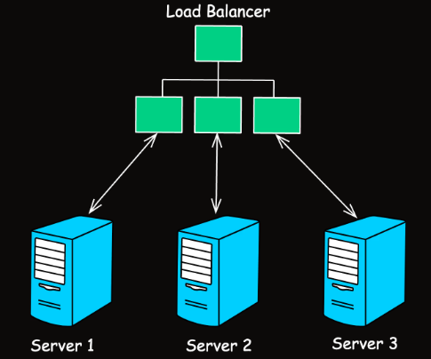
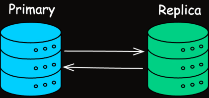
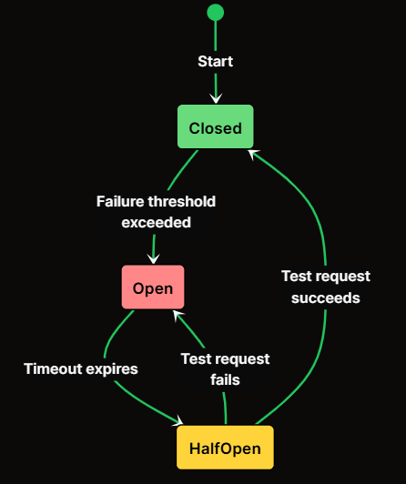
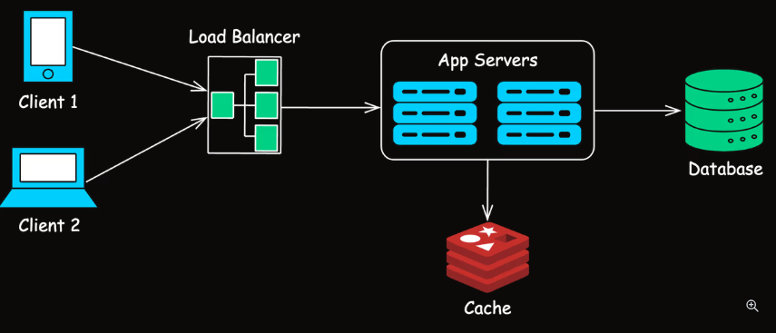

# <center> Reliability </center>

A reliable system performs its intended function correctly and consistently, even in the face of faults. While availability asks "Is the system up?", reliability asks "Is the system doing what it should?"

```ini
Consider a payment system that is always available but occasionally charges customers twice. Or a messaging app that delivers messages out of order.

These systems are available, but they are not reliable. And unreliable systems destroy user trust faster than unavailable ones.
```
**Reliability is the probability that a system will perform its intended function correctly over a given period of time, under specified conditions.**
1. CORRECTLY means producing the right output, not just any output.
2. OVER a GIVEN PERIOD means reliability is measured over time, not at a single instant. 
3. UNDER SPECIFIED CONDITIONS means we define what normal operation looks like.

`An available system responds. A reliable system responds correctly. You want both, but they are distinct`

<table class="min-w-full border-collapse"><thead class="bg-primary [&amp;&gt;tr:hover]:bg-primary"><tr class="transition-colors"><th class="px-2 py-2 sm:px-3 sm:py-2 text-left text-xs sm:text-sm font-semibold text-black">Concept</th><th class="px-2 py-2 sm:px-3 sm:py-2 text-left text-xs sm:text-sm font-semibold text-black">Question It Answers</th><th class="px-2 py-2 sm:px-3 sm:py-2 text-left text-xs sm:text-sm font-semibold text-black">Example</th></tr></thead><tbody class="divide-y divide-border bg-white dark:bg-black [&amp;&gt;tr:hover]:bg-primary/10 dark:[&amp;&gt;tr:hover]:bg-primary/20"><tr class="transition-colors"><td class="px-2 py-1.5 sm:px-3 sm:py-2 text-xs sm:text-sm text-foreground"><strong class="font-semibold">Availability</strong></td><td class="px-2 py-1.5 sm:px-3 sm:py-2 text-xs sm:text-sm text-foreground">Is the system responding?</td><td class="px-2 py-1.5 sm:px-3 sm:py-2 text-xs sm:text-sm text-foreground">System returns HTTP 200</td></tr><tr class="transition-colors"><td class="px-2 py-1.5 sm:px-3 sm:py-2 text-xs sm:text-sm text-foreground"><strong class="font-semibold">Reliability</strong></td><td class="px-2 py-1.5 sm:px-3 sm:py-2 text-xs sm:text-sm text-foreground">Is the response correct?</td><td class="px-2 py-1.5 sm:px-3 sm:py-2 text-xs sm:text-sm text-foreground">The balance returned is accurate</td></tr><tr class="transition-colors"><td class="px-2 py-1.5 sm:px-3 sm:py-2 text-xs sm:text-sm text-foreground"><strong class="font-semibold">Fault Tolerance</strong></td><td class="px-2 py-1.5 sm:px-3 sm:py-2 text-xs sm:text-sm text-foreground">Does it keep working when components fail?</td><td class="px-2 py-1.5 sm:px-3 sm:py-2 text-xs sm:text-sm text-foreground">Works with one database replica down</td></tr><tr class="transition-colors"><td class="px-2 py-1.5 sm:px-3 sm:py-2 text-xs sm:text-sm text-foreground"><strong class="font-semibold">Durability</strong></td><td class="px-2 py-1.5 sm:px-3 sm:py-2 text-xs sm:text-sm text-foreground">Is data preserved despite failures?</td><td class="px-2 py-1.5 sm:px-3 sm:py-2 text-xs sm:text-sm text-foreground">Data survives disk failure</td></tr></tbody></table>

## Ways to Measuring Reliability

#### **1. Mean Time Between Failures (MTBF)**
* `MTBF` measures the average time between failures. A higher MTBF means failures are less frequent. 
<code>MTBF = Total Operating Time / Number of Failures</code>

```ini
  - System ran for 10,000 hours
  - Experienced 5 failures
  - MTBF = 10,000 / 5 = 2,000 hours
An MTBF of 2,000 hours means you can expect one failure roughly every 83 days.
```

#### **2. Mean Time to Recovery (MTTR)**
* `MTTR` measures how long it takes to restore the system after a failure. A lower MTTR means faster recovery.
<code>MTTR = Total Downtime / Number of Failures</code>

```ini
  - 5 failures occurred
  - Total repair time: 10 hours
  - MTTR = 10 / 5 = 2 hours per failure
```
MTTR includes `detection time`, `diagnosis time`, `repair time` and `verification time`. 
* Reducing MTTR often has more impact than reducing failure rate. If you cannot prevent failures, at least recover quickly. 

#### **3. Error Rate**
* Percentage of requests that result in errors.
<code>Error Rate = Failed Requests / Total Requests × 100%</code>

<table class="w-full border-collapse rounded-lg overflow-hidden shadow-sm border border-gray-200 dark:border-gray-700"><thead><tr class="bg-primary text-black"><th class="px-2 py-2 sm:px-3 sm:py-3 md:px-4 md:py-3 font-semibold text-xs sm:text-sm min-w-[80px] sm:min-w-[100px] border-b border-r border-gray-200/30 dark:border-gray-600/30 text-left"><span>System Type</span></th><th class="px-2 py-2 sm:px-3 sm:py-3 md:px-4 md:py-3 font-semibold text-xs sm:text-sm min-w-[80px] sm:min-w-[100px] border-b border-r border-gray-200/30 dark:border-gray-600/30 text-left"><span>Target Error Rate</span></th><th class="px-2 py-2 sm:px-3 sm:py-3 md:px-4 md:py-3 font-semibold text-xs sm:text-sm min-w-[80px] sm:min-w-[100px] border-b border-gray-200 dark:border-gray-700 text-left"><span>Meaning</span></th></tr></thead><tbody><tr class="hover:bg-primary/10 dark:hover:bg-primary/20 transition-colors bg-white dark:bg-black"><td class="px-2 py-1.5 sm:px-3 sm:py-2 md:px-4 md:py-2 text-xs sm:text-sm font-medium text-gray-800 dark:text-gray-200 min-w-[80px] sm:min-w-[100px] border-b border-r border-gray-100 dark:border-gray-700/50 text-left"><span>Critical systems</span></td><td class="px-2 py-1.5 sm:px-3 sm:py-2 md:px-4 md:py-2 text-xs sm:text-sm font-medium text-gray-800 dark:text-gray-200 min-w-[80px] sm:min-w-[100px] border-b border-r border-gray-100 dark:border-gray-700/50 text-left"><span>&lt; 0.01%</span></td><td class="px-2 py-1.5 sm:px-3 sm:py-2 md:px-4 md:py-2 text-xs sm:text-sm font-medium text-gray-800 dark:text-gray-200 min-w-[80px] sm:min-w-[100px] border-b border-gray-100 dark:border-gray-700/50 text-left"><span>1 in 10,000 requests fails</span></td></tr><tr class="hover:bg-primary/10 dark:hover:bg-primary/20 transition-colors bg-white dark:bg-black"><td class="px-2 py-1.5 sm:px-3 sm:py-2 md:px-4 md:py-2 text-xs sm:text-sm font-medium text-gray-800 dark:text-gray-200 min-w-[80px] sm:min-w-[100px] border-b border-r border-gray-100 dark:border-gray-700/50 text-left"><span>Standard systems</span></td><td class="px-2 py-1.5 sm:px-3 sm:py-2 md:px-4 md:py-2 text-xs sm:text-sm font-medium text-gray-800 dark:text-gray-200 min-w-[80px] sm:min-w-[100px] border-b border-r border-gray-100 dark:border-gray-700/50 text-left"><span>&lt; 0.1%</span></td><td class="px-2 py-1.5 sm:px-3 sm:py-2 md:px-4 md:py-2 text-xs sm:text-sm font-medium text-gray-800 dark:text-gray-200 min-w-[80px] sm:min-w-[100px] border-b border-gray-100 dark:border-gray-700/50 text-left"><span>1 in 1,000 requests fails</span></td></tr><tr class="hover:bg-primary/10 dark:hover:bg-primary/20 transition-colors bg-white dark:bg-black"><td class="px-2 py-1.5 sm:px-3 sm:py-2 md:px-4 md:py-2 text-xs sm:text-sm font-medium text-gray-800 dark:text-gray-200 min-w-[80px] sm:min-w-[100px] border-r border-gray-100 dark:border-gray-700/50 text-left"><span>Tolerant systems</span></td><td class="px-2 py-1.5 sm:px-3 sm:py-2 md:px-4 md:py-2 text-xs sm:text-sm font-medium text-gray-800 dark:text-gray-200 min-w-[80px] sm:min-w-[100px] border-r border-gray-100 dark:border-gray-700/50 text-left"><span>&lt; 1%</span></td><td class="px-2 py-1.5 sm:px-3 sm:py-2 md:px-4 md:py-2 text-xs sm:text-sm font-medium text-gray-800 dark:text-gray-200 min-w-[80px] sm:min-w-[100px] text-left"><span>1 in 100 requests fails</span></td></tr></tbody></table>

#### **4. Data Correctness**
* Percentage of responses that contain correct data. 
<code>Correctness = Correct Responses / Total Responses × 100%</code>
A system can have 99.99% availability and 0.01% error rate, but if 1% of successful responses contain wrong data, you have a reliability problem. Users received a response, it just was not the right one.

---

## Why Systems Become Unreliable
1. Hardware failures
2. Software Bugs
3. Configuration Errors
4. Human Error
5. Overload & Cascading Failures
6. `Single Point of Failure (SPOF)`: If a critical component fails and no backup is available, the entire system may stop functioning.

Systems that work perfectly under normal load can fail catastrophically when overloaded. When one component slows down, requests queue up, timeouts fire, retries multiply the load, and the problem cascades.

---

## Key Principles of Reliable Systems

#### **1. Redundancy**
Redundancy means having backup components ready to take over if one part fails. This could involve multiple servers, duplicate network paths, or backup databases. 

#### **2. Failover Mechanisms**
Failover is the process by which a system automatically switches to a redundant or standby component when a failure is detected. This ensures continuous operation without noticeable disruption to users.

#### **3. Load Balancing**
Load balancing distributes incoming traffic across multiple servers. This not only improves performance but also prevents any single server from becoming a single point of failure. 

#### **4. Monitoring & Alerting**
A reliable system is constantly monitored. Tools and dashboards track system health and performance, while alerting mechanisms notify engineers of issues before they escalate into major problems.

#### **5. Graceful Degradation**
Even when parts of the system fail, a well-designed system can still provide core functionality rather than going completely offline. This concept is known as graceful degradation.

---

## Techniques to Enhance Reliability

#### **1. Redundant Architectures**
The most fundamental reliabilty technique is having more components than you need. If one fails, others continue operating. 

If one server fails, the load balancer automatically routes traffic to the remaining servers. 

#### **2. Data Replication**
Ensure your data is not stored in a single location. Use data replication strategies across multiple databases or data centers. 

If one database fails, the system can still access a copy from another location. 

#### **3. Graceful Degradation**
When parts of the system fail, graceful degradation keeps the core functionality working. Instead of complete failure, the system provides reduced service.


```ini
Consider an e-commerce site:

Full Service: Personalized recommendations, real-time inventory, all payment options
Partial Service: Generic recommendations, cached inventory, primary payment options
Core only: Browser products, checkout with basic payment
Emergency Mode: Display cached product pages, accept orders for later processing. 
```

#### **4. Circuit Breakers**
In a microservice architecture, one service failing can cascade failures throughout the system. `Circuit Breakers` detect when a service is failing and temporarily cut off requests to prevent overload, allowing the system to recover gracefully. 



<p>In the **closed state**, requests apass through normally. Failures are counted. When failures exceed a threshold (5 failures in 30 seconds), the circuits opens</p>
<p>IN the **open state**, requests fail immediately without calling the dependency. This prevents wasting resources and allows the dependency time to recover.</p>
<p>After a timeout, the circuit moves to **half-open**. A limited number of test requests are allowed through. If they succed, the circuit closes. If they fail, it opens again.</p>

---

# <center> Single Point of Failure (SPOF)</center>
A **Single Point of Failure (SPOF)** is a component in your system whose failure can bring down the entire system, causing downtime, potential data loss, and unhappy users. 
* By minimizing the number of SPOFs, you can imporve the overall **reliability** and **availability** of the system. 

## Understanding SPOFs

Imagine a bridge that connects two cities. Its the only route between them and it collapses, the cities are cut off. In this scenario, the bridge is the single point of failure.

* This system has various single points of failures in it:


Clients send requests to the load balancer, which distributes traffic across the two application servers. The application servers retrieve data from the cache if it's available, or from the database if it's not.

<p>IN this design, the potential SPOFs are:</p>

* **LoadBalancer**: If there is only one load balancer instance and it fails, all traffic will stop, preventing clients from reaching the applicaitons ervers. To avoid this, we can add a standby load balancer that cna takeover if the primary one fails.
* **Database**: With only one database, its failure would result in data being unavailable, causing downtime and potential data loss. We can avoid this by replicating the data across multiple servers and locations. 
* **Cache Server**: The cache server is not a true **SPOF** in the sense that it doesn't bring the entire system down. When its down, every request hits the database, incrasing load and slowing response times.
* The **application servers** are not SPOFs since you have two of them. If one fails, the other can still handle requests, assuming the load balancer can distribute traffic effectively.

---
## How to Identify `SPOF` in a Distributed System

#### **1. Map out the Architecture**
<p>Create a detailed diagram of your system's architecutre. Identify all components, services, and theire dependencies.</p>
* Look for components that do not have backups or redundancy.

#### **2. Dependency Analysis**
* Analyze dependencies between different services and components. 
* If a single component is required by multiple services and does not have a backup, it is likely a SPOF.

#### **3. Failure Impact Assessment**
* Assess the impact of failure fo reach component. 
* Perform a `what if` analysis for each component. 

```ini
“What if this component fails?” If the answer is that the system would stop functioning or degrade significantly, then that component is a SPOF.
```

#### **4. Chaos Testing**
**Chaos Testing, also known as Chaos Engineering, is the practice of intentionally injecting failures and disruptions into a system to understand how it behaves under stress and to ensure it can recover gracefully.**
* Chaos Engineering often involves the use of tools like `choas monkey` that randomly shut down instances or services to observe how the rest of the system responds.
---
## Stategies to Avoid Single Points of Failures

#### 1. Redundancy
The most common way to avoid SPOFs is by adding **redundancy**. Redundancy means having multiple components that can take over if one fails.
* Redudndant components can be either **active** or **passive**.
#### 2. Load Balancing
Load balancers distribute incoming traffic across multiple servers, ensuring no single server be comes overwhelmed. 
* To prevent the single load balancer becoming a single point of failure, we can add a standby load balancer which can take over if the primary one fails.
#### 3. Data Replicaiton
Data replicaiton invovles copying data drom one location to anothe rto ensure that data is available even if one location fails. 
* `SYNCHRONOUS REPLICATION`: Data is replicated in real-time to ensure consistency across locations. 
* `ASYNCHRONOUS REPLICATION`: Data is replicated with a delay, which can be more efficient but may result in slight data inconsistencies.
#### 4. Geographic Distribution
Distributing services and data across multiple geographic locations mitigates the risk of regional failures. 
* **content delivery networks CDN** to distribute content globally, improving availability and reducing latency. 
* **Multi-Region Cloud Deployments** to ensure that an outage in one region does not disrupt your entire application.

---
# <center> Maintainability </center>