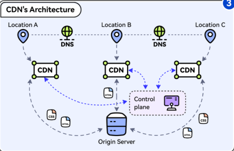

# 
Content Delivery Network

A content delivery network (CDN) is a *globally distributed network of proxy servers*, serving content from locations closer to the user. 
- Generally, *static* files such as `HTML/CSS/JS`, `photos`, and `videos` are served from CDN, although some CDNs such as Amazon's CloudFront support *dynamic* content. 

> When a user requests a web page, the content is delivered from the nearest CDN server rather than the origin server

## The Architecture of CDN
1. **Origin Server**: This is the primary source of content.
2. **Edge Servers/Geographically distributed Servers**: They cache and server content to the users and are distributed across the world.
3. **DNS**: The DNS resolves the domain name to the IP address of the nearest edge server
4. **Control Plane**: Responsible for configuring and managing the edge servers.

---

## How Does CDN Work ?

* Bob types in `www.myshop.com` in the browser. The browser looks up the domain name in the local DNS cache.
* If the domain name does not exist in the local DNS cache, the browser goes to the DNS resolver to resolve the name. The DNS resolver usually sits in the **Internet Service Provider** (ISP).
* The DNS resolver recursively resolves the domain name. Finally, it asks the **authoritative name server** to resolve the domain name.
* If we don’t use CDN, the authoritative name server returns the IP address for `www.myshop.com`. But with CDN, the authoritative name server has an alias `(CNAME)` pointing to `www.myshop.cdn.com` (the domain name of the CDN server).
* The DNS resolver asks the authoritative name server to `resolve www.myshop.cdn.com`. The authoritative name server returns the domain name for the load balancer of CDN `www.myshop.lb.com`.
* The DNS resolver asks the **CDN load balancer** to resolve `www.myshop.lb.com`. The load balancer chooses an optimal CDN edge server based on the user’s `IP address`, user’s `ISP`, the `content requested`, and the `server load`.
* The CDN load balancer returns the CDN edge server’s IP address for `www.myshop.lb.com`.
* Now we finally get the actual IP address to visit. The DNS resolver returns the IP address to the browser. The browser visits the CDN edge server to load the content.

* There are two types of contents cached on the CDN servers: `static content` & `dynamic content`. The former contains static pages, pictures, videos; the latter one includes results of edge computing.
* If the edge CDN server cache doesn’t contain the content, it goes upward to the regional CDN server. If the content is still not found, it will go upward to the central CDN server, or even go to the origin - the London web server. 
* The next time a user requests the same content, the request is redirected to the nearest edge server, which can deliver the content directly from its cache, improving performance and reducing latency.
* **This is called the `CDN distribution Network`, where the servers are deployed geographically**

---

## Types of CDN

CDNs are categorized based on their architecture, functionality, and use cases. Below are the primary types of CDNs:

#### 1. PUSH CDNs
Push CDNs require the content provider to upload or "push" content to the CDN servers. The CDN stores this content and serves it to users upon request. This type is ideal for static content like images, videos, and files that do not change frequently.

You can configure when content expires and when it is updated. Content is uploaded only when it is new or changed, minimizing traffic, but maximizing storage.

#### 2. PUll CDNs
Pull CDNs fetch content from the origin server when a user requests it for the first time. The content is then cached on the CDN's edge servers for subsequent requests. This reduces the load on the origin server and improves performance.

You leave the content on your server and rewrite URLs to point to the CDN. This results in a slower request until the content is cached on the CDN.

A `time-to-live (TTL)` determines how long content is cached. Pull CDNs minimize storage space on the CDN, but can create redundant traffic if files expire and are pulled before they have actually changed.

#### 3. Streaming CDNs
Streaming CDNs are optimized for delivering audio and video content in real-time. They ensure smooth playback by reducing buffering and latency, making them suitable for live streaming and on-demand video services.
- Example: Youtube, 

#### 4. Private CDN
This type of CDN is designed to serve the specific needs of an individual organization. Unlike a traditional CDN, a Private CDN is typically owned and managed by the organization rather than provided by a third-party vendor. This CDN is useful in Securing Content Delivery, Performance Optimization, and Compliance & governance.

---

## Disadvantage(s): CDN

- CDN costs could be significant depending on traffic, although this should be weighed with additional costs you would incur not using a CDN.
- Content might be [stale](no_longer_fresh) if it is updated before the TTL expires it.
- CDNs require changing URLs for static content to point to the CDN.

---
# Example: CloudFlare

The CDN market is expected to reach nearly $38 billion by 2028. Companies like Akamai, Cloudflare, and Amazon CloudFront are investing heavily in this area.

Cloudflare is a company specializing in internet infrastructure services designed to improve the performance, security, and reliability of websites and web applications.

- At its core, Cloudflare operates as content delivery network (CDN) and internet security service designed to improve your website’s speed, protect it from cyber threats, and ensure uptime even during high traffic periods. It is beneficial for running an e-commerce store, blog, or corporate website, Cloudflare helps optimize loading speeds and block malicious activity like DDoS attacks, all without compromising user experience.

* `Content Delivery Network (CDN)`: Distributes content across global servers to reduce latency and improve load times.
* `DDoS Protection`: Mitigates distributed denial-of-service attacks by absorbing and filtering malicious traffic.
* `Web Application Firewall (WAF)`: Protects against common web exploits like SQL injection and cross-site scripting.
* `SSL/TLS Encryption`: Provides free SSL certificates to secure data transmission.
* `DNS Services`: Manages domain name system records and offers advanced features like DNSSEC.
* `Load Balancing`: Distributes traffic across multiple servers to prevent overload.
* `Caching`: Stores frequently access content at edge locations for faster delivery.
* `Bot Management`: Identifies and mitigates traffic from malicious bots.
* `Developer Platform`: Tools like Cloudflare Workers for running serverless functions at the edge.
* `Analytics`: Provides insights into website traffic and performance.

### How Does Cloudflare Work ?
Cloudflare operates as a reverse proxy between a user’s browser and the origin server of a website or application. When a user requests a webpage, the request is first routed through Cloudflare’s global network instead of directly to the origin server. Cloudflare then forwards the request to the origin server, retrieves the content, and sends it back to the user.

1. **DNS Services**: Cloudflare acts as the authoritative DNS provider, translating domain names (e.g., example.com) into IP addresses (e.g., 103.21.244.0). This allows Cloudflare to direct traffic through its network for optimization and security.
2. **Content Delivery Network (CDN)**: Cloudflare’s CDN caches content at edge locations worldwide. When a user requests content, Cloudflare serves it from the nearest edge server, reducing latency and improving load times. For example, a user in Paris accessing a website hosted in Los Angeles can experience faster load times by fetching cached data from a local edge server.
3. **Reverse Proxy**: As a reverse proxy, Cloudflare performs load balancing (distributing traffic across multiple servers to prevent overload), hides the origin server’s IP address for added security, and handles SSL/TLS encryption to secure data transmission.
4. **Security Features**: Cloudflare protects against DDoS attacks by absorbing and filtering malicious traffic before it reaches the origin server. It also offers a `WAF` to block common web exploits like `SQL injection` and `cross-site scripting (XSS)`.
5. **Caching**: Frequently accessed content is stored at edge locations, reducing the need to fetch it from the origin server repeatedly, which enhances performance.