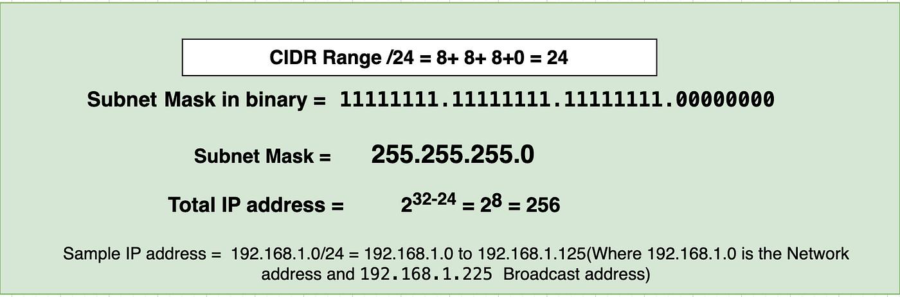
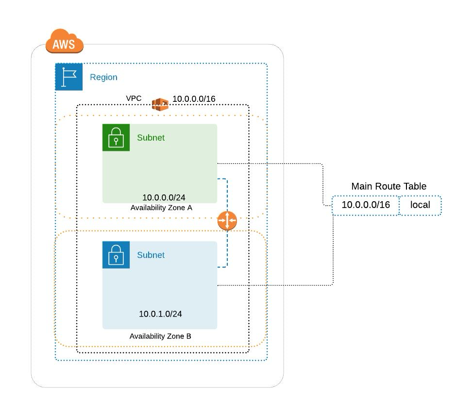
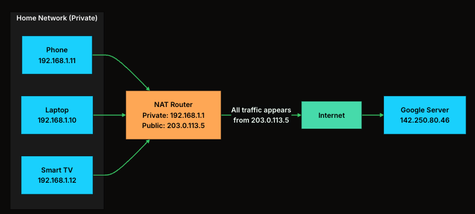

# 1. What is an IP Address ?

An `IP (Internet Protocol)` address is a unique numerical label assigned to every device on a network. Think of it as a postal address for machines: it tells the network where to deliver data.

- Without `IP addresses`, there's no way for your laptop to tell a router "send this packet to that web server." Every device that sends or receives data needs one.

<p>There are two versions in use today:</p>

- <strong>IPv4</strong>: uses 32 bit addresses like <code>192.168.1.3</code>. It ran out decades ago.
- <strong>IPv6</strong>: is the replacement for ipv4 using 128-bit addresses like <code>2001:0db8:85a3::8a2e:0370:7334</code>.

<P>IP addresses operate at Layer 3 (Network layer) of the OSI model. This is the layer responsible for routing, for getting packets from one network to another across the internet. Layer 2 (Data Link) handles local delivery using MAC addresses, but once a packet needs to leave your local network, IP takes over.</P>

---

# 2. IPv4: The Classic Address Format

An Ipv4 is `32` bit long, written as four decimal numbers seperated by dots. Each number is called an octet because it represents 8 bits.

- Part of an IP address identifies the `network`(which network?). The other part of the address identifies the `host`(which device on that network?).

```ini
192.168.1.25

192       168        1       25
11000000 10101000 00000001 00011001
```

Each octet can range from `0 - 255` **Since 8 bits can represent 2^8 = 256 values**

### Address Classes

- Addresses were divided into classes based on the first few bits. This determined how the 32 bits were split between the `Network portion & Host Portion`

#### Class A Public & Private IP Address Range

- Class A addresses are for networks with large number of total hosts.
- Class A allows for `126 (2^8 = 128-2)` **Ignore all 0's & 1's**.
- The 24 bits in the remaining three octets represent the `hosts ID` and allows for approximately `17 million hosts per network`.

```ini
Public IP Range: 1.0.0.0 to 126.255.255.255
Private IP Range: 10.0.0.0 to 10.255.255.255
Special IP Range: 127.0.0.1 to 127.255.255.255

Subnet Mask: 255.0.0.0 (8 bits)
Number of Networks: 126
Number of Hosts per Network: 16,777,214
```

- Class A IP address ranges are typically used by `Internet service providers` and large corporations - such as Google and Apple.

#### Class B Public & Private IP Address Range

- Class B addresses are for medium to large sized networks. Class B allows for `16,384` networks by using the first two octets for the `network ID`.
- The `16` bits in the third and fourth octet represent **host ID** and allows for approximately `2 ^ 16 = 65,000` hosts per network.
- Class B network number values begin at `128 and end at 191`.

```ini
Public IP Range: 128.0.0.0 to 191.255.255.255
First octet value range from 128 to 191
Private IP Range: 172.16.0.0 to 172.31.255.255
Subnet Mask: 255.255.0.0 (16 bits)
Number of Networks: 16,382
Number of Hosts per Network: 65,534
```

Class B IP address ranges are typically used by universities and medium-sized businesses.

#### Class C Public & Private IP Address Range

- Class C addresses are used in small local area networks (LANs). Class C allows for approximately `2 million` networks by using the first three octets for the network ID.
- The last octet (8 bits) represent the host ID and allows for 254 hosts per network.

```ini
Public IP Range: 192.0.0.0 to 223.255.255.255
First octet value range from 192 to 223
Private IP Range: 192.168.0.0 to 192.168.255.255 (See Private IP Addresses below for more information)
Subnet Mask: 255.255.255.0 (24 bits)
Number of Networks: 2,097,150
Number of Hosts per Network: 254
```

#### Class D IP Address Range

- Class D IP addresses are not allocated to hosts and are used for **multicasting**.
- **Multicasting** allows a single host to send a single stream of data to thousands of hosts across the Internet at the same time.
- It is often used for audio and video streaming, such as `IP-based cable TV networks`. Another example is the delivery of `real-time stock market data` from one source to many brokerage companies.

```ini
Range: 224.0.0.0 to 239.255.255.255
First octet value range from 224 to 239
Number of Networks: N/A
Number of Hosts per Network: Multicasting
```

#### Class E IP Address Range

- Class E IP addresses are not allocated to hosts and are not available for general use. These are reserved for research purposes.

```ini
Range: 240.0.0.0 to 255.255.255.255
First octet value range from 240 to 255
Number of Networks: N/A
Number of Hosts per Network: Research/Reserved/Experimental
```

#### Private IP Addresses

- Within each network class, there are designated IP addresses that are reserved specifically for private/internal use only. These IP addresses cannot be used on Internet-facing devices as they are non-routable.
- However, within your own home or business network, private IP addresses are assigned to your devices (such as workstations, printers, and home media server).

```ini
Class A Private Range: 10.0.0.0 to 10.255.255.255
Class B Private Range: 172.16.0.0 to 172.31.255.255
Class C Private Range: 192.168.0.0 to 192.168.255.255
```

**The problem was obvious. A company that needed 300 addresses had to get a Class B with 65,000 addresses, wasting over 99% of them. A company that needed 500 addresses couldn't use a Class C (only 254 hosts) and had to jump to a Class B. This rigid system burned through the IPv4 address space fast.**

---

# 3. Subnetting and Classless Inter Domain Routing (CIDR)

- Every IP address is divided into two parts: a network portion (which network is this device on?) and a host portion (which device on that network?). The **subnet mask** determines where this split happens.
- In CIDR notation, the split is written as a **suffix**. `192.168.1.0/24` means the first `24 bits` are the **network portion** and the remaining `8 bits` are for **hosts**. That gives you `2^8 = 256` addresses. In which we ignore `2` addresses.
- 254 usable, since the first is the network address and the last is the broadcast address.

```ini
192.168.1.0/24
2^8 = 256 Addresses, We cannot use all 256 as devices IPs. 2 are reserved (256 - 2 = 254) 254 are usable.

192.168.1.0 (first ip) = This represents the entire network itself, not a device which is used by routers to identify the subnet. NETWORK
192.168.1.255 (last ip) = Used to send a message to all devices in the network at once. BROADCAST
```



**What makes CIDR flexible is that the split can happen at any bit position, not just on octet boundaries. Need 1,000 addresses? Use a /22 block (1,024 addresses). Need 16? Use a /28. No more waste.**

<table class="w-full border-collapse rounded-lg overflow-hidden shadow-sm border border-gray-200 dark:border-gray-700"><thead><tr class="bg-primary text-black"><th class="px-2 py-2 sm:px-3 sm:py-3 md:px-4 md:py-3 font-semibold text-xs sm:text-sm min-w-[80px] sm:min-w-[100px] border-b border-r border-gray-200/30 dark:border-gray-600/30 text-left"><span>CIDR</span></th><th class="px-2 py-2 sm:px-3 sm:py-3 md:px-4 md:py-3 font-semibold text-xs sm:text-sm min-w-[80px] sm:min-w-[100px] border-b border-r border-gray-200/30 dark:border-gray-600/30 text-left"><span>Subnet Mask</span></th><th class="px-2 py-2 sm:px-3 sm:py-3 md:px-4 md:py-3 font-semibold text-xs sm:text-sm min-w-[80px] sm:min-w-[100px] border-b border-r border-gray-200/30 dark:border-gray-600/30 text-left"><span>Total Addresses</span></th><th class="px-2 py-2 sm:px-3 sm:py-3 md:px-4 md:py-3 font-semibold text-xs sm:text-sm min-w-[80px] sm:min-w-[100px] border-b border-r border-gray-200/30 dark:border-gray-600/30 text-left"><span>Usable Hosts</span></th><th class="px-2 py-2 sm:px-3 sm:py-3 md:px-4 md:py-3 font-semibold text-xs sm:text-sm min-w-[80px] sm:min-w-[100px] border-b border-gray-200 dark:border-gray-700 text-left"><span>Typical Use</span></th></tr></thead><tbody><tr class="hover:bg-primary/10 dark:hover:bg-primary/20 transition-colors bg-white dark:bg-black"><td class="px-2 py-1.5 sm:px-3 sm:py-2 md:px-4 md:py-2 text-xs sm:text-sm font-medium text-gray-800 dark:text-gray-200 min-w-[80px] sm:min-w-[100px] border-b border-r border-gray-100 dark:border-gray-700/50 text-left"><span>/8</span></td><td class="px-2 py-1.5 sm:px-3 sm:py-2 md:px-4 md:py-2 text-xs sm:text-sm font-medium text-gray-800 dark:text-gray-200 min-w-[80px] sm:min-w-[100px] border-b border-r border-gray-100 dark:border-gray-700/50 text-left"><span>255.0.0.0</span></td><td class="px-2 py-1.5 sm:px-3 sm:py-2 md:px-4 md:py-2 text-xs sm:text-sm font-medium text-gray-800 dark:text-gray-200 min-w-[80px] sm:min-w-[100px] border-b border-r border-gray-100 dark:border-gray-700/50 text-left"><span>16,777,216</span></td><td class="px-2 py-1.5 sm:px-3 sm:py-2 md:px-4 md:py-2 text-xs sm:text-sm font-medium text-gray-800 dark:text-gray-200 min-w-[80px] sm:min-w-[100px] border-b border-r border-gray-100 dark:border-gray-700/50 text-left"><span>16,777,214</span></td><td class="px-2 py-1.5 sm:px-3 sm:py-2 md:px-4 md:py-2 text-xs sm:text-sm font-medium text-gray-800 dark:text-gray-200 min-w-[80px] sm:min-w-[100px] border-b border-gray-100 dark:border-gray-700/50 text-left"><span>Large cloud providers</span></td></tr><tr class="hover:bg-primary/10 dark:hover:bg-primary/20 transition-colors bg-white dark:bg-black"><td class="px-2 py-1.5 sm:px-3 sm:py-2 md:px-4 md:py-2 text-xs sm:text-sm font-medium text-gray-800 dark:text-gray-200 min-w-[80px] sm:min-w-[100px] border-b border-r border-gray-100 dark:border-gray-700/50 text-left"><span>/16</span></td><td class="px-2 py-1.5 sm:px-3 sm:py-2 md:px-4 md:py-2 text-xs sm:text-sm font-medium text-gray-800 dark:text-gray-200 min-w-[80px] sm:min-w-[100px] border-b border-r border-gray-100 dark:border-gray-700/50 text-left"><span>255.255.0.0</span></td><td class="px-2 py-1.5 sm:px-3 sm:py-2 md:px-4 md:py-2 text-xs sm:text-sm font-medium text-gray-800 dark:text-gray-200 min-w-[80px] sm:min-w-[100px] border-b border-r border-gray-100 dark:border-gray-700/50 text-left"><span>65,536</span></td><td class="px-2 py-1.5 sm:px-3 sm:py-2 md:px-4 md:py-2 text-xs sm:text-sm font-medium text-gray-800 dark:text-gray-200 min-w-[80px] sm:min-w-[100px] border-b border-r border-gray-100 dark:border-gray-700/50 text-left"><span>65,534</span></td><td class="px-2 py-1.5 sm:px-3 sm:py-2 md:px-4 md:py-2 text-xs sm:text-sm font-medium text-gray-800 dark:text-gray-200 min-w-[80px] sm:min-w-[100px] border-b border-gray-100 dark:border-gray-700/50 text-left"><span>Large VPCs, corporate networks</span></td></tr><tr class="hover:bg-primary/10 dark:hover:bg-primary/20 transition-colors bg-white dark:bg-black"><td class="px-2 py-1.5 sm:px-3 sm:py-2 md:px-4 md:py-2 text-xs sm:text-sm font-medium text-gray-800 dark:text-gray-200 min-w-[80px] sm:min-w-[100px] border-b border-r border-gray-100 dark:border-gray-700/50 text-left"><span>/20</span></td><td class="px-2 py-1.5 sm:px-3 sm:py-2 md:px-4 md:py-2 text-xs sm:text-sm font-medium text-gray-800 dark:text-gray-200 min-w-[80px] sm:min-w-[100px] border-b border-r border-gray-100 dark:border-gray-700/50 text-left"><span>255.255.240.0</span></td><td class="px-2 py-1.5 sm:px-3 sm:py-2 md:px-4 md:py-2 text-xs sm:text-sm font-medium text-gray-800 dark:text-gray-200 min-w-[80px] sm:min-w-[100px] border-b border-r border-gray-100 dark:border-gray-700/50 text-left"><span>4,096</span></td><td class="px-2 py-1.5 sm:px-3 sm:py-2 md:px-4 md:py-2 text-xs sm:text-sm font-medium text-gray-800 dark:text-gray-200 min-w-[80px] sm:min-w-[100px] border-b border-r border-gray-100 dark:border-gray-700/50 text-left"><span>4,094</span></td><td class="px-2 py-1.5 sm:px-3 sm:py-2 md:px-4 md:py-2 text-xs sm:text-sm font-medium text-gray-800 dark:text-gray-200 min-w-[80px] sm:min-w-[100px] border-b border-gray-100 dark:border-gray-700/50 text-left"><span>Medium subnets</span></td></tr><tr class="hover:bg-primary/10 dark:hover:bg-primary/20 transition-colors bg-white dark:bg-black"><td class="px-2 py-1.5 sm:px-3 sm:py-2 md:px-4 md:py-2 text-xs sm:text-sm font-medium text-gray-800 dark:text-gray-200 min-w-[80px] sm:min-w-[100px] border-b border-r border-gray-100 dark:border-gray-700/50 text-left"><span>/24</span></td><td class="px-2 py-1.5 sm:px-3 sm:py-2 md:px-4 md:py-2 text-xs sm:text-sm font-medium text-gray-800 dark:text-gray-200 min-w-[80px] sm:min-w-[100px] border-b border-r border-gray-100 dark:border-gray-700/50 text-left"><span>255.255.255.0</span></td><td class="px-2 py-1.5 sm:px-3 sm:py-2 md:px-4 md:py-2 text-xs sm:text-sm font-medium text-gray-800 dark:text-gray-200 min-w-[80px] sm:min-w-[100px] border-b border-r border-gray-100 dark:border-gray-700/50 text-left"><span>256</span></td><td class="px-2 py-1.5 sm:px-3 sm:py-2 md:px-4 md:py-2 text-xs sm:text-sm font-medium text-gray-800 dark:text-gray-200 min-w-[80px] sm:min-w-[100px] border-b border-r border-gray-100 dark:border-gray-700/50 text-left"><span>254</span></td><td class="px-2 py-1.5 sm:px-3 sm:py-2 md:px-4 md:py-2 text-xs sm:text-sm font-medium text-gray-800 dark:text-gray-200 min-w-[80px] sm:min-w-[100px] border-b border-gray-100 dark:border-gray-700/50 text-left"><span>Small subnets, most common</span></td></tr><tr class="hover:bg-primary/10 dark:hover:bg-primary/20 transition-colors bg-white dark:bg-black"><td class="px-2 py-1.5 sm:px-3 sm:py-2 md:px-4 md:py-2 text-xs sm:text-sm font-medium text-gray-800 dark:text-gray-200 min-w-[80px] sm:min-w-[100px] border-b border-r border-gray-100 dark:border-gray-700/50 text-left"><span>/28</span></td><td class="px-2 py-1.5 sm:px-3 sm:py-2 md:px-4 md:py-2 text-xs sm:text-sm font-medium text-gray-800 dark:text-gray-200 min-w-[80px] sm:min-w-[100px] border-b border-r border-gray-100 dark:border-gray-700/50 text-left"><span>255.255.255.240</span></td><td class="px-2 py-1.5 sm:px-3 sm:py-2 md:px-4 md:py-2 text-xs sm:text-sm font-medium text-gray-800 dark:text-gray-200 min-w-[80px] sm:min-w-[100px] border-b border-r border-gray-100 dark:border-gray-700/50 text-left"><span>16</span></td><td class="px-2 py-1.5 sm:px-3 sm:py-2 md:px-4 md:py-2 text-xs sm:text-sm font-medium text-gray-800 dark:text-gray-200 min-w-[80px] sm:min-w-[100px] border-b border-r border-gray-100 dark:border-gray-700/50 text-left"><span>14</span></td><td class="px-2 py-1.5 sm:px-3 sm:py-2 md:px-4 md:py-2 text-xs sm:text-sm font-medium text-gray-800 dark:text-gray-200 min-w-[80px] sm:min-w-[100px] border-b border-gray-100 dark:border-gray-700/50 text-left"><span>Small server groups</span></td></tr><tr class="hover:bg-primary/10 dark:hover:bg-primary/20 transition-colors bg-white dark:bg-black"><td class="px-2 py-1.5 sm:px-3 sm:py-2 md:px-4 md:py-2 text-xs sm:text-sm font-medium text-gray-800 dark:text-gray-200 min-w-[80px] sm:min-w-[100px] border-r border-gray-100 dark:border-gray-700/50 text-left"><span>/32</span></td><td class="px-2 py-1.5 sm:px-3 sm:py-2 md:px-4 md:py-2 text-xs sm:text-sm font-medium text-gray-800 dark:text-gray-200 min-w-[80px] sm:min-w-[100px] border-r border-gray-100 dark:border-gray-700/50 text-left"><span>255.255.255.255</span></td><td class="px-2 py-1.5 sm:px-3 sm:py-2 md:px-4 md:py-2 text-xs sm:text-sm font-medium text-gray-800 dark:text-gray-200 min-w-[80px] sm:min-w-[100px] border-r border-gray-100 dark:border-gray-700/50 text-left"><span>1</span></td><td class="px-2 py-1.5 sm:px-3 sm:py-2 md:px-4 md:py-2 text-xs sm:text-sm font-medium text-gray-800 dark:text-gray-200 min-w-[80px] sm:min-w-[100px] border-r border-gray-100 dark:border-gray-700/50 text-left"><span>1</span></td><td class="px-2 py-1.5 sm:px-3 sm:py-2 md:px-4 md:py-2 text-xs sm:text-sm font-medium text-gray-800 dark:text-gray-200 min-w-[80px] sm:min-w-[100px] text-left"><span>Single host (exact match)</span></td></tr></tbody></table>

#### Cloud Relevance

- Cloud platforms like AWS, GCP, and Azure use CIDR blocks everywhere. When you create a VPC (Virtual Private Cloud), you define its IP range using CIDR.
- When you create a VPC, you choose a CIDR block like `10.0.0.0/16`

```ini
Total IPs = 2 ^ 16 = 65,536 - 2 = 65534
Range: 10.0.0.0 -> 10.255.255.255
```

- Now split the VPC into subnets, you don't use the whole `/16` directly, you divide it. **So now instead of one big network, you have multiple smaller networks with clear roles.**

```ini
VPC: 10.0.0.0/16
│
├── 10.0.1.0/24  → Web servers (10.0.1 is network address for Web Servers and each webserver can be assigned between 10.0.1.1 - 10.0.1.254)
├── 10.0.2.0/24  → Databases (10.0.1 is network address for Web Servers and each webserver can be assigned between 10.0.2.1 - 10.0.2.254)
├── 10.0.3.0/24  → Internal services (10.0.1 is network address for Web Servers and each webserver can be assigned between 10.0.3.1 - 10.0.3.254)

Each /24:

* Total IPs = 256
* Usable ≈ 254 (in general networking)
```



- Provides ISOLATION & IMPROVE SECURITY (Web servers cannot directly access database subnet unless allowed). Easier to organize, manage & scale.
- Control (ROUTING + FIREWALL RULES) you can apply rules `public subnet -> Internet Access`, `private subnet -> no internet`

<P>Cloud Providers reserve extra IPS per subnet</P>

```ini
* Network address
* Router
* DNS
* Future use
* Broadcast

256 - 5 = 251 usable
```

**Choosing the right CIDR block size upfront matters. Too small, and you run out of addresses. Too large, and you waste address space that could conflict with other VPCs if you ever need to peer them.**

---

# 4. Public vs Private IP Addresses

#### Public IP Addresses

- A public IP address is **globally unique** and reachable from anywhere on the internet. When you visit a website, your request goes to a public IP. When someone pings your home network, they're hitting your public IP.
- Public addresses are assigned by **Regional Internet Registries (RIRs)** and are a scarce resource.
- **Internet Service Providers** ISPs get blocks of public IPs and assign them to customers (usually dynamically, so your home IP changes periodically).

#### Private IP Addresses

- Within each network class, there are designated IP addresses that are reserved specifically for private/internal use only. These IP addresses cannot be used on Internet-facing devices as they are non-routable.
- However, within your own home or business network, private IP addresses are assigned to your devices (such as workstations, printers, and home media server).
- **Routers on the internet will simply drop a packet destined for a private IP**

<table class="w-full border-collapse rounded-lg overflow-hidden shadow-sm border border-gray-200 dark:border-gray-700"><thead><tr class="bg-primary text-black"><th class="px-2 py-2 sm:px-3 sm:py-3 md:px-4 md:py-3 font-semibold text-xs sm:text-sm min-w-[80px] sm:min-w-[100px] border-b border-r border-gray-200/30 dark:border-gray-600/30 text-left"><span>Range</span></th><th class="px-2 py-2 sm:px-3 sm:py-3 md:px-4 md:py-3 font-semibold text-xs sm:text-sm min-w-[80px] sm:min-w-[100px] border-b border-r border-gray-200/30 dark:border-gray-600/30 text-left"><span>CIDR</span></th><th class="px-2 py-2 sm:px-3 sm:py-3 md:px-4 md:py-3 font-semibold text-xs sm:text-sm min-w-[80px] sm:min-w-[100px] border-b border-r border-gray-200/30 dark:border-gray-600/30 text-left"><span>Addresses</span></th><th class="px-2 py-2 sm:px-3 sm:py-3 md:px-4 md:py-3 font-semibold text-xs sm:text-sm min-w-[80px] sm:min-w-[100px] border-b border-gray-200 dark:border-gray-700 text-left"><span>Typical Use</span></th></tr></thead><tbody><tr class="hover:bg-primary/10 dark:hover:bg-primary/20 transition-colors bg-white dark:bg-black"><td class="px-2 py-1.5 sm:px-3 sm:py-2 md:px-4 md:py-2 text-xs sm:text-sm font-medium text-gray-800 dark:text-gray-200 min-w-[80px] sm:min-w-[100px] border-b border-r border-gray-100 dark:border-gray-700/50 text-left"><code class="px-1.5 py-0.5 rounded bg-primary/10 dark:bg-primary/15 text-sm font-mono text-primary dark:text-green-400 border border-primary/20">10.0.0.0</code><span> to </span><code class="px-1.5 py-0.5 rounded bg-primary/10 dark:bg-primary/15 text-sm font-mono text-primary dark:text-green-400 border border-primary/20">10.255.255.255</code></td><td class="px-2 py-1.5 sm:px-3 sm:py-2 md:px-4 md:py-2 text-xs sm:text-sm font-medium text-gray-800 dark:text-gray-200 min-w-[80px] sm:min-w-[100px] border-b border-r border-gray-100 dark:border-gray-700/50 text-left"><span>10.0.0.0/8</span></td><td class="px-2 py-1.5 sm:px-3 sm:py-2 md:px-4 md:py-2 text-xs sm:text-sm font-medium text-gray-800 dark:text-gray-200 min-w-[80px] sm:min-w-[100px] border-b border-r border-gray-100 dark:border-gray-700/50 text-left"><span>~16.7 million</span></td><td class="px-2 py-1.5 sm:px-3 sm:py-2 md:px-4 md:py-2 text-xs sm:text-sm font-medium text-gray-800 dark:text-gray-200 min-w-[80px] sm:min-w-[100px] border-b border-gray-100 dark:border-gray-700/50 text-left"><span>Cloud VPCs, large corporate networks</span></td></tr><tr class="hover:bg-primary/10 dark:hover:bg-primary/20 transition-colors bg-white dark:bg-black"><td class="px-2 py-1.5 sm:px-3 sm:py-2 md:px-4 md:py-2 text-xs sm:text-sm font-medium text-gray-800 dark:text-gray-200 min-w-[80px] sm:min-w-[100px] border-b border-r border-gray-100 dark:border-gray-700/50 text-left"><code class="px-1.5 py-0.5 rounded bg-primary/10 dark:bg-primary/15 text-sm font-mono text-primary dark:text-green-400 border border-primary/20">172.16.0.0</code><span> to </span><code class="px-1.5 py-0.5 rounded bg-primary/10 dark:bg-primary/15 text-sm font-mono text-primary dark:text-green-400 border border-primary/20">172.31.255.255</code></td><td class="px-2 py-1.5 sm:px-3 sm:py-2 md:px-4 md:py-2 text-xs sm:text-sm font-medium text-gray-800 dark:text-gray-200 min-w-[80px] sm:min-w-[100px] border-b border-r border-gray-100 dark:border-gray-700/50 text-left"><span>172.16.0.0/12</span></td><td class="px-2 py-1.5 sm:px-3 sm:py-2 md:px-4 md:py-2 text-xs sm:text-sm font-medium text-gray-800 dark:text-gray-200 min-w-[80px] sm:min-w-[100px] border-b border-r border-gray-100 dark:border-gray-700/50 text-left"><span>~1 million</span></td><td class="px-2 py-1.5 sm:px-3 sm:py-2 md:px-4 md:py-2 text-xs sm:text-sm font-medium text-gray-800 dark:text-gray-200 min-w-[80px] sm:min-w-[100px] border-b border-gray-100 dark:border-gray-700/50 text-left"><span>Medium enterprise networks</span></td></tr><tr class="hover:bg-primary/10 dark:hover:bg-primary/20 transition-colors bg-white dark:bg-black"><td class="px-2 py-1.5 sm:px-3 sm:py-2 md:px-4 md:py-2 text-xs sm:text-sm font-medium text-gray-800 dark:text-gray-200 min-w-[80px] sm:min-w-[100px] border-r border-gray-100 dark:border-gray-700/50 text-left"><code class="px-1.5 py-0.5 rounded bg-primary/10 dark:bg-primary/15 text-sm font-mono text-primary dark:text-green-400 border border-primary/20">192.168.0.0</code><span> to </span><code class="px-1.5 py-0.5 rounded bg-primary/10 dark:bg-primary/15 text-sm font-mono text-primary dark:text-green-400 border border-primary/20">192.168.255.255</code></td><td class="px-2 py-1.5 sm:px-3 sm:py-2 md:px-4 md:py-2 text-xs sm:text-sm font-medium text-gray-800 dark:text-gray-200 min-w-[80px] sm:min-w-[100px] border-r border-gray-100 dark:border-gray-700/50 text-left"><span>192.168.0.0/16</span></td><td class="px-2 py-1.5 sm:px-3 sm:py-2 md:px-4 md:py-2 text-xs sm:text-sm font-medium text-gray-800 dark:text-gray-200 min-w-[80px] sm:min-w-[100px] border-r border-gray-100 dark:border-gray-700/50 text-left"><span>~65,000</span></td><td class="px-2 py-1.5 sm:px-3 sm:py-2 md:px-4 md:py-2 text-xs sm:text-sm font-medium text-gray-800 dark:text-gray-200 min-w-[80px] sm:min-w-[100px] text-left"><span>Home networks, small offices</span></td></tr></tbody></table>

- Your laptop right now probably has an IP like `192.168.1.x`. Your neighbor's laptop might also be `192.168.1.x`. That's fine because private addresses only need to be unique within their own network.

#### Network Address Translation - NAT: Bridging Private and Public

- Your home router has one public IP assigned by your ISP. When your laptop (say, `192.168.1.10`) sends a request to `142.250.80.46` (Google), the router rewrites the source IP from `192.168.1.10` to its own public IP (say, `203.0.113.5`). It keeps a translation table so it knows which internal device to forward the response back to.



- In cloud environments, the same public/private split applies. Your EC2 instances, Kubernetes pods, and RDS databases all get private IPs within the VPC. Only load balancers and NAT gateways get public IPs that face the internet. This is both a cost optimization (public IPs are limited and sometimes charged) and a security measure (internal services are unreachable from outside).

---

# 5. IPv6

<p>IPv4's 4.3 billion addresses seemed massive in 1981. Today, there are over 15 billion connected devices, and that number keeps growing with IoT. Phones, laptops, smart thermostats, security cameras, cars, and industrial sensors all need IP addresses. NAT has stretched IPv4's lifespan, but it adds complexity, breaks certain protocols, and makes end-to-end connectivity harder.</p>

<P>IPv6 was designed to solve this permanently. With `128-bit` addresses, it provides `2^128` addresses.</P>

- An IPv6 address is written as eight groups of four hexadecimal digits, separated by colons:

```ini
2001:0db8:85a3:0000:0000:8a23:0370:7334

That's long, so there are shortening rules:
1. Drop leading zeros in each group: 0db8 becomes db8, 0000 becomes 0
2 Replace consecutive groups of all zeros with ::

So address a becomes: 2001:db8:85a3::8a2e:370:7334
```

- Major ISPs and mobile networks have adopted it widely since mobile carriers were among the first to feel the pain of IPv4 exhaustion
- The transition strategy most networks use is dual-stack: running IPv4 and IPv6 simultaneously.
  **Devices prefer IPv6 when available but fall back to IPv4. This avoids a hard cutover and lets the transition happen gradually.**

---

# 6. Special IP Addresses

<table class="w-full border-collapse rounded-lg overflow-hidden shadow-sm border border-gray-200 dark:border-gray-700"><thead><tr class="bg-primary text-black"><th class="px-2 py-2 sm:px-3 sm:py-3 md:px-4 md:py-3 font-semibold text-xs sm:text-sm min-w-[80px] sm:min-w-[100px] border-b border-r border-gray-200/30 dark:border-gray-600/30 text-left"><span>Address</span></th><th class="px-2 py-2 sm:px-3 sm:py-3 md:px-4 md:py-3 font-semibold text-xs sm:text-sm min-w-[80px] sm:min-w-[100px] border-b border-r border-gray-200/30 dark:border-gray-600/30 text-left"><span>Name</span></th><th class="px-2 py-2 sm:px-3 sm:py-3 md:px-4 md:py-3 font-semibold text-xs sm:text-sm min-w-[80px] sm:min-w-[100px] border-b border-r border-gray-200/30 dark:border-gray-600/30 text-left"><span>Purpose</span></th><th class="px-2 py-2 sm:px-3 sm:py-3 md:px-4 md:py-3 font-semibold text-xs sm:text-sm min-w-[80px] sm:min-w-[100px] border-b border-gray-200 dark:border-gray-700 text-left"><span>When You'll See It</span></th></tr></thead><tbody><tr class="hover:bg-primary/10 dark:hover:bg-primary/20 transition-colors bg-white dark:bg-black"><td class="px-2 py-1.5 sm:px-3 sm:py-2 md:px-4 md:py-2 text-xs sm:text-sm font-medium text-gray-800 dark:text-gray-200 min-w-[80px] sm:min-w-[100px] border-b border-r border-gray-100 dark:border-gray-700/50 text-left"><code class="px-1.5 py-0.5 rounded bg-primary/10 dark:bg-primary/15 text-sm font-mono text-primary dark:text-green-400 border border-primary/20">127.0.0.1</code></td><td class="px-2 py-1.5 sm:px-3 sm:py-2 md:px-4 md:py-2 text-xs sm:text-sm font-medium text-gray-800 dark:text-gray-200 min-w-[80px] sm:min-w-[100px] border-b border-r border-gray-100 dark:border-gray-700/50 text-left"><span>Loopback</span></td><td class="px-2 py-1.5 sm:px-3 sm:py-2 md:px-4 md:py-2 text-xs sm:text-sm font-medium text-gray-800 dark:text-gray-200 min-w-[80px] sm:min-w-[100px] border-b border-r border-gray-100 dark:border-gray-700/50 text-left"><span>Routes back to your own machine</span></td><td class="px-2 py-1.5 sm:px-3 sm:py-2 md:px-4 md:py-2 text-xs sm:text-sm font-medium text-gray-800 dark:text-gray-200 min-w-[80px] sm:min-w-[100px] border-b border-gray-100 dark:border-gray-700/50 text-left"><code class="px-1.5 py-0.5 rounded bg-primary/10 dark:bg-primary/15 text-sm font-mono text-primary dark:text-green-400 border border-primary/20">localhost</code><span>, local development, health checks</span></td></tr><tr class="hover:bg-primary/10 dark:hover:bg-primary/20 transition-colors bg-white dark:bg-black"><td class="px-2 py-1.5 sm:px-3 sm:py-2 md:px-4 md:py-2 text-xs sm:text-sm font-medium text-gray-800 dark:text-gray-200 min-w-[80px] sm:min-w-[100px] border-b border-r border-gray-100 dark:border-gray-700/50 text-left"><code class="px-1.5 py-0.5 rounded bg-primary/10 dark:bg-primary/15 text-sm font-mono text-primary dark:text-green-400 border border-primary/20">0.0.0.0</code></td><td class="px-2 py-1.5 sm:px-3 sm:py-2 md:px-4 md:py-2 text-xs sm:text-sm font-medium text-gray-800 dark:text-gray-200 min-w-[80px] sm:min-w-[100px] border-b border-r border-gray-100 dark:border-gray-700/50 text-left"><span>All interfaces</span></td><td class="px-2 py-1.5 sm:px-3 sm:py-2 md:px-4 md:py-2 text-xs sm:text-sm font-medium text-gray-800 dark:text-gray-200 min-w-[80px] sm:min-w-[100px] border-b border-r border-gray-100 dark:border-gray-700/50 text-left"><span>Listen on every network interface</span></td><td class="px-2 py-1.5 sm:px-3 sm:py-2 md:px-4 md:py-2 text-xs sm:text-sm font-medium text-gray-800 dark:text-gray-200 min-w-[80px] sm:min-w-[100px] border-b border-gray-100 dark:border-gray-700/50 text-left"><span>Server bind addresses, "unspecified" address</span></td></tr><tr class="hover:bg-primary/10 dark:hover:bg-primary/20 transition-colors bg-white dark:bg-black"><td class="px-2 py-1.5 sm:px-3 sm:py-2 md:px-4 md:py-2 text-xs sm:text-sm font-medium text-gray-800 dark:text-gray-200 min-w-[80px] sm:min-w-[100px] border-b border-r border-gray-100 dark:border-gray-700/50 text-left"><code class="px-1.5 py-0.5 rounded bg-primary/10 dark:bg-primary/15 text-sm font-mono text-primary dark:text-green-400 border border-primary/20">255.255.255.255</code></td><td class="px-2 py-1.5 sm:px-3 sm:py-2 md:px-4 md:py-2 text-xs sm:text-sm font-medium text-gray-800 dark:text-gray-200 min-w-[80px] sm:min-w-[100px] border-b border-r border-gray-100 dark:border-gray-700/50 text-left"><span>Broadcast</span></td><td class="px-2 py-1.5 sm:px-3 sm:py-2 md:px-4 md:py-2 text-xs sm:text-sm font-medium text-gray-800 dark:text-gray-200 min-w-[80px] sm:min-w-[100px] border-b border-r border-gray-100 dark:border-gray-700/50 text-left"><span>Send to all devices on local network</span></td><td class="px-2 py-1.5 sm:px-3 sm:py-2 md:px-4 md:py-2 text-xs sm:text-sm font-medium text-gray-800 dark:text-gray-200 min-w-[80px] sm:min-w-[100px] border-b border-gray-100 dark:border-gray-700/50 text-left"><span>DHCP discovery, ARP requests</span></td></tr><tr class="hover:bg-primary/10 dark:hover:bg-primary/20 transition-colors bg-white dark:bg-black"><td class="px-2 py-1.5 sm:px-3 sm:py-2 md:px-4 md:py-2 text-xs sm:text-sm font-medium text-gray-800 dark:text-gray-200 min-w-[80px] sm:min-w-[100px] border-b border-r border-gray-100 dark:border-gray-700/50 text-left"><code class="px-1.5 py-0.5 rounded bg-primary/10 dark:bg-primary/15 text-sm font-mono text-primary dark:text-green-400 border border-primary/20">10.x.x.x</code><span>, </span><code class="px-1.5 py-0.5 rounded bg-primary/10 dark:bg-primary/15 text-sm font-mono text-primary dark:text-green-400 border border-primary/20">172.16-31.x.x</code><span>, </span><code class="px-1.5 py-0.5 rounded bg-primary/10 dark:bg-primary/15 text-sm font-mono text-primary dark:text-green-400 border border-primary/20">192.168.x.x</code></td><td class="px-2 py-1.5 sm:px-3 sm:py-2 md:px-4 md:py-2 text-xs sm:text-sm font-medium text-gray-800 dark:text-gray-200 min-w-[80px] sm:min-w-[100px] border-b border-r border-gray-100 dark:border-gray-700/50 text-left"><span>Private</span></td><td class="px-2 py-1.5 sm:px-3 sm:py-2 md:px-4 md:py-2 text-xs sm:text-sm font-medium text-gray-800 dark:text-gray-200 min-w-[80px] sm:min-w-[100px] border-b border-r border-gray-100 dark:border-gray-700/50 text-left"><span>Internal network use (RFC 1918)</span></td><td class="px-2 py-1.5 sm:px-3 sm:py-2 md:px-4 md:py-2 text-xs sm:text-sm font-medium text-gray-800 dark:text-gray-200 min-w-[80px] sm:min-w-[100px] border-b border-gray-100 dark:border-gray-700/50 text-left"><span>VPCs, home networks, corporate LANs</span></td></tr><tr class="hover:bg-primary/10 dark:hover:bg-primary/20 transition-colors bg-white dark:bg-black"><td class="px-2 py-1.5 sm:px-3 sm:py-2 md:px-4 md:py-2 text-xs sm:text-sm font-medium text-gray-800 dark:text-gray-200 min-w-[80px] sm:min-w-[100px] border-b border-r border-gray-100 dark:border-gray-700/50 text-left"><code class="px-1.5 py-0.5 rounded bg-primary/10 dark:bg-primary/15 text-sm font-mono text-primary dark:text-green-400 border border-primary/20">169.254.x.x</code></td><td class="px-2 py-1.5 sm:px-3 sm:py-2 md:px-4 md:py-2 text-xs sm:text-sm font-medium text-gray-800 dark:text-gray-200 min-w-[80px] sm:min-w-[100px] border-b border-r border-gray-100 dark:border-gray-700/50 text-left"><span>Link-local</span></td><td class="px-2 py-1.5 sm:px-3 sm:py-2 md:px-4 md:py-2 text-xs sm:text-sm font-medium text-gray-800 dark:text-gray-200 min-w-[80px] sm:min-w-[100px] border-b border-r border-gray-100 dark:border-gray-700/50 text-left"><span>Auto-assigned when DHCP fails</span></td><td class="px-2 py-1.5 sm:px-3 sm:py-2 md:px-4 md:py-2 text-xs sm:text-sm font-medium text-gray-800 dark:text-gray-200 min-w-[80px] sm:min-w-[100px] border-b border-gray-100 dark:border-gray-700/50 text-left"><span>"No internet" situations, self-configuration</span></td></tr><tr class="hover:bg-primary/10 dark:hover:bg-primary/20 transition-colors bg-white dark:bg-black"><td class="px-2 py-1.5 sm:px-3 sm:py-2 md:px-4 md:py-2 text-xs sm:text-sm font-medium text-gray-800 dark:text-gray-200 min-w-[80px] sm:min-w-[100px] border-r border-gray-100 dark:border-gray-700/50 text-left"><code class="px-1.5 py-0.5 rounded bg-primary/10 dark:bg-primary/15 text-sm font-mono text-primary dark:text-green-400 border border-primary/20">224.0.0.0/4</code></td><td class="px-2 py-1.5 sm:px-3 sm:py-2 md:px-4 md:py-2 text-xs sm:text-sm font-medium text-gray-800 dark:text-gray-200 min-w-[80px] sm:min-w-[100px] border-r border-gray-100 dark:border-gray-700/50 text-left"><span>Multicast</span></td><td class="px-2 py-1.5 sm:px-3 sm:py-2 md:px-4 md:py-2 text-xs sm:text-sm font-medium text-gray-800 dark:text-gray-200 min-w-[80px] sm:min-w-[100px] border-r border-gray-100 dark:border-gray-700/50 text-left"><span>One-to-many delivery</span></td><td class="px-2 py-1.5 sm:px-3 sm:py-2 md:px-4 md:py-2 text-xs sm:text-sm font-medium text-gray-800 dark:text-gray-200 min-w-[80px] sm:min-w-[100px] text-left"><span>Video streaming, service discovery</span></td></tr></tbody></table>

1. **LOOPBACK `127.0.0.1`** The entire `127.0.0.0/8` range is reserved for loopback, but `127.0.0.1` is what everyone uses. When you run a web server locally and visit `localhost:3000`, your traffic never leaves your machine. It goes down the network stack, hits the loopback interface, and comes right back up. Useful for development and testing, and also for inter-process communication on the same host.
2. `0.0.0.0`: This means different things depending on context. In a server's bind address, `0.0.0.0:8080` means **listen on port 8080 on all network interfaces**. In a routing table, `0.0.0.0/0` is the **default route**, the catch-all that matches any destination address.
3. **LINK LOCAL `169.254.x.x`**: If you computer can't reach `DHCP` server, it assings itself an address int his range. Seeing `169.254.x.x` on a device almost always means DHCP is broken or the network is misconfigured.
   - In cloud envrionments though, `169.254.169.254` is a special metadata endpoint that instances use to query information about themselves.

---

# 7. How IP Routing Works

**No single router knows the complete path to the destination. Each router only knows the next hop. The packet gets forwarded one router at a time until it arrives.**

### Routing Tables and Longest Prefix Match

Every router maintains a routing table: a list of network prefixes and which next hop to forward matching packets to. When a packet arrives, the router compares the destination IP against all entries in the table and picks the most specific match. This is called **longest prefix match.**

- For example, if a routing table has entries for `10.0.0.0/8` and `10.0.1.0/24`, a packet destined for `10.0.1.15` matches both. The router picks `/24` because it's more specific `(longer prefix)`.

### Gateway

- A gateway is a network device, often a router, that connects a local network to other networks such as Internet. It acts as a "doorway" for traffic to flow in and out of the local network, enabling communication between devices in different networks.

**DEFAULT GATEWAY** also known as a default route, is a special type of gateway that is used in computer networking to provide a default path for network traffic that is destined for a network outside of the local network.

- It is the IP address of the router that is used as the exit point for network traffic that does not have a specific route in the routing table.
- The default gateway is typically displayed as the destination `0.0.0.0`

```ini
A typical internet request passes through 10 to 15 routers.

$ traceroute google.com
 1  192.168.1.1      1.2 ms    (your home router)
 2  10.0.0.1         5.8 ms    (ISP gateway)
 3  72.14.215.85     8.3 ms    (ISP backbone)
 4  108.170.252.1    9.1 ms    (Google edge)
 5  142.250.80.46    9.5 ms    (destination)
```

### TTL: Time to Live

**What if routers have a misconfiguration and a packet ends up going in circles?**

<p>The `TTL (Time to Live)` field prevents this. Every IP packet starts with a TTL value (usually 64 or 128). Each router decrements it by 1. When TTL hits 0, the router drops the packet and sends an ICMP "Time Exceeded" message back to the sender.</p>

### BGP: Border Gateway Protocol

BGP is how large networks on the internet tell each other which IP ranges they can reach.

- The internet is made of many independent networks called `Autonomous Systems (AS)`
- Each AS (like an ISP or cloud provider) uses BGP to say: 👉 “I can deliver traffic to these IP addresses”

<P>Network = Country, BGP = agreements between countries, Routers = border checkpoints</P>

```ini
BGP doesn’t share individual IPs. It shares CIDR ranges:

* “I can reach 10.0.0.0/16”
* “I can reach 8.8.8.0/24”

These announcements are called routes.
```

1. Network A tells Network B: -> “I can reach these IP ranges”
2. Network B passes that info to others
3. Over time, networks build a global routing table
4. When you send data:
   - Routers choose a path based on BGP info
   - Traffic moves across multiple networks (AS → AS)
5. **BGP works between these Autonomous systems, not inside them.**

```ini
Home network → ISP → another ISP → cloud provider
```

<P>In October 2021, Facebook accidentally withdrew all its BGP routes during a maintenance operation. Every router on the internet removed Facebook's network from their routing tables. Facebook, Instagram, and WhatsApp became completely unreachable for about six hours. Even Facebook's internal tools for fixing the problem relied on the same network that was down, turning a configuration mistake into a major incident.</P>


