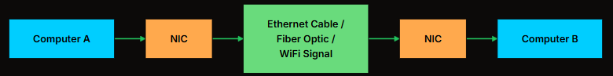
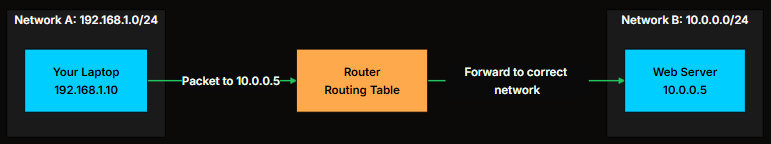
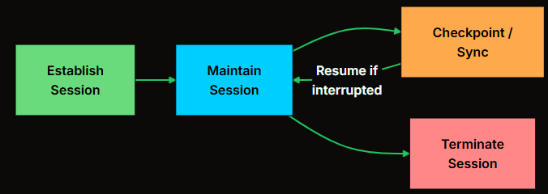
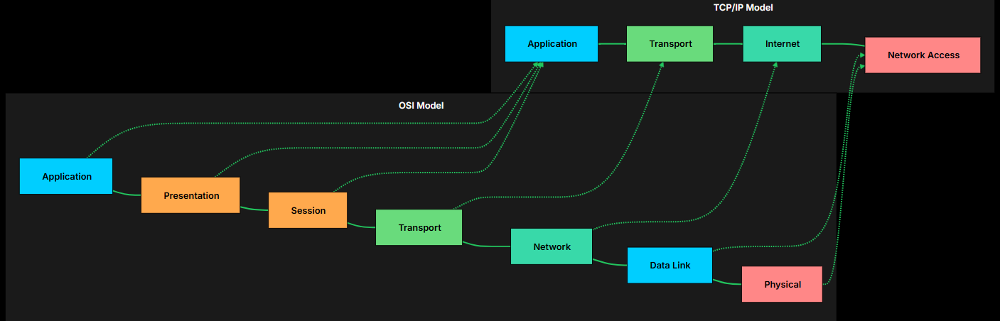

# 
 OSI Model 

The **OSI (Open System Innterconnect)** Model provides a conceptual framework that divides network communication into seven distinct layers. Each layer has a specific responsiblity, from transmitting raw bits over a network to delivering structured data to applications. 
- In `practice`, most **real-world systems use simplified models like `TCP/IP`**, but the OSI model remains one of the best ways to understand how data moves through a network stack and where different technologies operate. 

The OSI model doesn't specify how to <i>implement networking</i>. It specifies what responsibilities each layer has. Think of it as a contract. Layer 3 promises to handle routing. Layer 4 promises to handle reliable delivery. As long as each layer keeps its promise, the whole system works, no matter who built the hardware or software.

A popular mnemonic to remember the layers from bottom to top:&nbsp;<strong class="font-bold">P</strong>lease&nbsp;<strong class="font-bold">D</strong>o&nbsp;<strong class="font-bold">N</strong>ot&nbsp;<strong class="font-bold">T</strong>hrow&nbsp;<strong class="font-bold">S</strong>ausage&nbsp;<strong class="font-bold">P</strong>izza&nbsp;<strong class="font-bold">A</strong>way (Physical, Data Link, Network, Transport, Session, Presentation, Application).

---
## Layer 1: Physical 
- The Physical layer deals with raw bits traveling over a medium. Electrical signals on copper wire. Light pulses through fiber optic cables. Radio waves for WiFi. This layer has no idea what the bits mean. It just moves them from `point A to point B`.
- **It's responsible for transmitting binary data (0s and 1s),**

`When you plug in a Ethernet cable and see the link light turn on, that's Layer 1 telling you a physical connection exists`

**If the Physical layer isn't working, nothing else matters. No amount of software configuration fixes a broken cable.**

## Layer 2: Data Link
- The Physical layer can move bits, but it has no concept of structure or addressing. The Data Link layer fixes that by organizing bits into frames and introducing `MAC addresses`, **unique hardware identifiers burned into every network interface card.** Ensuring reliable node-to-node delivery of data. 
- A MAC address looks like `00:1A:2B:3C:4D:5E` which are globally unique. It's `48` bits long and **uniquely identifies a device on a local network.**
- The key device at this layer is the `switch & bridges`. A switch reads the destination MAC address in each frame, looks it up in its [MAC address table](https://ccna-200-301.online/wp-content/uploads/2020/06/MAC-address-tables-Switches.png), and forwards the frame only to the correct port. Compare that to a hub (Layer 1), which blindly broadcasts every signal to every port.
- **But `Layer 2` only works within a single network. To reach a device on a different network, you need `Layer 3`.**

## Layer 3: Network 
- The Network layer is what lets your laptop in New York talk to a server in Tokyo. It handles `routing`: **figuring out a path across multiple networks to reach the destination.**
- `Routers` live at Layer 3. They read the destination IP address in each packet and forward it toward its destination, one hop at a time.

- MAC addresses are permanent, burned into hardware. IP addresses are logical and can 
- MAC addresses handle local delivery within a network (Layer 2), while IP addresses handle routing across networks (Layer 3).

<table class="w-full border-collapse rounded-lg overflow-hidden shadow-sm border border-gray-200 dark:border-gray-700"><thead><tr class="bg-primary text-black"><th class="px-2 py-2 sm:px-3 sm:py-3 md:px-4 md:py-3 font-semibold text-xs sm:text-sm min-w-[80px] sm:min-w-[100px] border-b border-r border-gray-200/30 dark:border-gray-600/30 text-left">Protocol</th><th class="px-2 py-2 sm:px-3 sm:py-3 md:px-4 md:py-3 font-semibold text-xs sm:text-sm min-w-[80px] sm:min-w-[100px] border-b border-gray-200 dark:border-gray-700 text-left">Purpose</th></tr></thead><tbody><tr class="hover:bg-primary/10 dark:hover:bg-primary/20 transition-colors bg-white dark:bg-black"><td class="px-2 py-1.5 sm:px-3 sm:py-2 md:px-4 md:py-2 text-xs sm:text-sm font-medium text-gray-800 dark:text-gray-200 min-w-[80px] sm:min-w-[100px] border-b border-r border-gray-100 dark:border-gray-700/50 text-left">IP (IPv4/IPv6)</td><td class="px-2 py-1.5 sm:px-3 sm:py-2 md:px-4 md:py-2 text-xs sm:text-sm font-medium text-gray-800 dark:text-gray-200 min-w-[80px] sm:min-w-[100px] border-b border-gray-100 dark:border-gray-700/50 text-left">Addressing and routing</td></tr><tr class="hover:bg-primary/10 dark:hover:bg-primary/20 transition-colors bg-white dark:bg-black"><td class="px-2 py-1.5 sm:px-3 sm:py-2 md:px-4 md:py-2 text-xs sm:text-sm font-medium text-gray-800 dark:text-gray-200 min-w-[80px] sm:min-w-[100px] border-b border-r border-gray-100 dark:border-gray-700/50 text-left">ICMP</td><td class="px-2 py-1.5 sm:px-3 sm:py-2 md:px-4 md:py-2 text-xs sm:text-sm font-medium text-gray-800 dark:text-gray-200 min-w-[80px] sm:min-w-[100px] border-b border-gray-100 dark:border-gray-700/50 text-left">Error reporting, diagnostics (ping)</td></tr><tr class="hover:bg-primary/10 dark:hover:bg-primary/20 transition-colors bg-white dark:bg-black"><td class="px-2 py-1.5 sm:px-3 sm:py-2 md:px-4 md:py-2 text-xs sm:text-sm font-medium text-gray-800 dark:text-gray-200 min-w-[80px] sm:min-w-[100px] border-b border-r border-gray-100 dark:border-gray-700/50 text-left">ARP</td><td class="px-2 py-1.5 sm:px-3 sm:py-2 md:px-4 md:py-2 text-xs sm:text-sm font-medium text-gray-800 dark:text-gray-200 min-w-[80px] sm:min-w-[100px] border-b border-gray-100 dark:border-gray-700/50 text-left">Mapping IP addresses to MAC addresses</td></tr><tr class="hover:bg-primary/10 dark:hover:bg-primary/20 transition-colors bg-white dark:bg-black"><td class="px-2 py-1.5 sm:px-3 sm:py-2 md:px-4 md:py-2 text-xs sm:text-sm font-medium text-gray-800 dark:text-gray-200 min-w-[80px] sm:min-w-[100px] border-r border-gray-100 dark:border-gray-700/50 text-left">OSPF, BGP</td><td class="px-2 py-1.5 sm:px-3 sm:py-2 md:px-4 md:py-2 text-xs sm:text-sm font-medium text-gray-800 dark:text-gray-200 min-w-[80px] sm:min-w-[100px] text-left">Routing protocols for finding best paths</td></tr></tbody></table>

**But `Layer 3` only gets packets to the right machine. It doesn't know which application on that machine should receive the data.**

## Layer 4: Transport
- It adds `ports`, **numbers that identify which application should handle incoming data**. A web server listens on `port 443 (HTTPS)`. An `SSH` server listens on port `22`. **The combination of IP address + port is what we call a `socket`**
- It handles breaking large chunks of data into smaller segments, managing `flow control` so a **fast sender doesn't overwhelm a slow receiver**, and giving you a choice between `reliability (TCP)` or `speed (UDP)`.

<table class="w-full border-collapse rounded-lg overflow-hidden shadow-sm border border-gray-200 dark:border-gray-700"><thead><tr class="bg-primary text-black"><th class="px-2 py-2 sm:px-3 sm:py-3 md:px-4 md:py-3 font-semibold text-xs sm:text-sm min-w-[80px] sm:min-w-[100px] border-b border-r border-gray-200/30 dark:border-gray-600/30 text-left">Feature</th><th class="px-2 py-2 sm:px-3 sm:py-3 md:px-4 md:py-3 font-semibold text-xs sm:text-sm min-w-[80px] sm:min-w-[100px] border-b border-r border-gray-200/30 dark:border-gray-600/30 text-left">TCP</th><th class="px-2 py-2 sm:px-3 sm:py-3 md:px-4 md:py-3 font-semibold text-xs sm:text-sm min-w-[80px] sm:min-w-[100px] border-b border-gray-200 dark:border-gray-700 text-left">UDP</th></tr></thead><tbody><tr class="hover:bg-primary/10 dark:hover:bg-primary/20 transition-colors bg-white dark:bg-black"><td class="px-2 py-1.5 sm:px-3 sm:py-2 md:px-4 md:py-2 text-xs sm:text-sm font-medium text-gray-800 dark:text-gray-200 min-w-[80px] sm:min-w-[100px] border-b border-r border-gray-100 dark:border-gray-700/50 text-left">Connection</td><td class="px-2 py-1.5 sm:px-3 sm:py-2 md:px-4 md:py-2 text-xs sm:text-sm font-medium text-gray-800 dark:text-gray-200 min-w-[80px] sm:min-w-[100px] border-b border-r border-gray-100 dark:border-gray-700/50 text-left">3-way handshake required</td><td class="px-2 py-1.5 sm:px-3 sm:py-2 md:px-4 md:py-2 text-xs sm:text-sm font-medium text-gray-800 dark:text-gray-200 min-w-[80px] sm:min-w-[100px] border-b border-gray-100 dark:border-gray-700/50 text-left">Connectionless</td></tr><tr class="hover:bg-primary/10 dark:hover:bg-primary/20 transition-colors bg-white dark:bg-black"><td class="px-2 py-1.5 sm:px-3 sm:py-2 md:px-4 md:py-2 text-xs sm:text-sm font-medium text-gray-800 dark:text-gray-200 min-w-[80px] sm:min-w-[100px] border-b border-r border-gray-100 dark:border-gray-700/50 text-left">Reliability</td><td class="px-2 py-1.5 sm:px-3 sm:py-2 md:px-4 md:py-2 text-xs sm:text-sm font-medium text-gray-800 dark:text-gray-200 min-w-[80px] sm:min-w-[100px] border-b border-r border-gray-100 dark:border-gray-700/50 text-left">Guaranteed delivery, retransmission</td><td class="px-2 py-1.5 sm:px-3 sm:py-2 md:px-4 md:py-2 text-xs sm:text-sm font-medium text-gray-800 dark:text-gray-200 min-w-[80px] sm:min-w-[100px] border-b border-gray-100 dark:border-gray-700/50 text-left">Best effort, no guarantees</td></tr><tr class="hover:bg-primary/10 dark:hover:bg-primary/20 transition-colors bg-white dark:bg-black"><td class="px-2 py-1.5 sm:px-3 sm:py-2 md:px-4 md:py-2 text-xs sm:text-sm font-medium text-gray-800 dark:text-gray-200 min-w-[80px] sm:min-w-[100px] border-b border-r border-gray-100 dark:border-gray-700/50 text-left">Ordering</td><td class="px-2 py-1.5 sm:px-3 sm:py-2 md:px-4 md:py-2 text-xs sm:text-sm font-medium text-gray-800 dark:text-gray-200 min-w-[80px] sm:min-w-[100px] border-b border-r border-gray-100 dark:border-gray-700/50 text-left">Packets arrive in order</td><td class="px-2 py-1.5 sm:px-3 sm:py-2 md:px-4 md:py-2 text-xs sm:text-sm font-medium text-gray-800 dark:text-gray-200 min-w-[80px] sm:min-w-[100px] border-b border-gray-100 dark:border-gray-700/50 text-left">Order not guaranteed</td></tr><tr class="hover:bg-primary/10 dark:hover:bg-primary/20 transition-colors bg-white dark:bg-black"><td class="px-2 py-1.5 sm:px-3 sm:py-2 md:px-4 md:py-2 text-xs sm:text-sm font-medium text-gray-800 dark:text-gray-200 min-w-[80px] sm:min-w-[100px] border-b border-r border-gray-100 dark:border-gray-700/50 text-left">Overhead</td><td class="px-2 py-1.5 sm:px-3 sm:py-2 md:px-4 md:py-2 text-xs sm:text-sm font-medium text-gray-800 dark:text-gray-200 min-w-[80px] sm:min-w-[100px] border-b border-r border-gray-100 dark:border-gray-700/50 text-left">Higher (headers, acknowledgments)</td><td class="px-2 py-1.5 sm:px-3 sm:py-2 md:px-4 md:py-2 text-xs sm:text-sm font-medium text-gray-800 dark:text-gray-200 min-w-[80px] sm:min-w-[100px] border-b border-gray-100 dark:border-gray-700/50 text-left">Minimal</td></tr><tr class="hover:bg-primary/10 dark:hover:bg-primary/20 transition-colors bg-white dark:bg-black"><td class="px-2 py-1.5 sm:px-3 sm:py-2 md:px-4 md:py-2 text-xs sm:text-sm font-medium text-gray-800 dark:text-gray-200 min-w-[80px] sm:min-w-[100px] border-r border-gray-100 dark:border-gray-700/50 text-left">Use Cases</td><td class="px-2 py-1.5 sm:px-3 sm:py-2 md:px-4 md:py-2 text-xs sm:text-sm font-medium text-gray-800 dark:text-gray-200 min-w-[80px] sm:min-w-[100px] border-r border-gray-100 dark:border-gray-700/50 text-left">HTTP, email, file transfer</td><td class="px-2 py-1.5 sm:px-3 sm:py-2 md:px-4 md:py-2 text-xs sm:text-sm font-medium text-gray-800 dark:text-gray-200 min-w-[80px] sm:min-w-[100px] text-left">DNS lookups, video streaming, gaming</td></tr></tbody></table>

Port numbers are divided into ranges:
<table class="w-full border-collapse rounded-lg overflow-hidden shadow-sm border border-gray-200 dark:border-gray-700"><thead><tr class="bg-primary text-black"><th class="px-2 py-2 sm:px-3 sm:py-3 md:px-4 md:py-3 font-semibold text-xs sm:text-sm min-w-[80px] sm:min-w-[100px] border-b border-r border-gray-200/30 dark:border-gray-600/30 text-left">Range</th><th class="px-2 py-2 sm:px-3 sm:py-3 md:px-4 md:py-3 font-semibold text-xs sm:text-sm min-w-[80px] sm:min-w-[100px] border-b border-r border-gray-200/30 dark:border-gray-600/30 text-left">Type</th><th class="px-2 py-2 sm:px-3 sm:py-3 md:px-4 md:py-3 font-semibold text-xs sm:text-sm min-w-[80px] sm:min-w-[100px] border-b border-gray-200 dark:border-gray-700 text-left">Examples</th></tr></thead><tbody><tr class="hover:bg-primary/10 dark:hover:bg-primary/20 transition-colors bg-white dark:bg-black"><td class="px-2 py-1.5 sm:px-3 sm:py-2 md:px-4 md:py-2 text-xs sm:text-sm font-medium text-gray-800 dark:text-gray-200 min-w-[80px] sm:min-w-[100px] border-b border-r border-gray-100 dark:border-gray-700/50 text-left">0-1023</td><td class="px-2 py-1.5 sm:px-3 sm:py-2 md:px-4 md:py-2 text-xs sm:text-sm font-medium text-gray-800 dark:text-gray-200 min-w-[80px] sm:min-w-[100px] border-b border-r border-gray-100 dark:border-gray-700/50 text-left">Well-known</td><td class="px-2 py-1.5 sm:px-3 sm:py-2 md:px-4 md:py-2 text-xs sm:text-sm font-medium text-gray-800 dark:text-gray-200 min-w-[80px] sm:min-w-[100px] border-b border-gray-100 dark:border-gray-700/50 text-left">HTTP (80), HTTPS (443), SSH (22)</td></tr><tr class="hover:bg-primary/10 dark:hover:bg-primary/20 transition-colors bg-white dark:bg-black"><td class="px-2 py-1.5 sm:px-3 sm:py-2 md:px-4 md:py-2 text-xs sm:text-sm font-medium text-gray-800 dark:text-gray-200 min-w-[80px] sm:min-w-[100px] border-b border-r border-gray-100 dark:border-gray-700/50 text-left">1024-49151</td><td class="px-2 py-1.5 sm:px-3 sm:py-2 md:px-4 md:py-2 text-xs sm:text-sm font-medium text-gray-800 dark:text-gray-200 min-w-[80px] sm:min-w-[100px] border-b border-r border-gray-100 dark:border-gray-700/50 text-left">Registered</td><td class="px-2 py-1.5 sm:px-3 sm:py-2 md:px-4 md:py-2 text-xs sm:text-sm font-medium text-gray-800 dark:text-gray-200 min-w-[80px] sm:min-w-[100px] border-b border-gray-100 dark:border-gray-700/50 text-left">MySQL (3306), PostgreSQL (5432)</td></tr><tr class="hover:bg-primary/10 dark:hover:bg-primary/20 transition-colors bg-white dark:bg-black"><td class="px-2 py-1.5 sm:px-3 sm:py-2 md:px-4 md:py-2 text-xs sm:text-sm font-medium text-gray-800 dark:text-gray-200 min-w-[80px] sm:min-w-[100px] border-r border-gray-100 dark:border-gray-700/50 text-left">49152-65535</td><td class="px-2 py-1.5 sm:px-3 sm:py-2 md:px-4 md:py-2 text-xs sm:text-sm font-medium text-gray-800 dark:text-gray-200 min-w-[80px] sm:min-w-[100px] border-r border-gray-100 dark:border-gray-700/50 text-left">Dynamic/Ephemeral</td><td class="px-2 py-1.5 sm:px-3 sm:py-2 md:px-4 md:py-2 text-xs sm:text-sm font-medium text-gray-800 dark:text-gray-200 min-w-[80px] sm:min-w-[100px] text-left">Assigned to client-side connections</td></tr></tbody></table>

## Layer 5: Session
- The Session layer manages the **lifecycle of connections between applications**: setting them up, keeping them alive, and tearing them down.
- In practice, most modern protocols fold this into the Application layer. 
- When you download a large file and the connection drops, session management decides whether you restart from scratch or resume from where you left off. When you're on a video call and your WiFi hiccups for a second, the session layer is what keeps things going.

<table class="w-full border-collapse rounded-lg overflow-hidden shadow-sm border border-gray-200 dark:border-gray-700"><thead><tr class="bg-primary text-black"><th class="px-2 py-2 sm:px-3 sm:py-3 md:px-4 md:py-3 font-semibold text-xs sm:text-sm min-w-[80px] sm:min-w-[100px] border-b border-r border-gray-200/30 dark:border-gray-600/30 text-left">Protocol</th><th class="px-2 py-2 sm:px-3 sm:py-3 md:px-4 md:py-3 font-semibold text-xs sm:text-sm min-w-[80px] sm:min-w-[100px] border-b border-gray-200 dark:border-gray-700 text-left">Session Function</th></tr></thead><tbody><tr class="hover:bg-primary/10 dark:hover:bg-primary/20 transition-colors bg-white dark:bg-black"><td class="px-2 py-1.5 sm:px-3 sm:py-2 md:px-4 md:py-2 text-xs sm:text-sm font-medium text-gray-800 dark:text-gray-200 min-w-[80px] sm:min-w-[100px] border-b border-r border-gray-100 dark:border-gray-700/50 text-left">NetBIOS</td><td class="px-2 py-1.5 sm:px-3 sm:py-2 md:px-4 md:py-2 text-xs sm:text-sm font-medium text-gray-800 dark:text-gray-200 min-w-[80px] sm:min-w-[100px] border-b border-gray-100 dark:border-gray-700/50 text-left">Name resolution and session management</td></tr><tr class="hover:bg-primary/10 dark:hover:bg-primary/20 transition-colors bg-white dark:bg-black"><td class="px-2 py-1.5 sm:px-3 sm:py-2 md:px-4 md:py-2 text-xs sm:text-sm font-medium text-gray-800 dark:text-gray-200 min-w-[80px] sm:min-w-[100px] border-b border-r border-gray-100 dark:border-gray-700/50 text-left">RPC</td><td class="px-2 py-1.5 sm:px-3 sm:py-2 md:px-4 md:py-2 text-xs sm:text-sm font-medium text-gray-800 dark:text-gray-200 min-w-[80px] sm:min-w-[100px] border-b border-gray-100 dark:border-gray-700/50 text-left">Remote procedure call sessions</td></tr><tr class="hover:bg-primary/10 dark:hover:bg-primary/20 transition-colors bg-white dark:bg-black"><td class="px-2 py-1.5 sm:px-3 sm:py-2 md:px-4 md:py-2 text-xs sm:text-sm font-medium text-gray-800 dark:text-gray-200 min-w-[80px] sm:min-w-[100px] border-r border-gray-100 dark:border-gray-700/50 text-left">SIP</td><td class="px-2 py-1.5 sm:px-3 sm:py-2 md:px-4 md:py-2 text-xs sm:text-sm font-medium text-gray-800 dark:text-gray-200 min-w-[80px] sm:min-w-[100px] text-left">VoIP session setup and teardown</td></tr></tbody></table>

**Example:**  In a web-based messenger, the Session Layer maintains the active link between your browser and the server, ensuring your specific chat remains open and synchronized while handling background encryption and data conversion.

## Layer 6: Presentation 
- The Presentation layer is the translator. It converts data between the format applications use and the format the network needs.
- Three things happen here. Encryption (TLS/SSL encrypts data before it hits the wire). Compression (gzip or Brotli shrink the data to save bandwidth). And encoding (converting between character sets like ASCII and UTF-8, or data formats like JPEG and JSON).
- Like the Session layer, Presentation is usually folded into the Application layer in real implementations. When your browser establishes an HTTPS connection, it's doing Layer 6 encryption as part of a Layer 7 protocol.

<table class="w-full border-collapse rounded-lg overflow-hidden shadow-sm border border-gray-200 dark:border-gray-700"><thead><tr class="bg-primary text-black"><th class="px-2 py-2 sm:px-3 sm:py-3 md:px-4 md:py-3 font-semibold text-xs sm:text-sm min-w-[80px] sm:min-w-[100px] border-b border-r border-gray-200/30 dark:border-gray-600/30 text-left">Function</th><th class="px-2 py-2 sm:px-3 sm:py-3 md:px-4 md:py-3 font-semibold text-xs sm:text-sm min-w-[80px] sm:min-w-[100px] border-b border-gray-200 dark:border-gray-700 text-left">Examples</th></tr></thead><tbody><tr class="hover:bg-primary/10 dark:hover:bg-primary/20 transition-colors bg-white dark:bg-black"><td class="px-2 py-1.5 sm:px-3 sm:py-2 md:px-4 md:py-2 text-xs sm:text-sm font-medium text-gray-800 dark:text-gray-200 min-w-[80px] sm:min-w-[100px] border-b border-r border-gray-100 dark:border-gray-700/50 text-left">Encryption</td><td class="px-2 py-1.5 sm:px-3 sm:py-2 md:px-4 md:py-2 text-xs sm:text-sm font-medium text-gray-800 dark:text-gray-200 min-w-[80px] sm:min-w-[100px] border-b border-gray-100 dark:border-gray-700/50 text-left">TLS/SSL, AES</td></tr><tr class="hover:bg-primary/10 dark:hover:bg-primary/20 transition-colors bg-white dark:bg-black"><td class="px-2 py-1.5 sm:px-3 sm:py-2 md:px-4 md:py-2 text-xs sm:text-sm font-medium text-gray-800 dark:text-gray-200 min-w-[80px] sm:min-w-[100px] border-b border-r border-gray-100 dark:border-gray-700/50 text-left">Compression</td><td class="px-2 py-1.5 sm:px-3 sm:py-2 md:px-4 md:py-2 text-xs sm:text-sm font-medium text-gray-800 dark:text-gray-200 min-w-[80px] sm:min-w-[100px] border-b border-gray-100 dark:border-gray-700/50 text-left">gzip, Brotli, deflate</td></tr><tr class="hover:bg-primary/10 dark:hover:bg-primary/20 transition-colors bg-white dark:bg-black"><td class="px-2 py-1.5 sm:px-3 sm:py-2 md:px-4 md:py-2 text-xs sm:text-sm font-medium text-gray-800 dark:text-gray-200 min-w-[80px] sm:min-w-[100px] border-b border-r border-gray-100 dark:border-gray-700/50 text-left">Encoding</td><td class="px-2 py-1.5 sm:px-3 sm:py-2 md:px-4 md:py-2 text-xs sm:text-sm font-medium text-gray-800 dark:text-gray-200 min-w-[80px] sm:min-w-[100px] border-b border-gray-100 dark:border-gray-700/50 text-left">ASCII, UTF-8, Base64</td></tr><tr class="hover:bg-primary/10 dark:hover:bg-primary/20 transition-colors bg-white dark:bg-black"><td class="px-2 py-1.5 sm:px-3 sm:py-2 md:px-4 md:py-2 text-xs sm:text-sm font-medium text-gray-800 dark:text-gray-200 min-w-[80px] sm:min-w-[100px] border-r border-gray-100 dark:border-gray-700/50 text-left">Data Formats</td><td class="px-2 py-1.5 sm:px-3 sm:py-2 md:px-4 md:py-2 text-xs sm:text-sm font-medium text-gray-800 dark:text-gray-200 min-w-[80px] sm:min-w-[100px] text-left">JPEG, PNG, MPEG, JSON</td></tr></tbody></table>

## Layer 7: Application 
- This is the layer you interact with most directly. Every time your browser sends an HTTP request, every time yous end an email,e very time your code makes a DNS query, that's layer 7 at work. 
- Acts as a `User Interface window` for network-based applications (like web browsers or email clients) to access network services.
- It's where all the high-level protocols live: `HTTP, FTP, SMTP, DNS, SSH`. It's also where application-level concerns like authentication happen.

<table class="w-full border-collapse rounded-lg overflow-hidden shadow-sm border border-gray-200 dark:border-gray-700"><thead><tr class="bg-primary text-black"><th class="px-2 py-2 sm:px-3 sm:py-3 md:px-4 md:py-3 font-semibold text-xs sm:text-sm min-w-[80px] sm:min-w-[100px] border-b border-r border-gray-200/30 dark:border-gray-600/30 text-left">Protocol</th><th class="px-2 py-2 sm:px-3 sm:py-3 md:px-4 md:py-3 font-semibold text-xs sm:text-sm min-w-[80px] sm:min-w-[100px] border-b border-r border-gray-200/30 dark:border-gray-600/30 text-left">Port</th><th class="px-2 py-2 sm:px-3 sm:py-3 md:px-4 md:py-3 font-semibold text-xs sm:text-sm min-w-[80px] sm:min-w-[100px] border-b border-gray-200 dark:border-gray-700 text-left">Purpose</th></tr></thead><tbody><tr class="hover:bg-primary/10 dark:hover:bg-primary/20 transition-colors bg-white dark:bg-black"><td class="px-2 py-1.5 sm:px-3 sm:py-2 md:px-4 md:py-2 text-xs sm:text-sm font-medium text-gray-800 dark:text-gray-200 min-w-[80px] sm:min-w-[100px] border-b border-r border-gray-100 dark:border-gray-700/50 text-left">HTTP</td><td class="px-2 py-1.5 sm:px-3 sm:py-2 md:px-4 md:py-2 text-xs sm:text-sm font-medium text-gray-800 dark:text-gray-200 min-w-[80px] sm:min-w-[100px] border-b border-r border-gray-100 dark:border-gray-700/50 text-left">80</td><td class="px-2 py-1.5 sm:px-3 sm:py-2 md:px-4 md:py-2 text-xs sm:text-sm font-medium text-gray-800 dark:text-gray-200 min-w-[80px] sm:min-w-[100px] border-b border-gray-100 dark:border-gray-700/50 text-left">Web pages (unencrypted)</td></tr><tr class="hover:bg-primary/10 dark:hover:bg-primary/20 transition-colors bg-white dark:bg-black"><td class="px-2 py-1.5 sm:px-3 sm:py-2 md:px-4 md:py-2 text-xs sm:text-sm font-medium text-gray-800 dark:text-gray-200 min-w-[80px] sm:min-w-[100px] border-b border-r border-gray-100 dark:border-gray-700/50 text-left">HTTPS</td><td class="px-2 py-1.5 sm:px-3 sm:py-2 md:px-4 md:py-2 text-xs sm:text-sm font-medium text-gray-800 dark:text-gray-200 min-w-[80px] sm:min-w-[100px] border-b border-r border-gray-100 dark:border-gray-700/50 text-left">443</td><td class="px-2 py-1.5 sm:px-3 sm:py-2 md:px-4 md:py-2 text-xs sm:text-sm font-medium text-gray-800 dark:text-gray-200 min-w-[80px] sm:min-w-[100px] border-b border-gray-100 dark:border-gray-700/50 text-left">Secure web pages</td></tr><tr class="hover:bg-primary/10 dark:hover:bg-primary/20 transition-colors bg-white dark:bg-black"><td class="px-2 py-1.5 sm:px-3 sm:py-2 md:px-4 md:py-2 text-xs sm:text-sm font-medium text-gray-800 dark:text-gray-200 min-w-[80px] sm:min-w-[100px] border-b border-r border-gray-100 dark:border-gray-700/50 text-left">FTP</td><td class="px-2 py-1.5 sm:px-3 sm:py-2 md:px-4 md:py-2 text-xs sm:text-sm font-medium text-gray-800 dark:text-gray-200 min-w-[80px] sm:min-w-[100px] border-b border-r border-gray-100 dark:border-gray-700/50 text-left">21</td><td class="px-2 py-1.5 sm:px-3 sm:py-2 md:px-4 md:py-2 text-xs sm:text-sm font-medium text-gray-800 dark:text-gray-200 min-w-[80px] sm:min-w-[100px] border-b border-gray-100 dark:border-gray-700/50 text-left">File transfer</td></tr><tr class="hover:bg-primary/10 dark:hover:bg-primary/20 transition-colors bg-white dark:bg-black"><td class="px-2 py-1.5 sm:px-3 sm:py-2 md:px-4 md:py-2 text-xs sm:text-sm font-medium text-gray-800 dark:text-gray-200 min-w-[80px] sm:min-w-[100px] border-b border-r border-gray-100 dark:border-gray-700/50 text-left">SSH</td><td class="px-2 py-1.5 sm:px-3 sm:py-2 md:px-4 md:py-2 text-xs sm:text-sm font-medium text-gray-800 dark:text-gray-200 min-w-[80px] sm:min-w-[100px] border-b border-r border-gray-100 dark:border-gray-700/50 text-left">22</td><td class="px-2 py-1.5 sm:px-3 sm:py-2 md:px-4 md:py-2 text-xs sm:text-sm font-medium text-gray-800 dark:text-gray-200 min-w-[80px] sm:min-w-[100px] border-b border-gray-100 dark:border-gray-700/50 text-left">Secure remote access</td></tr><tr class="hover:bg-primary/10 dark:hover:bg-primary/20 transition-colors bg-white dark:bg-black"><td class="px-2 py-1.5 sm:px-3 sm:py-2 md:px-4 md:py-2 text-xs sm:text-sm font-medium text-gray-800 dark:text-gray-200 min-w-[80px] sm:min-w-[100px] border-b border-r border-gray-100 dark:border-gray-700/50 text-left">SMTP</td><td class="px-2 py-1.5 sm:px-3 sm:py-2 md:px-4 md:py-2 text-xs sm:text-sm font-medium text-gray-800 dark:text-gray-200 min-w-[80px] sm:min-w-[100px] border-b border-r border-gray-100 dark:border-gray-700/50 text-left">25</td><td class="px-2 py-1.5 sm:px-3 sm:py-2 md:px-4 md:py-2 text-xs sm:text-sm font-medium text-gray-800 dark:text-gray-200 min-w-[80px] sm:min-w-[100px] border-b border-gray-100 dark:border-gray-700/50 text-left">Sending email</td></tr><tr class="hover:bg-primary/10 dark:hover:bg-primary/20 transition-colors bg-white dark:bg-black"><td class="px-2 py-1.5 sm:px-3 sm:py-2 md:px-4 md:py-2 text-xs sm:text-sm font-medium text-gray-800 dark:text-gray-200 min-w-[80px] sm:min-w-[100px] border-b border-r border-gray-100 dark:border-gray-700/50 text-left">DNS</td><td class="px-2 py-1.5 sm:px-3 sm:py-2 md:px-4 md:py-2 text-xs sm:text-sm font-medium text-gray-800 dark:text-gray-200 min-w-[80px] sm:min-w-[100px] border-b border-r border-gray-100 dark:border-gray-700/50 text-left">53</td><td class="px-2 py-1.5 sm:px-3 sm:py-2 md:px-4 md:py-2 text-xs sm:text-sm font-medium text-gray-800 dark:text-gray-200 min-w-[80px] sm:min-w-[100px] border-b border-gray-100 dark:border-gray-700/50 text-left">Domain name resolution</td></tr><tr class="hover:bg-primary/10 dark:hover:bg-primary/20 transition-colors bg-white dark:bg-black"><td class="px-2 py-1.5 sm:px-3 sm:py-2 md:px-4 md:py-2 text-xs sm:text-sm font-medium text-gray-800 dark:text-gray-200 min-w-[80px] sm:min-w-[100px] border-r border-gray-100 dark:border-gray-700/50 text-left">DHCP</td><td class="px-2 py-1.5 sm:px-3 sm:py-2 md:px-4 md:py-2 text-xs sm:text-sm font-medium text-gray-800 dark:text-gray-200 min-w-[80px] sm:min-w-[100px] border-r border-gray-100 dark:border-gray-700/50 text-left">67/68</td><td class="px-2 py-1.5 sm:px-3 sm:py-2 md:px-4 md:py-2 text-xs sm:text-sm font-medium text-gray-800 dark:text-gray-200 min-w-[80px] sm:min-w-[100px] text-left">Dynamic IP assignment</td></tr></tbody></table>

---
## How Data Flows
- When we transfer information from one device to another, it travels through 7 layers of OSI model. First data travels down through 7 layers from the sender's end and then climbs back 7 layers on the receiver's end.

1. The Application layer generates the data, say an HTTP request
2. The Transport layer wraps it with a TCP or UDP header (source port, destination port, sequence numbers), creating a segment
3. The Network layer wraps that with an IP header (source IP, destination IP), creating a packet
4. The Data Link layer wraps that with an Ethernet header and trailer (source MAC, destination MAC, checksum), creating a frame
5. The Physical layer converts the frame into raw bits and sends them over the wire

<table class="w-full border-collapse rounded-lg overflow-hidden shadow-sm border border-gray-200 dark:border-gray-700"><thead><tr class="bg-primary text-black"><th class="px-2 py-2 sm:px-3 sm:py-3 md:px-4 md:py-3 font-semibold text-xs sm:text-sm min-w-[80px] sm:min-w-[100px] border-b border-r border-gray-200/30 dark:border-gray-600/30 text-left">Layer</th><th class="px-2 py-2 sm:px-3 sm:py-3 md:px-4 md:py-3 font-semibold text-xs sm:text-sm min-w-[80px] sm:min-w-[100px] border-b border-gray-200 dark:border-gray-700 text-left">Data Unit Name</th></tr></thead><tbody><tr class="hover:bg-primary/10 dark:hover:bg-primary/20 transition-colors bg-white dark:bg-black"><td class="px-2 py-1.5 sm:px-3 sm:py-2 md:px-4 md:py-2 text-xs sm:text-sm font-medium text-gray-800 dark:text-gray-200 min-w-[80px] sm:min-w-[100px] border-b border-r border-gray-100 dark:border-gray-700/50 text-left">Application (Layer 7)</td><td class="px-2 py-1.5 sm:px-3 sm:py-2 md:px-4 md:py-2 text-xs sm:text-sm font-medium text-gray-800 dark:text-gray-200 min-w-[80px] sm:min-w-[100px] border-b border-gray-100 dark:border-gray-700/50 text-left">Data</td></tr><tr class="hover:bg-primary/10 dark:hover:bg-primary/20 transition-colors bg-white dark:bg-black"><td class="px-2 py-1.5 sm:px-3 sm:py-2 md:px-4 md:py-2 text-xs sm:text-sm font-medium text-gray-800 dark:text-gray-200 min-w-[80px] sm:min-w-[100px] border-b border-r border-gray-100 dark:border-gray-700/50 text-left">Transport (Layer 4)</td><td class="px-2 py-1.5 sm:px-3 sm:py-2 md:px-4 md:py-2 text-xs sm:text-sm font-medium text-gray-800 dark:text-gray-200 min-w-[80px] sm:min-w-[100px] border-b border-gray-100 dark:border-gray-700/50 text-left">Segment (TCP) / Datagram (UDP)</td></tr><tr class="hover:bg-primary/10 dark:hover:bg-primary/20 transition-colors bg-white dark:bg-black"><td class="px-2 py-1.5 sm:px-3 sm:py-2 md:px-4 md:py-2 text-xs sm:text-sm font-medium text-gray-800 dark:text-gray-200 min-w-[80px] sm:min-w-[100px] border-b border-r border-gray-100 dark:border-gray-700/50 text-left">Network (Layer 3)</td><td class="px-2 py-1.5 sm:px-3 sm:py-2 md:px-4 md:py-2 text-xs sm:text-sm font-medium text-gray-800 dark:text-gray-200 min-w-[80px] sm:min-w-[100px] border-b border-gray-100 dark:border-gray-700/50 text-left">Packet</td></tr><tr class="hover:bg-primary/10 dark:hover:bg-primary/20 transition-colors bg-white dark:bg-black"><td class="px-2 py-1.5 sm:px-3 sm:py-2 md:px-4 md:py-2 text-xs sm:text-sm font-medium text-gray-800 dark:text-gray-200 min-w-[80px] sm:min-w-[100px] border-b border-r border-gray-100 dark:border-gray-700/50 text-left">Data Link (Layer 2)</td><td class="px-2 py-1.5 sm:px-3 sm:py-2 md:px-4 md:py-2 text-xs sm:text-sm font-medium text-gray-800 dark:text-gray-200 min-w-[80px] sm:min-w-[100px] border-b border-gray-100 dark:border-gray-700/50 text-left">Frame</td></tr><tr class="hover:bg-primary/10 dark:hover:bg-primary/20 transition-colors bg-white dark:bg-black"><td class="px-2 py-1.5 sm:px-3 sm:py-2 md:px-4 md:py-2 text-xs sm:text-sm font-medium text-gray-800 dark:text-gray-200 min-w-[80px] sm:min-w-[100px] border-r border-gray-100 dark:border-gray-700/50 text-left">Physical (Layer 1)</td><td class="px-2 py-1.5 sm:px-3 sm:py-2 md:px-4 md:py-2 text-xs sm:text-sm font-medium text-gray-800 dark:text-gray-200 min-w-[80px] sm:min-w-[100px] text-left">Bits</td></tr></tbody></table>

---

## OSI vs TCP/IP Model
- OSI Model is the theoritacal Tool, the `TCP/IP` model is the one that's actually implemented and used by the internet. 

<table class="w-full border-collapse rounded-lg overflow-hidden shadow-sm border border-gray-200 dark:border-gray-700"><thead><tr class="bg-primary text-black"><th class="px-2 py-2 sm:px-3 sm:py-3 md:px-4 md:py-3 font-semibold text-xs sm:text-sm min-w-[80px] sm:min-w-[100px] border-b border-r border-gray-200/30 dark:border-gray-600/30 text-left">OSI Layers</th><th class="px-2 py-2 sm:px-3 sm:py-3 md:px-4 md:py-3 font-semibold text-xs sm:text-sm min-w-[80px] sm:min-w-[100px] border-b border-r border-gray-200/30 dark:border-gray-600/30 text-left">TCP/IP Layer</th><th class="px-2 py-2 sm:px-3 sm:py-3 md:px-4 md:py-3 font-semibold text-xs sm:text-sm min-w-[80px] sm:min-w-[100px] border-b border-gray-200 dark:border-gray-700 text-left">Protocols</th></tr></thead><tbody><tr class="hover:bg-primary/10 dark:hover:bg-primary/20 transition-colors bg-white dark:bg-black"><td class="px-2 py-1.5 sm:px-3 sm:py-2 md:px-4 md:py-2 text-xs sm:text-sm font-medium text-gray-800 dark:text-gray-200 min-w-[80px] sm:min-w-[100px] border-b border-r border-gray-100 dark:border-gray-700/50 text-left">Application + Presentation + Session</td><td class="px-2 py-1.5 sm:px-3 sm:py-2 md:px-4 md:py-2 text-xs sm:text-sm font-medium text-gray-800 dark:text-gray-200 min-w-[80px] sm:min-w-[100px] border-b border-r border-gray-100 dark:border-gray-700/50 text-left">Application</td><td class="px-2 py-1.5 sm:px-3 sm:py-2 md:px-4 md:py-2 text-xs sm:text-sm font-medium text-gray-800 dark:text-gray-200 min-w-[80px] sm:min-w-[100px] border-b border-gray-100 dark:border-gray-700/50 text-left">HTTP, FTP, DNS, SSH, TLS</td></tr><tr class="hover:bg-primary/10 dark:hover:bg-primary/20 transition-colors bg-white dark:bg-black"><td class="px-2 py-1.5 sm:px-3 sm:py-2 md:px-4 md:py-2 text-xs sm:text-sm font-medium text-gray-800 dark:text-gray-200 min-w-[80px] sm:min-w-[100px] border-b border-r border-gray-100 dark:border-gray-700/50 text-left">Transport</td><td class="px-2 py-1.5 sm:px-3 sm:py-2 md:px-4 md:py-2 text-xs sm:text-sm font-medium text-gray-800 dark:text-gray-200 min-w-[80px] sm:min-w-[100px] border-b border-r border-gray-100 dark:border-gray-700/50 text-left">Transport</td><td class="px-2 py-1.5 sm:px-3 sm:py-2 md:px-4 md:py-2 text-xs sm:text-sm font-medium text-gray-800 dark:text-gray-200 min-w-[80px] sm:min-w-[100px] border-b border-gray-100 dark:border-gray-700/50 text-left">TCP, UDP</td></tr><tr class="hover:bg-primary/10 dark:hover:bg-primary/20 transition-colors bg-white dark:bg-black"><td class="px-2 py-1.5 sm:px-3 sm:py-2 md:px-4 md:py-2 text-xs sm:text-sm font-medium text-gray-800 dark:text-gray-200 min-w-[80px] sm:min-w-[100px] border-b border-r border-gray-100 dark:border-gray-700/50 text-left">Network</td><td class="px-2 py-1.5 sm:px-3 sm:py-2 md:px-4 md:py-2 text-xs sm:text-sm font-medium text-gray-800 dark:text-gray-200 min-w-[80px] sm:min-w-[100px] border-b border-r border-gray-100 dark:border-gray-700/50 text-left">Internet</td><td class="px-2 py-1.5 sm:px-3 sm:py-2 md:px-4 md:py-2 text-xs sm:text-sm font-medium text-gray-800 dark:text-gray-200 min-w-[80px] sm:min-w-[100px] border-b border-gray-100 dark:border-gray-700/50 text-left">IP, ICMP, ARP</td></tr><tr class="hover:bg-primary/10 dark:hover:bg-primary/20 transition-colors bg-white dark:bg-black"><td class="px-2 py-1.5 sm:px-3 sm:py-2 md:px-4 md:py-2 text-xs sm:text-sm font-medium text-gray-800 dark:text-gray-200 min-w-[80px] sm:min-w-[100px] border-r border-gray-100 dark:border-gray-700/50 text-left">Data Link + Physical</td><td class="px-2 py-1.5 sm:px-3 sm:py-2 md:px-4 md:py-2 text-xs sm:text-sm font-medium text-gray-800 dark:text-gray-200 min-w-[80px] sm:min-w-[100px] border-r border-gray-100 dark:border-gray-700/50 text-left">Network Access</td><td class="px-2 py-1.5 sm:px-3 sm:py-2 md:px-4 md:py-2 text-xs sm:text-sm font-medium text-gray-800 dark:text-gray-200 min-w-[80px] sm:min-w-[100px] text-left">Ethernet, WiFi, PPP</td></tr></tbody></table>

#### Internet Layer
- Same as the network layer
- Responsible for addressing, packaging, and routing data packets so they can travel across networks and reach the correct destination device. It ensures that data can move between different networks efficiently.

#### Network Access (Link Layer)
- Responsible for physically transmitting data over network hardware, including cables, switches, and wireless connections. 
- It handles how data is formatted for the network medium and ensures it reaches the next device on the path.

